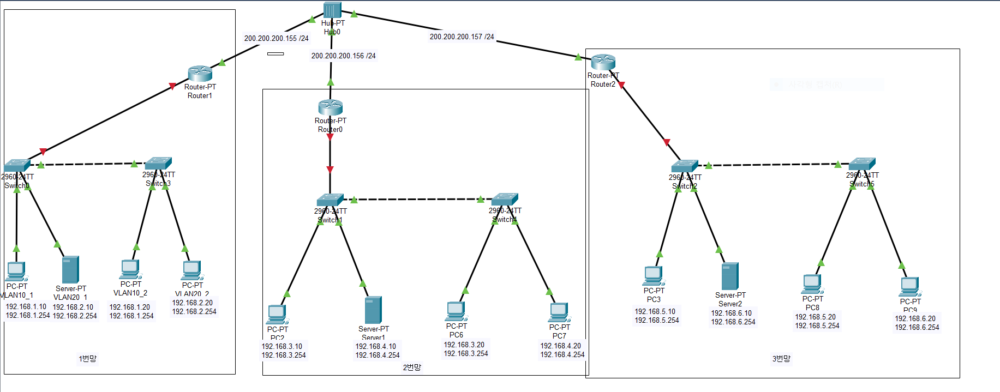

# 네트워크 구축

이번 실습은 조원 2명 총 3명이서 함께 네트워크 망을 구축 했습니다!!!!!

##### 1 단계 : Packet Tracer를 이용한 망 구축

##### 2 단계 :  Vlan, Inter Vlan 구축

##### 3 단계 : NAT , Static NAT , Dynamic + NAT

##### 4단계 :  AccessList , TCP wrapper

순서로 구축을 하겠습니다.

##### 1 단계 : Packet Tracer를 이용한 망 구축

Packet Tracer를 이용해 간단한 통신망을 구축한 다음에 GNS를 이용해 조원들과 통신을 시도해 볼 것입니다.

우선 Packet Tracer를 이용한 망 구축을 하면서 조원들과 네트워크 주소가 겹치지 않도록 망을 구성해 봤습니다.

##### 2 단계 :  Vlan, Inter Vlan 구축

1단계에서 구축한 Packet Tracer망을 토대로 제가 맡은 2번망을 GNS로 다시 구성해 보았습니다.

밖으로 통신하기 위한 NAT 1개 Packet Tracer에서 구성 했던대로 라우터 1개 switch 2개 pc3개 server대신 cloud를 1개 구성 했습니다.

그리고 왼쪽 switch에 Vlan 10,20을 만들고 PC와 연결되 있는 이더넷에 각각 10, 20 한개씩 넣어주고 switch끼리 연결 되있는 이더넷에는 trunk mode를 설정하였습니다.

반대쪽인 오른쪽에도 Vlan 10,20을 만들고 PC와 연결되 있는 이더넷에 각각 10,20 한개씩 넣어주고 switch 연결부는 trunk mode를 설정하였습니다.

Router에는 Vlan10, 20이 서로 통신을 할 수 있도록 Inter Vlan을 설정 하였습니다.

##### 3 단계 : NAT , Static NAT , Dynamic + NAT

##### 4단계 :  AccessList , TCP wrapper

