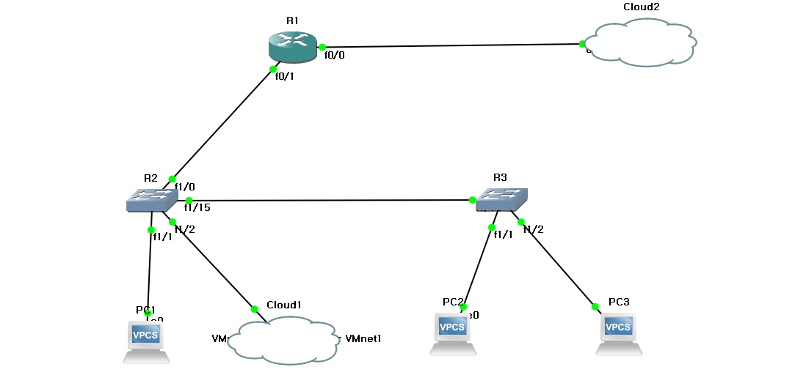

# 네트워크 구축

이번 실습은 조원 2명 총 3명이서 함께 네트워크 망을 구축 했습니다!!!!!

##### 1 단계 : Packet Tracer를 이용한 망 구축

##### 2 단계 :  Vlan, Inter Vlan 구축

##### 3 단계 : NAT , Static NAT , Dynamic + NAT

##### 4단계 :  AccessList , TCP wrapper

순서로 구축을 하겠습니다.

##### 1 단계 : Packet Tracer를 이용한 망 구축

Packet Tracer를 이용해 간단한 통신망을 구축한 다음에 GNS를 이용해 조원들과 통신을 시도해 볼 것입니다.

우선 Packet Tracer를 이용한 망 구축을 하면서 조원들과 네트워크 주소가 겹치지 않도록 망을 구성해 봤습니다.

##### 2 단계 :  Vlan, Inter Vlan 구축

1단계에서 구축한 Packet Tracer망을 토대로 제가 맡은 2번망을 GNS로 다시 구성해 보았습니다.

밖으로 통신하기 위한 NAT 1개 Packet Tracer에서 구성 했던대로 라우터 1개 switch 2개 pc3개 server대신 cloud를 1개 구성 했습니다.

그리고 왼쪽 switch에 Vlan 10,20을 만들고 PC와 연결되 있는 이더넷에 각각 10, 20 한개씩 넣어주고 switch끼리 연결 되있는 이더넷에는 trunk mode를 설정하였습니다.

반대쪽인 오른쪽에도 Vlan 10,20을 만들고 PC와 연결되 있는 이더넷에 각각 10,20 한개씩 넣어주고 switch 연결부는 trunk mode를 설정하였습니다.

Router에는 Vlan10, 20이 서로 통신을 할 수 있도록 Inter Vlan을 설정 하였습니다.

각기 다른 Vlan 10, 20이 서로 통신이 되었습니다.

Vlan 설정은 여기서 마치고 NAT로 넘어 가겠습니다.

##### 3 단계 : NAT , Static NAT , Dynamic + NAT

Vlan 10에 P.A.T를 넣고 Vlan 20에 Static NAT를 넣도록 하겠습니다.

Vlan 10에 설정되어 있는 192.168.3.0 네트워크 주소를 P.A.T를 Vlan 20에는 192.168.4.0 네트워크 IP주소에는 Static NAT를 넣고

라우터 기준 바깥쪽에 outside를 설정하고 안쪽인 Vlan이 설정되어 있는 인터페이스에는 inside를 설정 했습니다.

Static을 설정한 192.168.4.20은 라우터를 통해 나갈때 200.200.200.141의 공인 IP주소로 나가도록 설정했으며

192.168.4.10은 200.200.200.142로 나가도록 설정 했습니다.

192.168.3.0 네트워크만 정보를 주고 받을 수 있도록 P.A.T도 설정 되어있는 상태 입니다.

그리고 default route에 200.200.200.254를 넣어 두겠습니다.

outside쪽 인터페이스에는 200.200.200.xxx의 주소를 각각 조원들과 나누어 넣었고 이것을 토대로 통신을 해보도록 하겠습니다.

조원 1은 200.200.200.155 조원 2는 200.200.200.157로 주소를 설정해 놓은 상태입니다.

------ 사진 ---------

통신이 잘 되는 것을 확인 했으니 다음으로 넘어 가겠습니다.

##### 4단계 :  AccessList , TCP wrapper

ACL을 이용해 팀원중에 1명의 네트워크를 지정해서 static  NAT  로 지정된 서버로 접근하지 못하도록 먼저 설정 하겠습니다.

이렇게 설정을 해 두고 모박스텀을 이용해서 ssh를 이용해 접근을 해 보겠습니다.

접속이 아예 안되는 것을 확인 했습니다.

다음으로 TCP Wrapper 를 이용해 리눅스 서버에는 내부 네트워크 컴퓨터중 관리자로 지정된 특정 컴퓨터만 접속 가능하도록 설정 하겠습니다.

그전에 리눅스 서버에서 구성한 GNS망에 통신이 잘 되는지 부터 확인해 보겠습니다.

Static NAT, Routing 도 잘 통신이 되는것을 확인 했으니  TCP Wrapper 설정을 하겠습니다.

allow 파일에 가서 172.168.3.20만 허용되도록 설정하고 deny파일에 가서 모든것을 막겠다고 설정 했습니다.

allow가 deny보다 우선권이 있기에 모든것을 막겠다고 설정을 해도 allow에 허락되어 있는 172.168.3.20이 우선이기 때문에

172.168.3.20은 통신이 되지만 다른 PC에서는 통신이 안되는 것을 확인해 보실 수 있습니다.
