# TCP Wrapper

- ### 접근 통제 관련 파일

  
  
  
  

  #### 172.16.0.100의 sshd접근 차단

  우선 sshd의 데몬이 실행되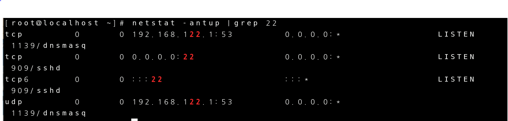고 있는지 확인 해야합니다.

  

tcp 포트번호 22번 확인하기.

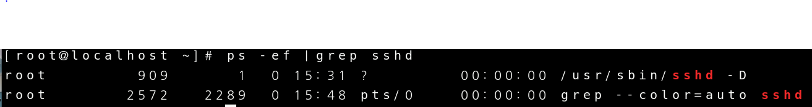

sshd 확인하기

준비된 다른 VM환경에서 putty라는 프로그램을 이용해서 실습 준비를 마저 해보 겠습니다.

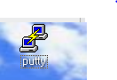

centos의 ip주소를 입력 합니다.

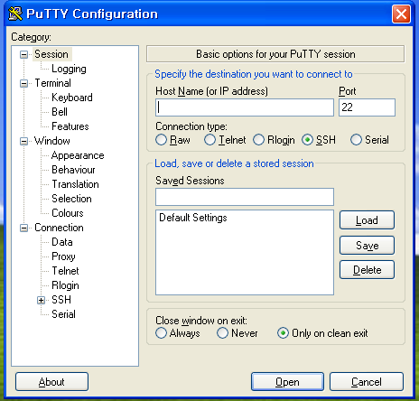

ip주소를 입력하고 open을 누르면 아래처럼 창이 나옵니다.

그때 id와 passward를 입력하면 됩니다.

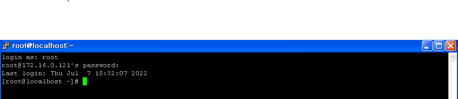

그다음 centos로 가서 172.16.0.100 에서 ssh의 접근을 차단 합니다.

맨 마지막 줄에 sshd: ip address를 입력하고 저장하고 나오시면 됩니다.

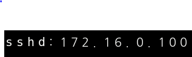

이제 각 환경에서 접속을 해서 확인을 해보겠습니다.

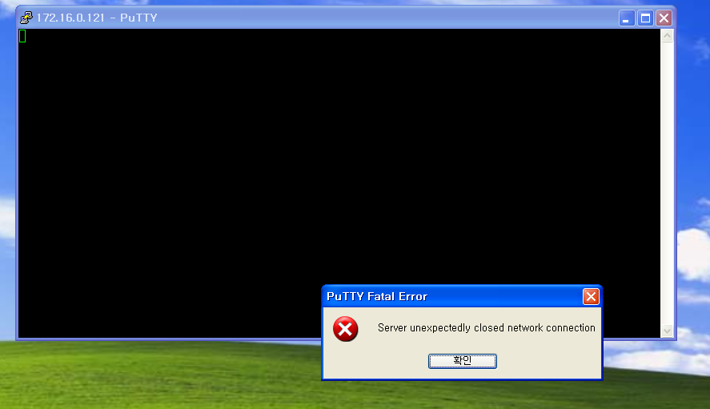

xp 환경에서 ssh를 통하여 centos 환경으로 접속

접속이 차단되어 있습니다.

host에서 centos로 접속 해보겠습니다

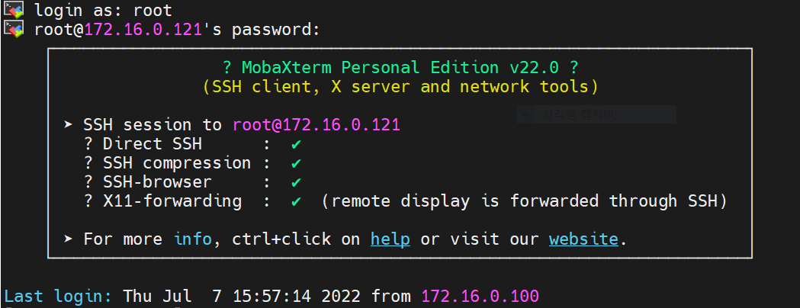

여기서는 접속이 가능합니다.

다음은 172.16.0.100 에 sshd 허용과 차단을 동시에 해두면 무엇이 우선순위 인가 알아 보겠습니다.

centos에서 

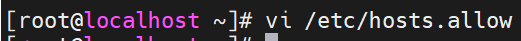

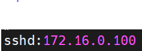

allow 파일에 172.16.0.100의 sshd 허용을 한다 쓰고나서 확인해 보러 가겠습니다.

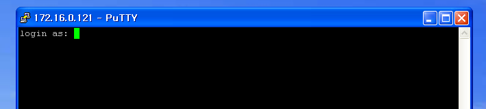

xp에서 centos로 접속이 되었습니다.

차단과 허용을 동시에 해두면 허용이 우선순위 라는 것이 확인 되었습니다.

172.16.0.100 의 sshd 접근을 차단 ,  접속을 시도한 컴퓨터의 IP 주소를 logging을 알아 보겠습니다.

우선 allow파일에서 sshd 허용을 삭제하고 deny파일로 가서 설정을 변경해 보겠습니다.

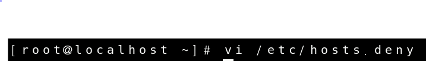

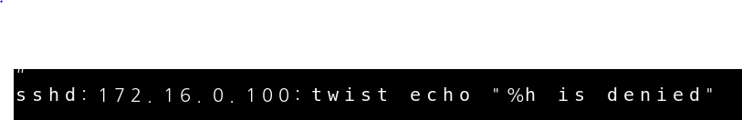

이 상태로 다시 xp환경에서 centos 환경으로 접속을 시도해 보면

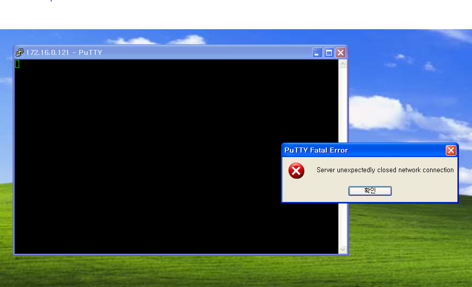

접근이 차단 되어 있는게 확인이 가능 합니다. logging을 보면

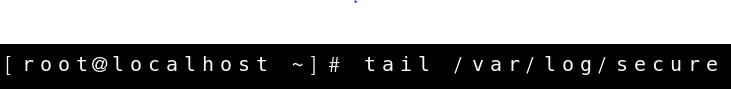

deny 파일에서 설정했던 twist 설정이 기록에 남아 있는게 보입니다.

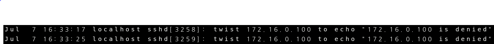

#### httpd 의 TCP wrapper 적용을 확인해 확인해 보겠습니다.

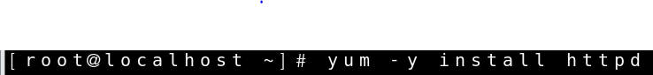

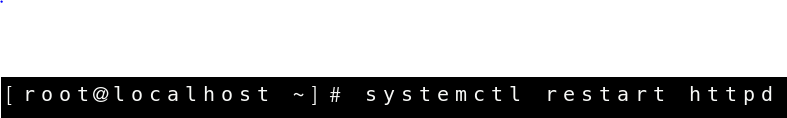

httpd 파일을 다운 받고 실행시키고 systemctl status로 상태를 확인해 보면

active 상태가 된것을 확인 한 뒤 httpd가 잘 실행 되는지 한번 확인해 보러 갑니다.

xp환경으로 가서 주소창에 172.16.0.121(centos환경 ip address) 입력합니다.

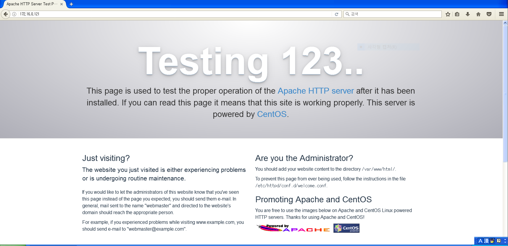

접속이 잘 되는 것을 확인 하였으면 다시 centos로 가서 deny파일에 172.16.0.100을 다시 차단해 보겠습니다.

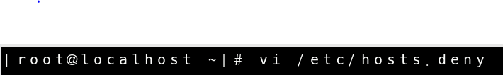

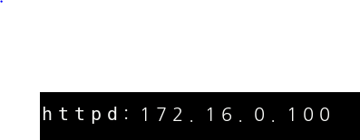

다시 xp환경으로 가서 확인해 보면

httpd는 ssh와 다르게 영향을 받지 않음을 확인 가능 합니다.

####  

#### xinetd 에서의 TCP wrapper

telnet-server 설치 > standalone 으로 실행 > 테스트 순으로 진행 하겠습니다.

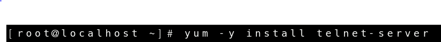

telnet-server를 설치

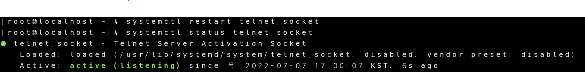

telnet 상태 확인

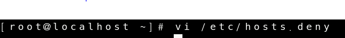

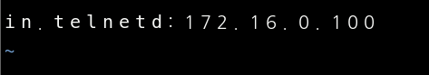

deny파일에 telnet 차단 설정

이렇게 환경을 구성하고 xp환경으로 가서 puty로 telnet을 테스트 해보면 접속이 되는것이 확인 가능합니다.

접속이 되지 않아야 하는데 접속이 되는 이유는 telnet은 제어여부를 결정 할 수 있는 프로그램이 아니기 때문 입니다.

telnet을 차단 하려면 xinetd를 차단해야 telnet의 접근이 차단 됩니다.

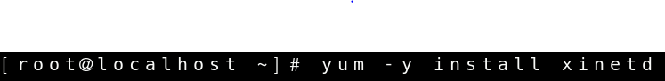

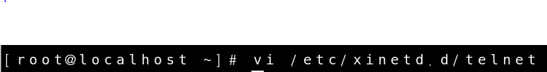

telnet파일을 만들어서 아래와 같이 설정

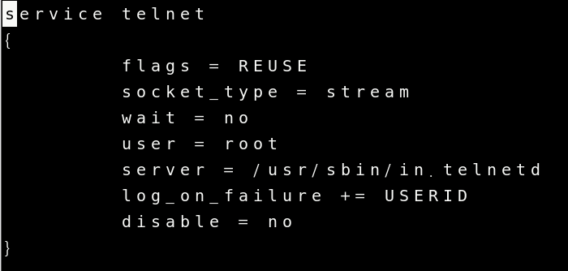

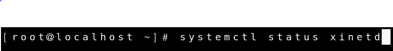

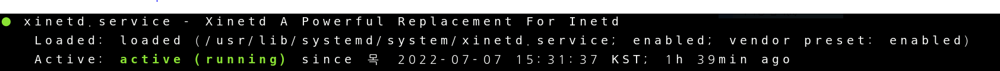

xinetd가 잘 활성화 되었는지 확인

xp환경에 가서 puty로 telnet을 확인해보면 아예 접근이 되지 않는것을 확인할 수 있습니다.

#### 특정 host (172.16.0.100) 접근을 모두 차단 

/etc/hosts.allow , /etc/hosts.deny  추가했었던 내용 제거하고 시작 하겠습니다.

그리고 deny파일에 가서 ALL:172.16.0.100을 설정 합니다.

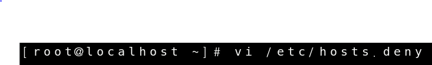

다시 xp환경에 가서 puty로 telnet과 ssh를 확인해 보면 둘다 차단이 되어있습니다.

ssh는 연결도중에 짤리고 telnet은 상위 xinetd에서 차단하기 때문에 아예 접근조차 안되서 접속 창 조차 뜨지 않습니다.

#### 모든 host , r 접근 거부 , 172.16.0.1 만 접근하도록 설정

위에서 실습했던 allow가 deny보다 우선이라는 점을 이용해서 설정해 보도록 하겠습니다.

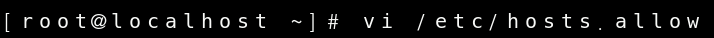

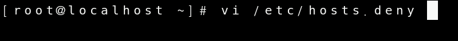

allow파일에서 172.16.0.1만 허용하고 deny파일에서는 모두 제한으로 설정 했습니다.

위의 실습과 똑같이 telnet ssh등 모든것이 xp환경에서는 막혀 있음을 확인 할 수 있습니다.

xp환경에서 ncpl.cpl에서 ip주소를 172.16.0.1로 바꾸고 테스트 해보시면 telnet ssh가 접속이 되는것을 확인 가능합니다.

#### 방화벽 (firewall)

TCP Wrapper는 방화벽과 연관이 되어 있습니다.

본격적으로 방화벽이 이거다!!는 조금 나중에 배우고 지금은 방화벽이  TCP Wrapper와 무슨 관계인지 조금 알아 보겠습니다.

우선 앞서 실습했던 내용들을 지워주고 /etc/hosts.allow , /etc/hosts.deny  내용 제거

iptables의 상태를 확인해 보겠습니다.

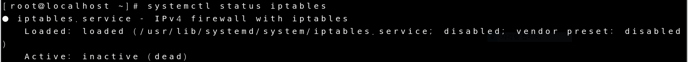

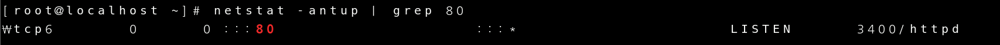

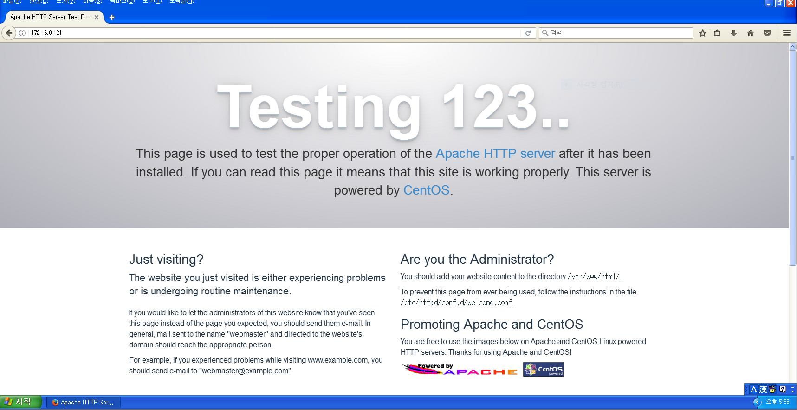

httpd와 systemctl status iptables로 방화벽이 설정 되어 있지 않는것을 확인해 볼 수 있습니다.

이제 방화벽을 활성화 시켜 보겠습니다.

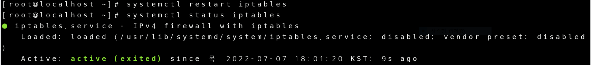

다시 httpd로 방화벽이 잘 활성화 되었나 확인을 해봅니다.

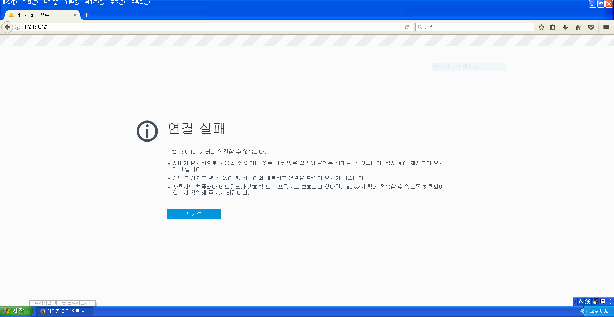

방화벽이 활성화 되어 httpd의 접근이 제한 된 것을 확인 가능합니다.

xp환경에서 httpd말고 telnet과 ssh도 확인해 보겠습니다.

ssh는 접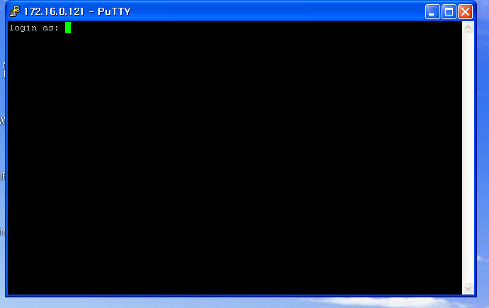속이 되지만 telnet과 httpd는 접속이 제한되어 있습니다.

iptalbes의 목록을 확인해 보면

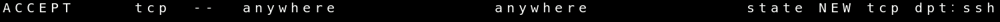

ssh는 접근이 가능하도록 설정이 되어 있지만 telnet과 httpd는 설정이 되어있지 않습니다.

그래서 방화벽을 활성화 했을때 telnet과 httpd는 접속이 되지 않고 ssh는 접속이 되는 것입니다.

