# 암호학

##### 단방향 함수 실습 (Hash)

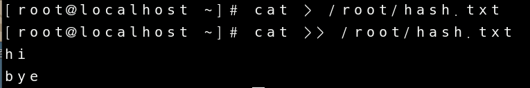

우선 실습을 위한 파일을 하나 생성 합니다.

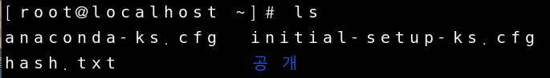

파일이 잘 생성 되었나 확인 합니다.

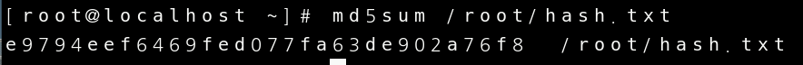

파일의 해쉬값을 확인 합니다.

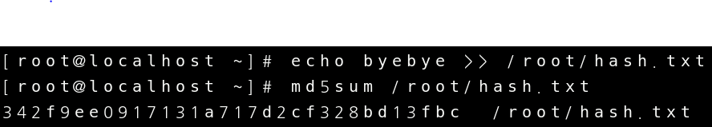

파일안에 내용을 바꾼뒤 해쉬값을 확인해 보면 해쉬값이 달라진 것을 확인해 볼 수 있습니다.

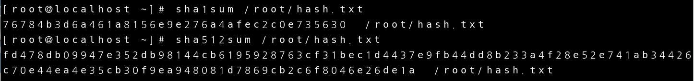

리눅스에는 여러개의 단방향 암호화가 있는데 더 복잡한 암호화 일수록 해쉬값이 더 길다는 것이 확인 가능합니다.

비밀번호의 해쉬값을 저장해 둔 파일입니다.

$6$ 는 sha512라는 암호화 방식을 사용했다는 뜻이고 그다음 나오는 nsXkw6Pt5sjSlIcj는 해쉬값 이며 나머지는 솔트값 입니다.

##### 비 대칭키를 이용한 암호화

#####  1. 환경설정

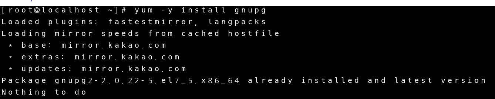

gnupg 파일을 yum을 통해서 다운받는다.

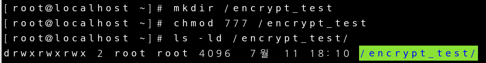

실습을 위해 디렉터리를 하나 만들어 주고 777로 모든권한을 준다음에 디렉터리가 잘 만들어 졌는지 확인한다.

###### 2. 공개키 생성

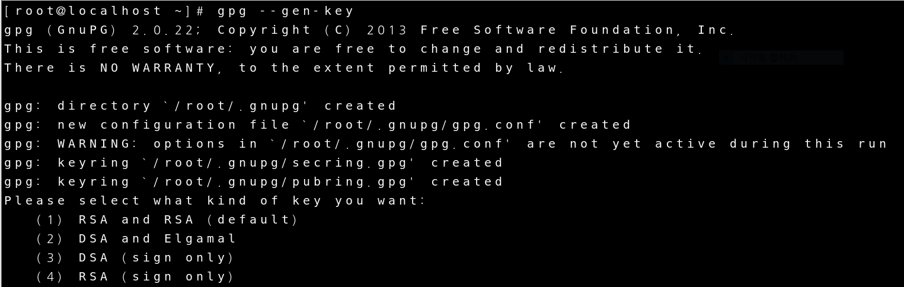

공개키를 생성하는 명령어인 gpg --gen-key를 입력.

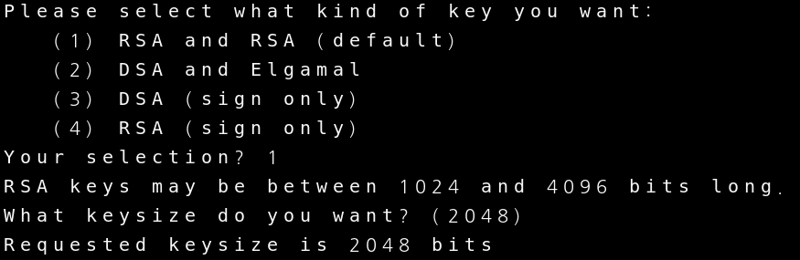

공개키 유형과 key size를 설정한다.

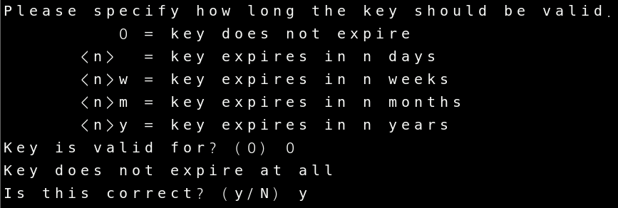

공개키의 유효기간을 설정하고 y를 입력해서 생성한다.

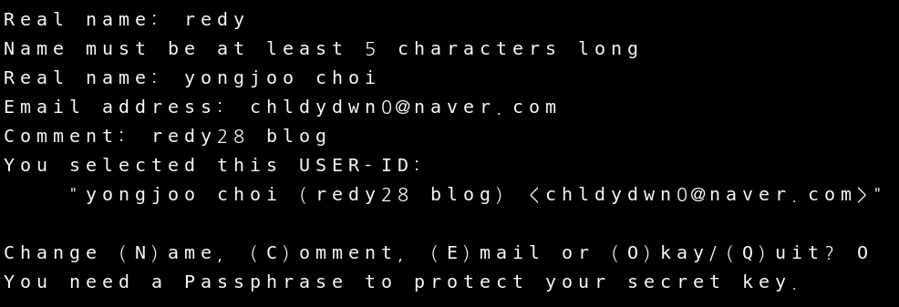

공개키의 식별자를 생성한다.

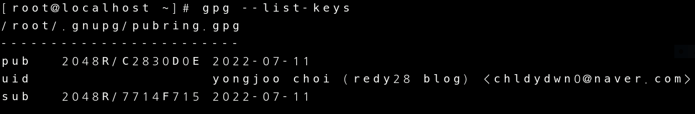

공개키가 잘 설정 되었는지 확인한다.

###### 3. 공개키 내보내기

공개키를 내보내기 위해 export를 해준다. 이때 공개키 식별자를 생성했을때 정보를 넣어줘야 한다. 다른 정보를 넣으면 식별 불가능으로 공개키를 내보낼 수 없다.

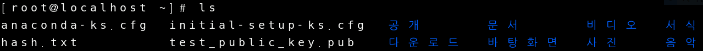

공개키 내보낸 것을 확인 한 후

공개키를 저장소에 복사한다.

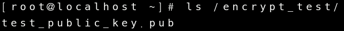

공개키를 저장소에 복사한 것을 확인.

###### 4. 공개키 가져와서 적용하기

공개키를 적용할 ktest라는 사용자로 접속.

공개키 저장소에서 공개키 복사해 오기.

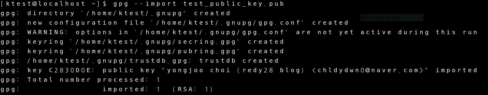

공개키 import 하기.

###### 5. 평문 작성하고 공개키로 암호화 하기

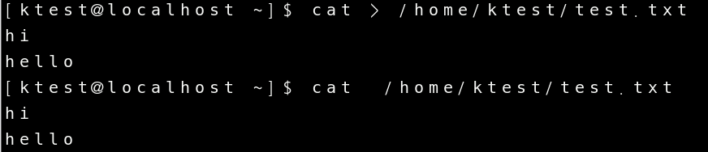

평문 작성하기(내용은 아무거나 상관 없습니다).

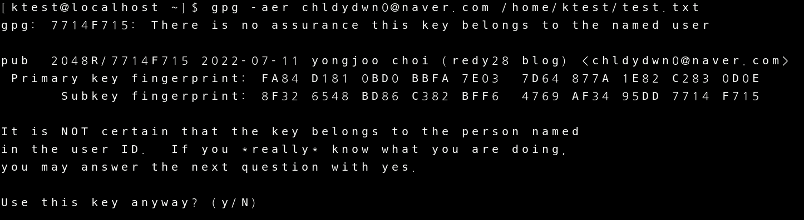

공개키로 암호화를 해주기

공개키로 암호화 설정한거 확인하기 (test.txt.asc 파일이 생성 되어야 합니다.)

공개키 저장소에 암호문 복사하기

###### 6. 암호문 root 사용자로 이동시키고 개인키로 복호화 하기

개인키로 복호화 하기전에 확인을 위한 평문을 하나 작성.

root 사용자로 와서 암호문 이동 시키기.

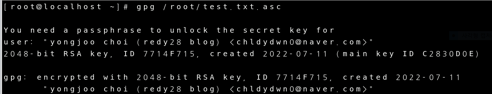

개인키로 복호화 시키는 과정.

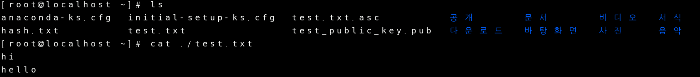

개인키로 복호화 되었는지 확인.

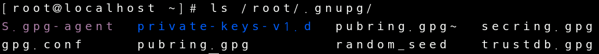

공개키와 개인키를 확인(secring.gpg, pubring.gpg 파일 확인.)
