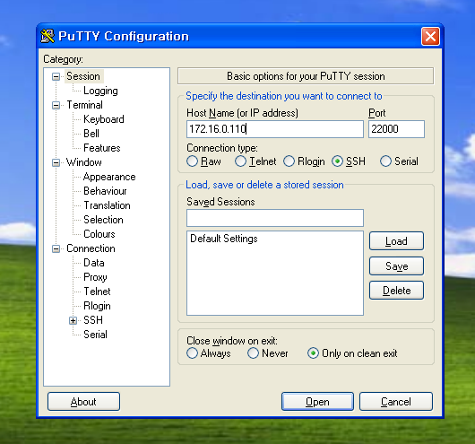
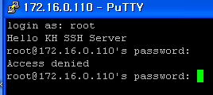

# SSH

간단하게 SSH에 대해 알아보는 실습을 해보겠습니다.

<br><br><br>

### 목적지 port 바꾸기

우선 centOS6를 Client로 XP를 Server로 활용하면서 사용해 보겠습니다.

SSH의 기본 *port 번호는* *22번입니다.*

그럼 SSH의 *port 번호를* 바꾸면 제대로 실행이 되는지 한번 *알아보겠습니다.*

<br><br><br>

우선 SSH의 정보가 담긴 파일은 `/etc/ssh`에 있습니다.

<br><br><br>

*port 번호* 정보가 담긴 파일에 접근합니다.


<br><br><br>

port 번호를 22000으로 바꿔 보겠습니다.


port번호 변경사항을 재적용 시킵니다.

<br><br><br>


<br><br><br>

이제 Server에 가서 확인해 보겠습니다.




*port 번호를* 바꿔도 그 바꾼 번호를 통해 접속한다면 문제없이 접속이 가능하다는 것을 알 수 있습니다.

<br><br><br>

### root 로그인을 차단

다음은 root 사용자를 차단하고 접속이 되는지 확인해 보겠습니다.

<br><br><br>

root 사용자를 차단하고 재적용 합니다.


<br><br><br>


<br><br><br>

Server로 가서 확인해 보겠습니다.


root 사용자는 *로그인이 안 되지만* 다른 *사용자는 로그인이 되는 것을* 확인해 볼 수 있습니다.


<br><br><br><br><br><br>


### SSH 버전 변경 테스트

SSHv2에서 SSHv1로 바꿔서 실행해 보겠습니다.


<br><br><br><br><br><br>


Server로 가서 확인해 보겠습니다.

SSH버전을 1로 바꾸고 접속 하겠습니다.


접속에 성공 했습니다. SSH 버전2로도 한번 접속 해보겠습니다.


접속에 실패했습니다.

SSH는 다른 버전으로는 접속이 되지 않는다를 알 수 있습니다.

<br><br><br>

이제 Server에 설치되어 있는 Wireshark로 SSH에 대해 좀 더 자세히 알아보도록 하겠습니다.

<br><br><br>

SSH의 기본 동작 방식입니다.


<br><br><br>

SSHv1의 TCP 연결 생성부터 Wireshark로 알아 보겠습니다.


<br><br><br>

SSH version 협상 부분입니다.


<br><br><br>

key 교환 부분입니다.


<br><br><br>

SSHv2를 Wireshark로 알아 보겠습니다.

<br><br><br>

SSH version 협상 부분입니다.


<br><br><br>

key 교환 부분입니다.


<br><br><br>

암호화 통신 / 암호화된 Data 송 / 수신 부분입니다.


<br><br><br>

이번에는 Protocol 1,2를 동시에 사용해 보겠습니다.


<br><br><br>

동시에 SSHv1은 version1.5 SSHv2는 version2.0이 실행되는 것을 위의 Wireshark로 확인이 가능합니다.

Protocol 1,2를 동시에 사용하면


version이 1.99로 실행되는 것을 확인 할 수 있습니다.


<br><br><br><br><br><br>


이제 위에서 실습했던 것들을 토대로 내용을 조금 더 추가하여 SSH server 구성 실습을 해 보겠습니다.


```
SSH Server 구성 실습
- CentOS 6  구성 조건
 IP : 172.16.0.110/24 (그대로) 
 standalone 모드로 설정 (그대로) 

 port번호 : 10022번으로 설정
 root 로그인 금지
 로그인 대기 시간 : 30초
 로그인 시도 횟수 : 2
 배너 정보 변경 : Hello KH SSH Server  - 접속할때 나오면 메시지 
```

천천히 하나씩 진행하도록 하겠습니다.

IP와 standalone은 기본 설정 그대로이기에 넘어가도록 하겠습니다.

SSH의 설정은 `/etc/ssh/sshd_config` 로 들어가서 설정하면 됩니다.

<br><br><br>

port 번호 설정 입니다.


root 로그인 금지 설정 입니다.


로그인 대기 시간 30초로 설정 입니다.


로그인 시도 횟수 2회로 설정 입니다.


배너정보 변경 설정 입니다.

배너는 경로를 설정 해야 되기 때문에 밖에서 파일을 하나 만들고 Hello KH SSH Server 내용을 넣어 주겠습니다.


<br><br><br>

root 로그인 금지 설정 확인 입니다.

접속시 Hello KH SSH Server 뜨는 것도 같이 확인 가능 합니다.



다른 사용자로 로그인 되는지 확인해 보겠습니다.


로그인 대기시간 30초 설정 확인 입니다.


로그인 시도 횟수 2회로 설정 확인 입니다.


<br><br><br><br><br><br>


마지막으로 SCP에 대해서 알아 보겠습니다.

SCP란 SSH를 이용해 파일을 복사하는 명령어 입니다.

우선 172.16.0.121의 CentOS7에 hi라는 내용이 담긴 파일을 하나 만들고 172.16.0.205의 다른 CentOS7에 복사해 보겠습니다.

<br><br><br>

우선 2개의 서버들이 서로 통신이 되는지 확인해 보겠습니다.


정상적으로 핑이 가는 것을 확인 했습니다.

다음으로 파일을 하나 만들어 보겠습니다.


<br><br><br>

이제 SCP명령어를 한번 확인해 보겠습니다.


<br><br><br>

SCP명령어를 실행 해보겠습니다.


파일이 복사가 되었습니다. 제대로 복사가 되었는지 확인하러 가보겠습니다.


파일이 잘 복사 되었습니다.

<br><br><br>

지금까지 SSHD에 대해서 알아 봤습니다.

실습 마무리 하겠습니다~~
