# VNC

VNC란?

- 원격으로 다른 컴퓨터를 제어하는 그래픽 데스크톱 공유시스템이다.

- VNC의 Port 번호는 5900 ~ 관리자가 정하는 번호로 실행이 된다.

VNC 실습

- CentOS7을 사용 하겠습니다.

VNC용 사용자를 추가 및 암호를 설정 하겠습니다.

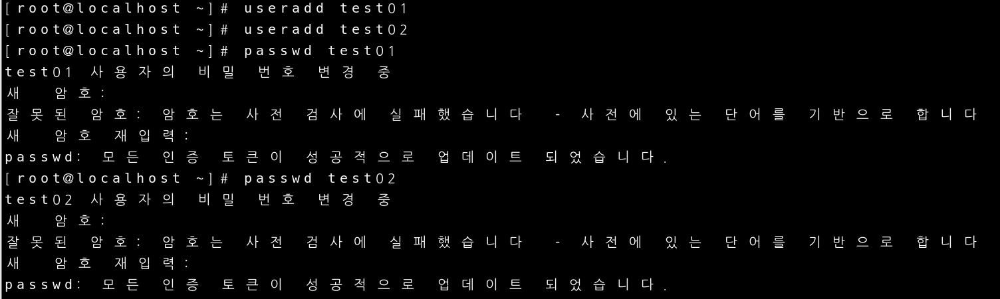

VNC서버를 설치 하겠습니다.

설치된 Daemon 파일을 복사하여 사용자별 데몬을 별도로 생성 하겠습니다.

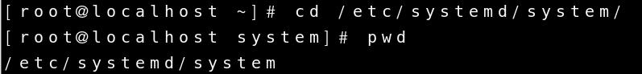

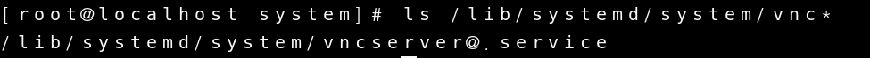

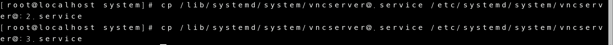

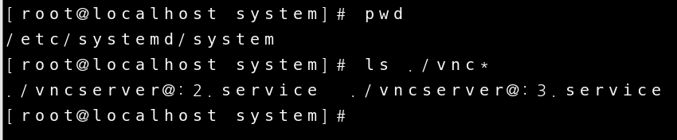

데몬파일을 복사하여 현재경로에 파일 2개를 복사해 놨습니다.

이제 이중에 2번 파일을 열어서 파일을 편집 하도록 하겠습니다.

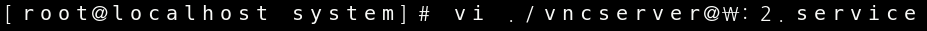

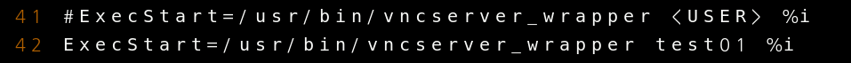

user에 아까 생성했던 test01을 입력하고 나가겠습니다.

데몬을 재시작할때 자동으로 시작하도록 설정해 두고 재부팅을 해보겠 습니다.

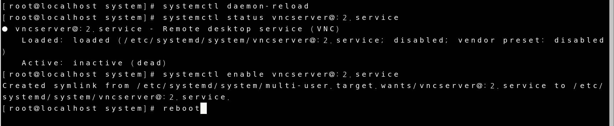

재부팅을 하고 데몬의 상태를 확인해 보면 실행이 안된다고 뜨는것을 확인해 볼 수 있습니다.

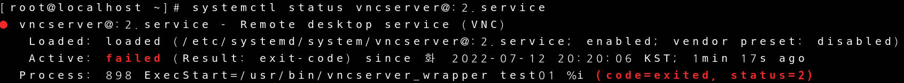

 7월 12 20:18:22 localhost.localdomain vncserver_wrapper[1066]: You will require a password to access your desktops.

이 Error를 토대로 클라이언트를 설정해 보겠습니다.

먼저 아까 만들었던 test01로 사용자를 변경하고

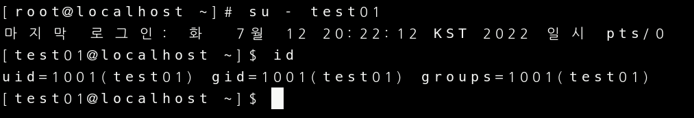

클라이언트를 재설정 하겠습니다.

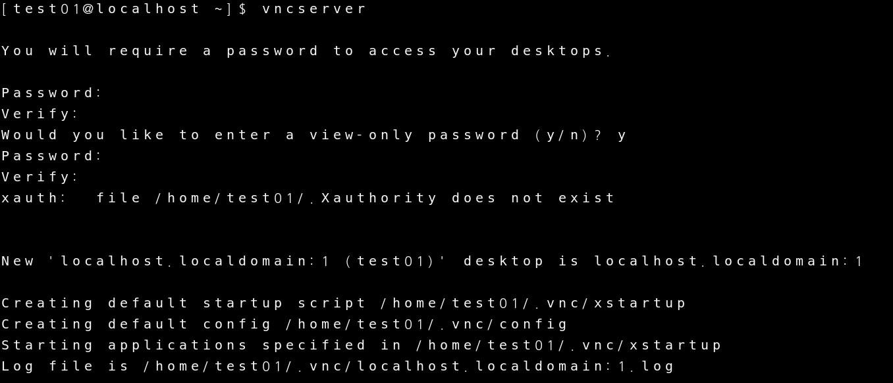

이제 데몬을 다시 시작해 보겠습니다.

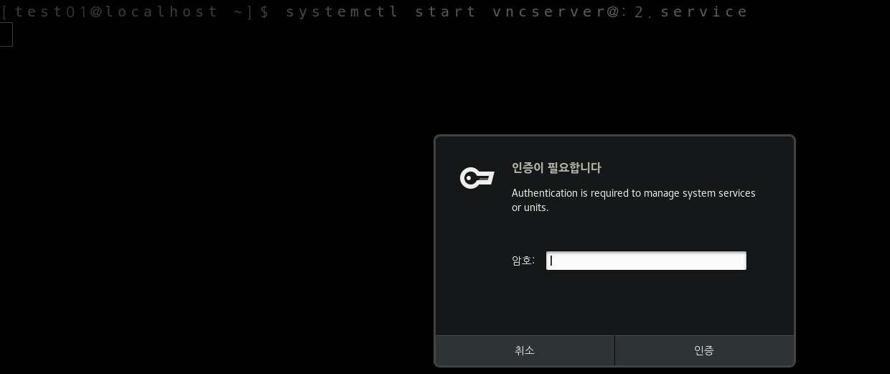

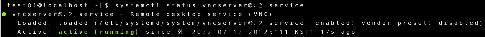

데몬 상태가 dead에서 active로 변경이 되었습니다.

이제 TigerVNC view를 설치해서 확인해 보겠습니다.

IP주소와 Port 번호를 입력 하고(Port 번호는 위에서 말했던 5900 ~ 으로 입력해 주셔야 합니다.)

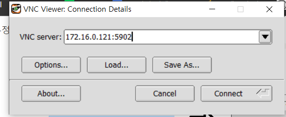

아까 설정했던 password를 입력 합니다.

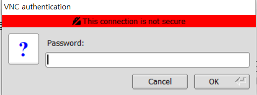

연결에 성공 하였습니다.

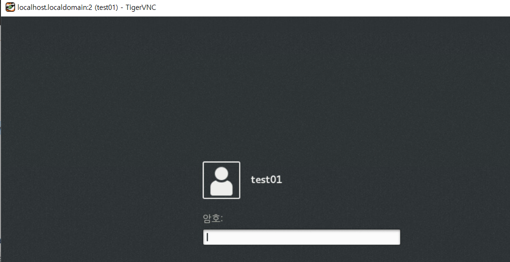