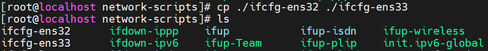

# Routing Linux

### 구성도

Router를 Linux라고 생각하고 각각 xp환경과 2003환경에 연결하여 서로 다른 망끼리 통신이 되도록 구축 하겠습니다.

조원은 3명이며 한명당 망 1개씩 구축 하였습니다.

우선 VM ware의 network환경을 설정 하겠습니다.

VMnet2 Host-only를 만들어 놓겠습니다.

xp와 2003환경도 설정 하겠습니다.

그리고 Linux에 인터페이스를 추가 하겠습니다.

Linux에 접속해서 인터페이스가 제대로 추가 되었는지 확인을 해 봅니다.

원활한 통신을 위해 조원들과 network address가 겹치지 않도록 ip주소를 설정 하겠습니다.

변경을 하고 `systemctl restart network` 를 입력하여 네트워크를 재시작 하겠습니다.

조원들과 통신이 잘 되는지 ping을 확인해 보겠습니다.

200.200.200.163 200.200.200.169 둘다 잘 가는것을 확인을 합니다.

아까 만들었던 인터페이스의 설정을 변경 하겠습니다.

ifcfg-ens32 파일을 확인하고 복사를 ifcfg-ens33으로 해줍니다.

복사를 한 뒤 vi로 들어가서 설정을 바꿔줍니다.

이름과 UUID IP주소를 바꿔야 합니다. UUID는 처음에 인터페이스 확인차 입력한 명령어  `nmcli connection` 로 확인 할 수 있습니다.

`systemctl restart network` 를 한 뒤에 ifconfig로 확인해 보겠습니다.

똑같이 ens34를 만들면 됩니다.

ens33 파일을 복사해서 ens34파일로 만들겠습니다.

vi로 들어가서 설정을 바꿔주는데 ens33과 다르게 UUID를 빼고 MAC주소를 넣어서 설정해 보겠습니다.

ifconfig로 ens34에 있는 MAC주소를 복사해서 HWADDR을 입력하고 써주시면 됩니다.

다시 나가서 `systemctl restart network` 를 한 뒤에 ifconfig로 확인해 보겠습니다.

