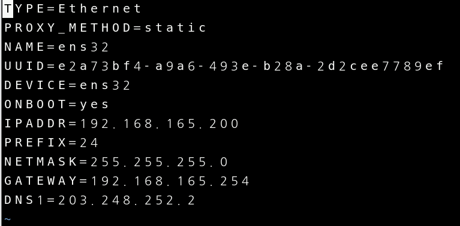
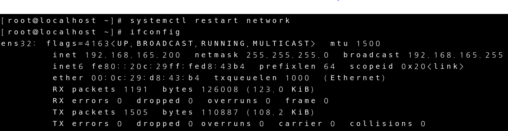

# Routing Windows

이번엔 2003환경을 host라 생각하고 xp와 linux를 연결해 보겠습니다.

  

### Linux 환경설정

우선 리눅스의 기본적인 ip 주소를 변경 하겠습니다.

 

재시작 하고 정보가 제대로 변경 되었는지 확인 해보겠습니다.

 

 

### 2003 환경설정

리눅스 환경설정이 끝났으니 2003환경을 설정 해보겠습니다.

우선 VM ware의 인터페이스를 설정 하겠습니다.

VMnet0은 2003에 bridge로 연결 VMnet1은 xp에 host-only로 연결 VMnet2는 linux에 host-only로 연결 하겠습니다.

