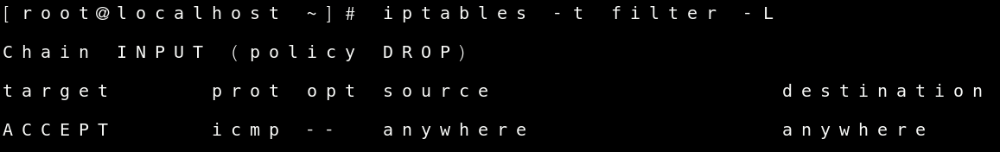

# Firewall - Linux

 

### Linux - iptables

Linux 방화벽에는 대표적으로 iptables가 있습니다.

 

##### ip tables 란 

- Linux Kernel 내부의 네트워크 관련 프레임워크 

- 네트워크 패킷을 제어할 수 있는 기능을 제공 함

이러한 기능이 있는 ip tables의 기본적인 문법 구조부터 확인해 보겠습니다.

 

 

##### ip tables 문법 구조 확인하기

우선 ip tables를 test할 환경부터 설정 하겠습니다.

VM ware에 Linux, xp 2개의 환경을 사용 하겠습니다.

 

Linux에 `yum -y install httpd` 로 http를 먼저 설치하기

 

httpd와 ip tables를 실행 시키기

 

XP로 가서 httpd 실행 되는지 확인하기

 

ip tables 시작

 

다시 XP로 가서 httpd 확인

ip tables를 실행하자 마자 httpd가 실행이 되지 않음을 확인 할 수 있습니다.

 

filter table 의 목록 확인

현재 ip tables의 실행 목록을 볼 수 있는 간단한 명령어 입니다.

 

ip tables의 Chain 별 접근제어 방식 종류에는

- black list : 기본적으로 모든 대상을 허용(ACCEPT)하고 차단(DROP)할 대상을 제어 합니다.
- white list : 기본적으로 모든 대상을 차단(DROP)하고 허용(ACCEPT)할 대상을 제어 합니다.

이번에는 white list 제어 방식을 사용하여 실습 해 보겠습니다.

 

 

##### White list - ICMP 허용

우선 ip tables를 초기화 하고 확인

-F 명령어로 초기화를 해주고 -L로 위의 사진과 비교 해보면 초기화가 됬구나 확인이 가능 합니다.

 

INPUT chain 의 기본정책은 DROP or ACCEPT로 정의 할 수 있습니다.

이번에는 white list 방식을 사용할 것이기 때문에 DROP을 사용 하겠습니다.

 

INPUT chain을 DROP으로 설정하고 확인

 

XP에서 Linux로 ping 확인

아직 ping이 전달되지 않음.

 

ip tables에서 ICMP허용 하기

white list 방식을 사용하고 있는 상태이기 때문에 ICMP만 ACCEPT로 허용을 해줍니다.

 

XP에서 다시 ping확인

ICMP를 허용하니 ping이 잘 전달되는 모습

 

 

##### White list - SSH

XP에서 putty를 사용해서 SSH로 Linux 접속해 보기

접속 불가능

 

ip tables에서 SSH 허용하고 확인

 

XP에서 putty로 다시 SSH 접근

성공!!!!

 

##### White list - SSH

###### SSH를 172.16.0.1 에서만 허용하기

 

SSH를 삭제

-L 명령어 뒤에 --line 옵션을 쓰면 행number가 보입니다.

-D 명령어를 사용해서 SSH가 허용되어 있는 2행을 삭제 합니다.

 

삭제된거 확인

 

172.16.0.1만 SSH허용 하겠다는 정책을 추가하기

 

XP에서 putty로 SSH접근 해보기

접근실패

 

 

##### White list - Httpd 허용

ip tables에서 httpd 허용하기

httpd 허용된거 확인

 

XP에서 확인해 보기

httpd 허용 성공!!

 

 

##### -I Insert 활용하기

목록확인

 

3번째행 지우고 확인

 

맨 앞에 Insert하기

 

다시 지우고 확인

 

2번째 행 앞에 Insert하기

 

 

##### REJECT , DROP 차이

ip tables 초기화

 

Chain INPUT DROP에서 ACCEPT로 바꾸기

 

Httpd 차단

 

XP에서 와이어샤크 켜고 http://172.16.0.121 으로 접속하고 와이어샤크에 172.16.0.121 은 필터해서 출력하기

 

Httpd 차단 삭제

 

REJECT  사용하면서 메시지를 출력하도록 옵션 설정

 

XP에서 와이어샤크 켜고 http://172.16.0.121 으로 접속하고 와이어샤크에 172.16.0.121 은 필터해서 출력하기

ICMP 확인하기

 

