# Firewall - Linux

 

### Linux - iptables

Linux 방화벽에는 대표적으로 iptables가 있습니다.

 

##### ip tables 란 

- Linux Kernel 내부의 네트워크 관련 프레임워크 

- 네트워크 패킷을 제어할 수 있는 기능을 제공 함

이러한 기능이 있는 ip tables의 기본적인 문법 구조부터 확인해 보겠습니다.

 

 

##### ip tables 문법 구조 확인하기

우선 ip tables를 test할 환경부터 설정 하겠습니다.

VM ware에 Linux, xp 2개의 환경을 사용 하겠습니다.

 

Linux에 `yum -y install httpd` 로 http를 먼저 설치하기

 

httpd와 ip tables를 실행 시키기

 

XP로 가서 httpd 실행 되는지 확인하기

 

ip tables 시작

 

다시 XP로 가서 httpd 확인

ip tables를 실행하자 마자 httpd가 실행이 되지 않음을 확인 할 수 있습니다.

 

filter table 의 목록 확인

현재 ip tables의 실행 목록을 볼 수 있는 간단한 명령어 입니다.

 

ip tables의 Chain 별 접근제어 방식 종류에는

- black list : 기본적으로 모든 대상을 허용(ACCEPT)하고 차단(DROP)할 대상을 제어 합니다.
- white list : 기본적으로 모든 대상을 차단(DROP)하고 허용(ACCEPT)할 대상을 제어 합니다.

이번에는 white list 제어 방식을 사용하여 실습 해 보겠습니다.

 

 

##### White list - ICMP 허용

우선 ip tables를 초기화 하고 확인

-F 명령어로 초기화를 해주고 -L로 위의 사진과 비교 해보면 초기화가 됬구나 확인이 가능 합니다.

 

INPUT chain 의 기본정책은 DROP or ACCEPT로 정의 할 수 있습니다.

이번에는 white list 방식을 사용할 것이기 때문에 DROP을 사용 하겠습니다.

 

INPUT chain을 DROP으로 설정하고 확인

 

XP에서 Linux로 ping 확인

아직 ping이 전달되지 않음.

 

ip tables에서 ICMP허용 하기

white list 방식을 사용하고 있는 상태이기 때문에 ICMP만 ACCEPT로 허용을 해줍니다.

 

XP에서 다시 ping확인

ICMP를 허용하니 ping이 잘 전달되는 모습

 

 

##### White list - SSH

XP에서 putty를 사용해서 SSH로 Linux 접속해 보기

접속 불가능

 

ip tables에서 SSH 허용하고 확인

 

XP에서 putty로 다시 SSH 접근

성공!!!!

 

##### White list - SSH

###### SSH를 172.16.0.1 에서만 허용하기

 

SSH를 삭제

-L 명령어 뒤에 --line 옵션을 쓰면 행number가 보입니다.

-D 명령어를 사용해서 SSH가 허용되어 있는 2행을 삭제 합니다.

 

삭제된거 확인

 

172.16.0.1만 SSH허용 하겠다는 정책을 추가하기

 

XP에서 putty로 SSH접근 해보기

접근실패

 

 

##### White list - Httpd 허용

ip tables에서 httpd 허용하기

httpd 허용된거 확인

 

XP에서 확인해 보기

httpd 허용 성공!!

 

 

##### -I Insert 활용하기

목록확인

 

3번째행 지우고 확인

 

맨 앞에 Insert하기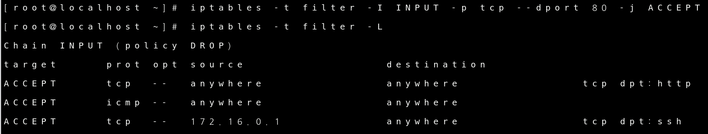

 

다시 지우고 확인

 

2번째 행 앞에 Insert하기

 

 

##### REJECT , DROP 차이

ip tables 초기화

 

Chain INPUT DROP에서 ACCEPT로 바꾸기

 

Httpd 차단

 

XP에서 와이어샤크 켜고 http://172.16.0.121 으로 접속하고 와이어샤크에 172.16.0.121 은 필터해서 출력하기

 

Httpd 차단 삭제

 

REJECT  사용하면서 메시지를 출력하도록 옵션 설정

 

XP에서 와이어샤크 켜고 http://172.16.0.121 으로 접속하고 와이어샤크에 172.16.0.121 은 필터해서 출력하기

ICMP 확인하기

 

 

##### 리눅스 서버로 ICMP 접근시 기록 (LOG) 를 남긴다

XP에서 -t 옵션을 사용해서 ping을 계속 보내기

 

Linux에서 LOG확인 하기

 

tail -f 사용해서 실시간으로 LOG계속 확인하기

 

LOG에 별도 표기하기

 

XP에서 다시 ping보내고 tail로 확인

[ICMP LOG] 뜨는게 확인되면 성공 입니다.

 

 

##### 로컬 루프백 인터페이스 차단

루프백 인터페이스 확인

 

루프백 인터페이스 ping으로 확인

루프백 인터페이스는 내부에서만 사용하기 때문에 외부에서 ping을 보낼 수 없습니다. 내부인 Linux에서 확인 하겠습니다.

 

루프백 인터페이스 차단하기

 

ping으로 차단 확인하기

 

##### 사용자 정의 chain 을 만들어서 특정한 상황에 대한 정책을 별도로 만들어서 처리 

icmp 로 접근한 내역은 모두 기록하고 특정 IP  주소(XP) 면 별도 응답없이 차단(DROP) 처리 하겠습니다.

 

사용자 체인 추가, 삭제 해보기

 

built-in chain 을 삭제 시도

built-in chain은 사용자가 만든 chain이 아니라 -X 옵션 으로는 삭제가 불가능 합니다.

사용자 chain만 삭제가 가능 하다는 걸 알 수 있는 부분 입니다.

 

다시 사용자 chain생성

 

사용자 정의 chain에 정책 추가

 

INPUT chain 으로 들어오는 작업으로 사용자 정의 chain으로 연결

-j 사용자 정의 chain명을 해주시면 됩니다.

 

Linux에서 xp로 ping확인

 

사용자 정의 chain 이름 변경하기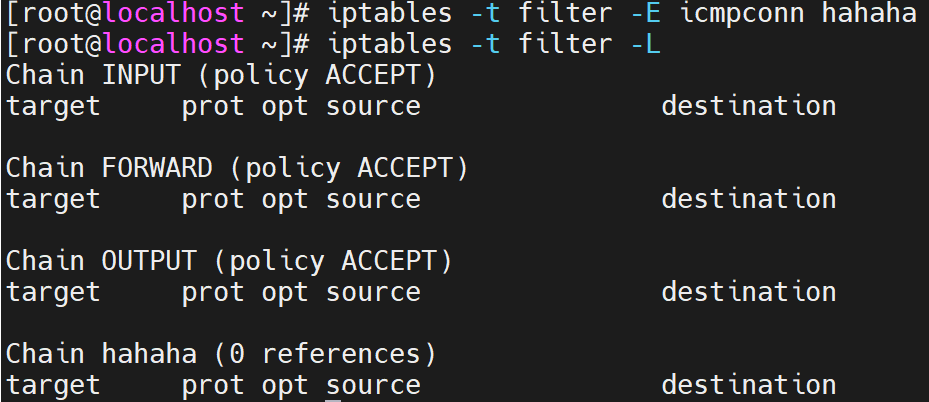

 

##### iptables 내용을 영구 저장

iptables 재시작해서 기본정책 복구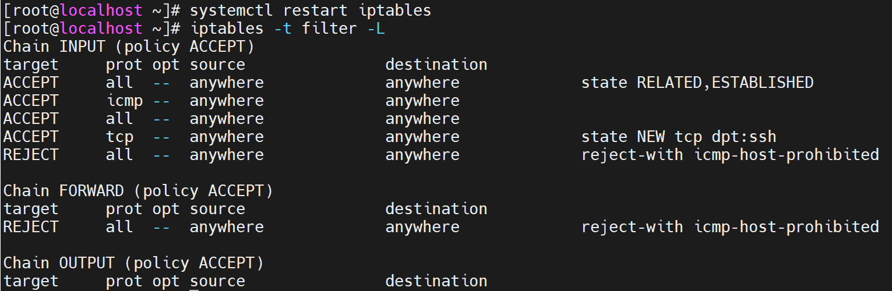

 

원본파일 확인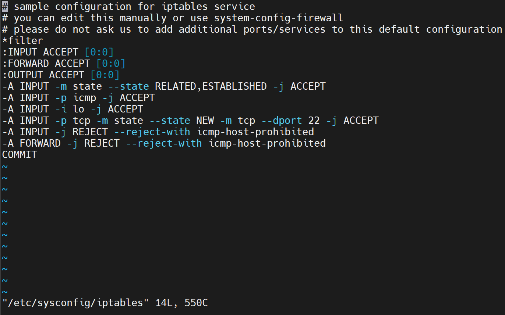

 

안전하게 원본파일 다른곳에 백업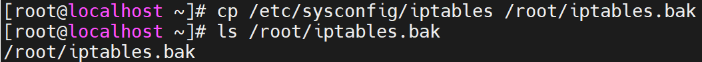

 

정책 초기화 후 ICMP차단 생성 후 정책 저장하기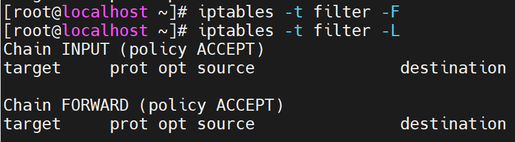

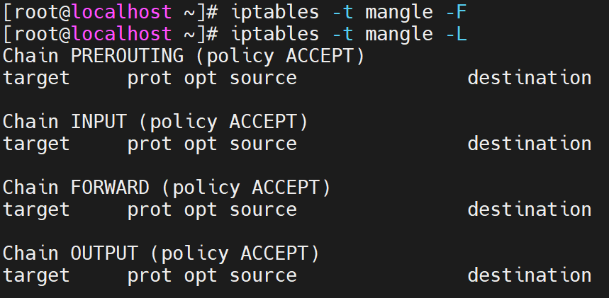

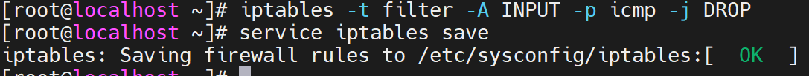

 

원본파일 가서 확인하기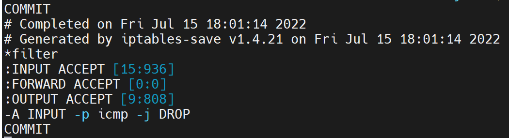

정책에 ICMP DROP확인

 

백업해둔 파일 원본 파일로 다시 복구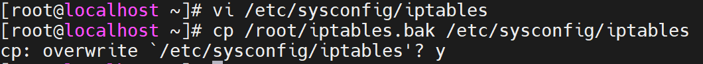

 

기본정책으로 다시 복구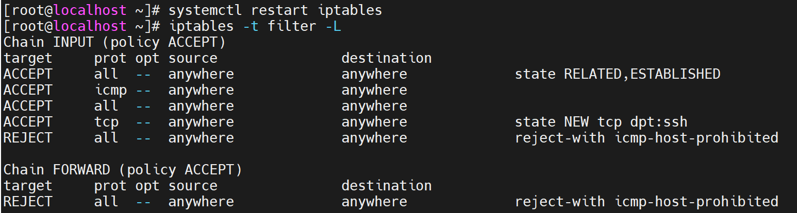

 

 

##### 설정파일을 기본 파일이 아닌 다른 파일로 지정

ICMP 차단으로 설정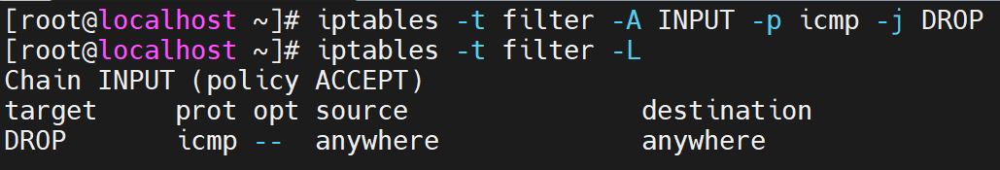

 

다른파일에 현재정책 백업하기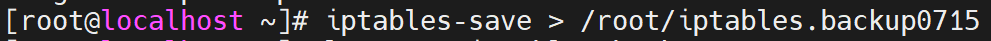

 

백업파일 확인

 

정책 초기화

 

백업파일 불러와서 정책 설정하기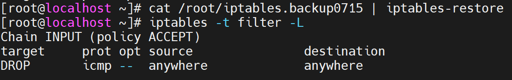

이렇게 원본파일을 백업 하는 방법과 설정되어 있는 정책을 다른 파일로 옮겨 백업하는 방법이 있습니다.

 

 

### script 파일을 이용한 iptables 설정

/etc/sysconfig/iptables 파일을 사용하지 않고 해보겠습니다.

 

우선 iptables가 자동으로 서비스 되지 않도록 설정 합니다.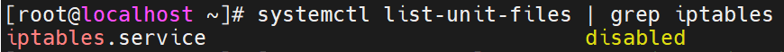

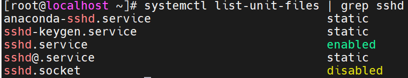

 

script 파일을 작성하고 내용작성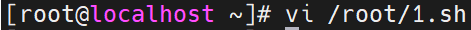

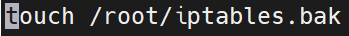

 

파일확인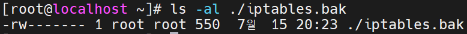

 

파일 실행후 다시 확인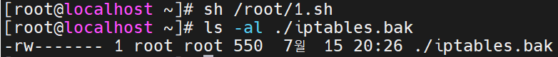

시간 변경 되면서 파일이 실행 되었음을 알 수 있음.

 

 

##### 시스템 시작시 ssh , icmp 만 허용하고 나머지는 모두 거부 하도록 

파일 생성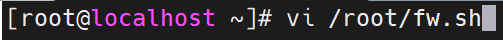

 

실행시킬 명령어, 내용 쓰고 저장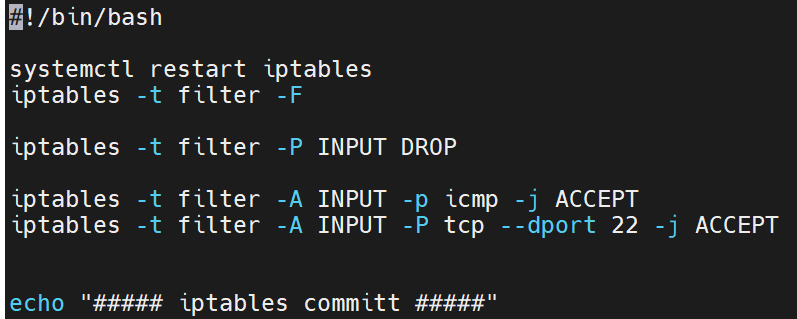

 

파일 실행 후 확인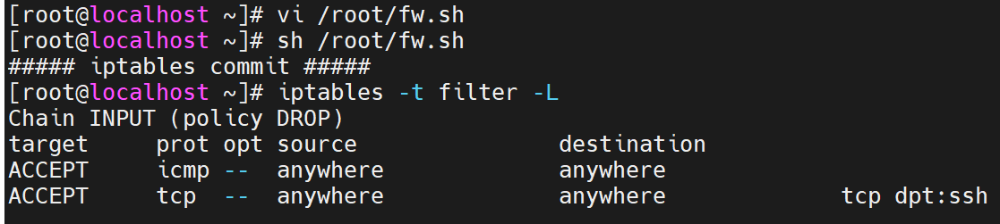

실행이 된 것을 확인 가능.

 

##### 위에서 작성한 fw.sh iptables 설정파일의 내용을 시스템 시작 시 항상 적용

/etc/rc.local 등록하면 자동으로 실행 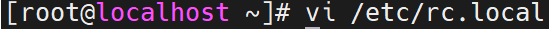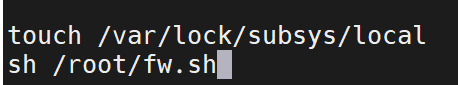

내용추가 하고 재시작

 

재시작 했으나 파일이 실행되지 않음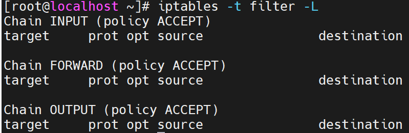

그 이유는 원본 파일에 퍼미션이 없기 때문입니다.

원본 파일에 실행 퍼미션만 부여하고 다시 확인 해보겠습니다.

 

원본파일에 실행 퍼미션 부여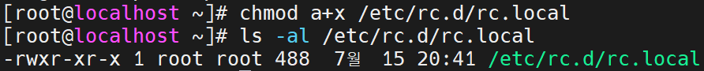

 

재시작 후 확인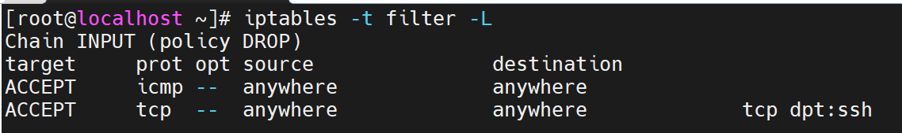

스크립트 파일이 실행 된 것을 보실 수 있습니다.

 

 

 

### mangle tables

패킷의 필드를 변조할 수 있는 table입니다.

 

Window의 기본 TTL은 128 Linux는 64 입니다.

mangle table을 사용해서 Linux의 TTL 셋팅을 바꿔 보겠습니다.

 

mangle table로 TTL셋팅 변경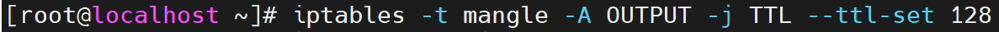

 

바로 XP로 가서 ping을 해보면 원래 TTL이 64로 와야 하지만 128로 오는 것을 확인이 가능합니다.

 

XP에서 Wire shark로 확인

request reply 확인하면 바뀐점 확인 가능

 

