# Nat table

저번의 Firewall_Linux에서 이어지는 실습 입니다.

기본적인 환경설정은 저번과 똑같습니다.

이번에 환경설정은 간단히만 설명 드리고 넘어 가겠습니다.

 

### D NAT 실습

 

환경설정

VM Ware에서 총 3개의 환경을 구성 하겠습니다.

XP : 192.168.164.100

2003 : 192.168.165.100

Linux : 200.200.200.166

XP와 2003에는 host-only로 VMnet1 VMnet2로 연결을 시켜주고

Linux에는 VMnet0 Bridged로 설정을 합니다.

 

이제 Linux를 Router라 생각하고 NAT를 이용해 다른곳과 연결을 해보도록 하겠습니다.

 

우선 D NAT부터 해보겠습니다.

 

우선 ens32를 IP주소 2개로 활용하기 위해 추가해 보겠습니다.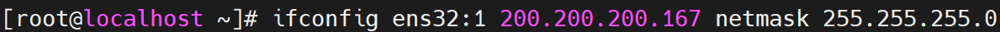

ens32:1을 하나 만들면서 새로운 IP주소를 넣었습니다.

 

ens32 확인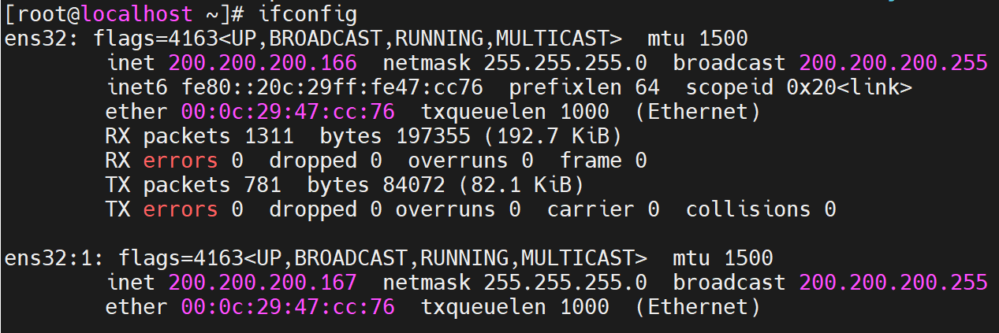

ens32 ens32:1 2개다 생성 된 것을 확인 하시면 제대로 입력이 된겁니다.

 

D NAT를 설정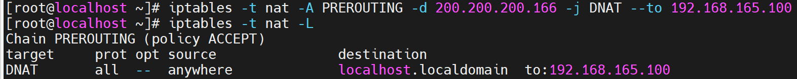

D NAT는 도착지의 IP주소를 바꿔주는 기능을 가지고 있습니다.

 

이제 2003에 가서 웹서버를 다운 받겠습니다.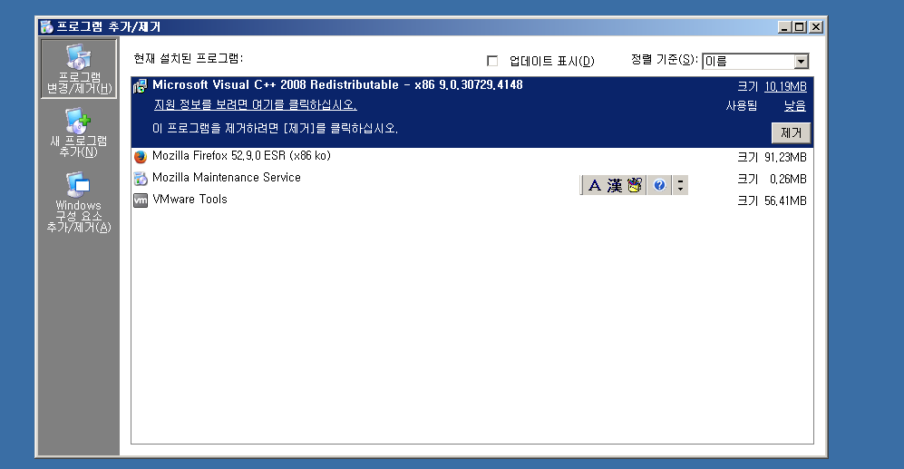

제어판 > 프로그램 추가/제거

 

응용프로그램 체크하고 더블클릭해서 들어가기

인터넷 정보 서비스 체크

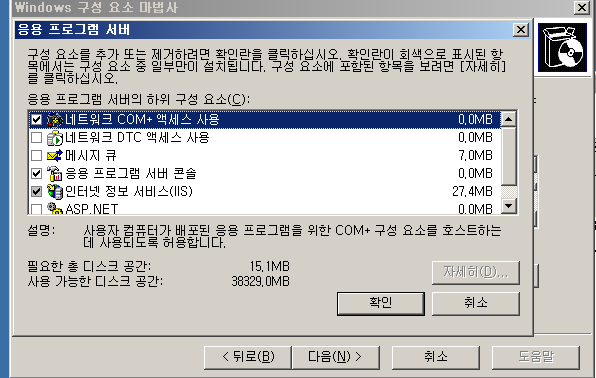

 

2003 인터넷에서 localhost 입력하고 확인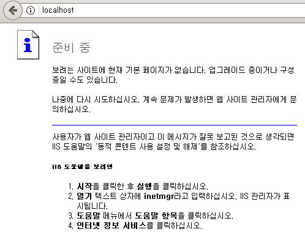

D NAT를 host에서 Test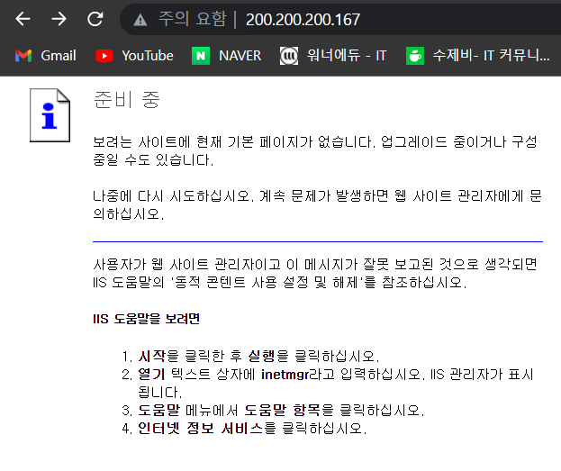

이 페이지가 뜨면 성공 입니다.

D NAT로 도착지의 주소를 2003으로 바꿔둔 상태 입니다.

그래서 200.200.200.167을 입력해도 2003으로 도착하기 때문에 똑같은 페이지가 생성 되는것이 확인 가능합니다.

 

 

 

### S NAT 실습

S NAT를 설정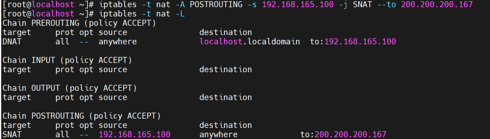

S NAT는 출발지의 주소를 변환해 주는 기능이 있습니다.

출발지와 변환 될 출발지 주소를 입력해 주시면 됩니다.

 

S NAT Test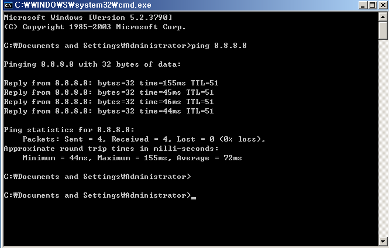

이번에는 출발지의 주소를 바꿔주는 S NAT 였습니다.

 

 

 

### MASQUERADE  : P.A.T 

출발지의  주소가 입력한 네트워크인 경우 -o 나가는 방향 입력한  인터페이스의 주소로 변환되는 기능 입니다.

우선 설정입니다. 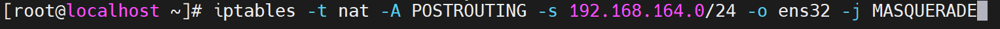

192.168.164.0의 네트워크는 나갈때 ens-32의 주소로 변환되서 나간다 라고 설정 합니다.

 

XP환경에서 인터넷이 되는지 Test 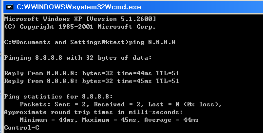

인터넷이 되면 주소 변환이 잘 이뤄지고 나갔다 라는 뜻 입니다.

 

 

 

### DNAT를 이용한 Port Forwarding

우선 기존에 실습했던 NAT Table을 초기화 합니다.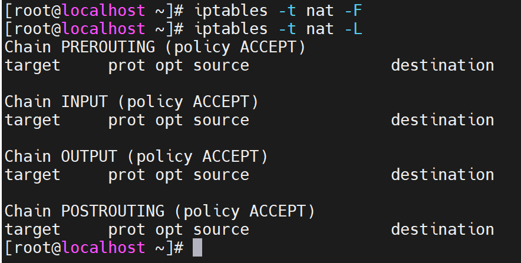

 

Port Forwarding 설정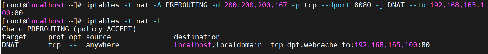

Host pc에서 Test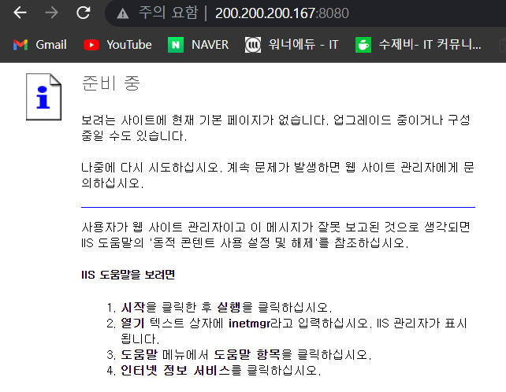

 

 

 

### REDIRECT를 이용한  PortForwarding

여기서는 Cent7 환경도 사용 하겠습니다.

우선 httpd를 다운 받습니다.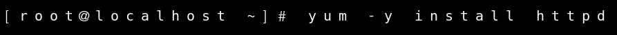

 

인터페이스 환경 수정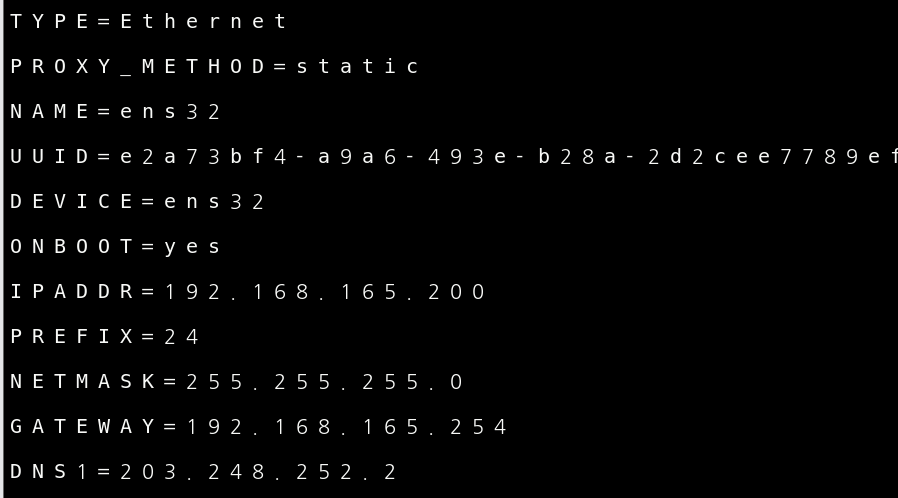

 

PortForwarding 설정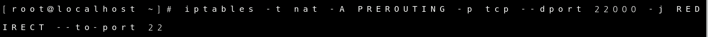

 

XP환경에서 putty를 사용해 cent7 환경에 들어가 보겠습니다.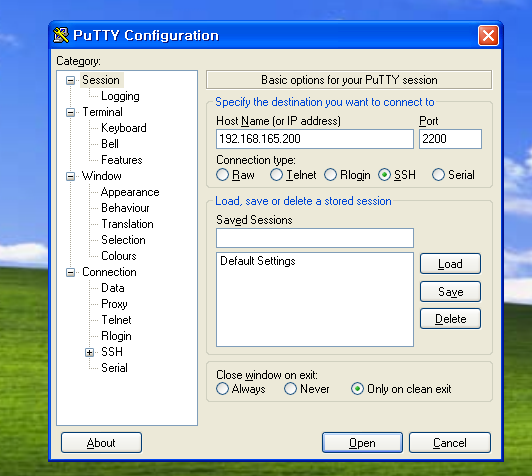

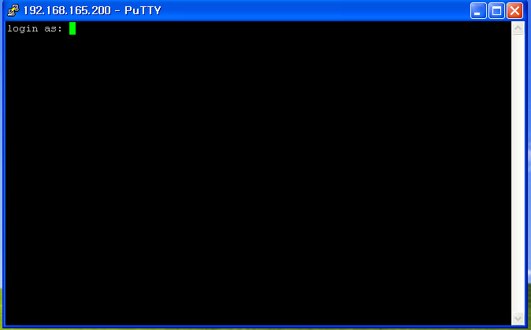

정상적으로 접속이 됬습니다.

REDIRECT를 이용한  PortForwarding은 port 번호를 지정하여 변경 할 수도 있습니다.