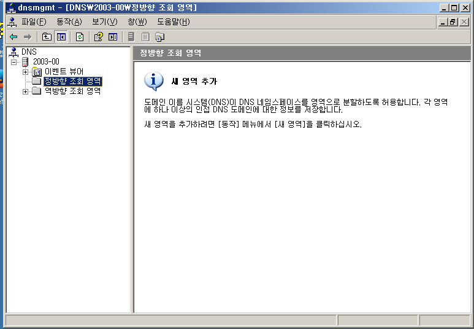

# DNS

##### host 파일의 용도

host 파일은 IP주소 바꿔주는 정보를 가지고 있는 로컬 파일 입니다.

이 파일을 window, linux에서 확인 해 보겠습니다.

 

##### window

c드라이브 > windows > system32 > drivers > etc 로 들어가면 host 파일이 있습니다.

그 파일을 메모장으로 열어서 수정하고 확인 해 보겠습니다.

 

메모장으로 열어서 수정

맨 밑줄에 200.200.200.254 www.nate.com으로 추가해 줍니다.

 

ping으로 확인

설정한 대로 www.nate.com으로 ping을 보내면 200.200.200.254로 나옵니다.

 

메모장에 있던 localhost도 ping을 보내보면

입력되있는 127.0.0.1로 나옵니다.

 

host에서 원래 nate의 주소를 확인해 보겠습니다.

이것이 원래 nate의 ip주소 입니다.

host파일에 ip주소와 이름을 설정하면 ip주소와 이름을 변경 해준다는 것을 window에서 확인해 봤습니다.

 

 

 

##### Linux

이제 linux에서 확인해 보겠습니다.

linux는 /etc/hosts 라는 곳에 host파일이 있습니다.

 

host파일 수정

끝에 쓴 nate, sk로 ping을 보내도 해당 ip주소로 ping이 가능합니다.

 

확인

linux에서도 host파일은 window와 똑같이 ip주소를 바꿔주는 기능이 있는 것을 확인 가능 합니다.

 

 

 

### DNS(domain name system)

host파일에는 문제점이 있습니다.

1. 급격히 증가하는 호스트에 대한 관리 문제가 발생 함

2.  파일의 크기가 증가하면서 업데이트 시 트래픽을 증가 시킴 

3. 호스트의 정보가 갱신될 때 마다 모든 호스트가 파일을 업데이트 해야 함

 

이러한 문제점을 해결하기 위해 나온것이 DNS입니다.

 

 

 

##### DNS 실습

구성도

 

x1 환경설정

 

x2 환경설정, DNS 설치

DNS 설치는 제어판 > 프로그램 추가 제거 > windows 구성요소 추가 제거 > 네트워킹 서비스 > DNS체크 > 확인 > 다음 > CD/DVD ROM 추가 2003관련 iso 선택하여 추가 관리도구 > DNS  확인

이런 아이콘이 생깁니다.

 

##### A Record 설정

 

DNS 클릭

 

새영역 생성 -> 주영역 체크

 

영역이름에 FQDN 입력

 

생성확인

 

레코드 생성하기

이렇게 레코드를 생성하고 x1에서 ping으로 확인 해보겠습니다.

 

x1에서 ping으로 확인

 

##### C NAME

새별칭 설정

 

새별칭 이름 입력

 

새별칭 FQDN 설정

 

생성확인 

 

x1에서 ping으로 Test

 

