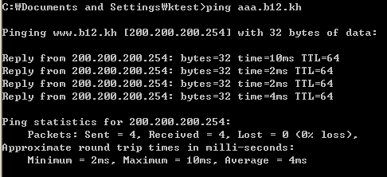
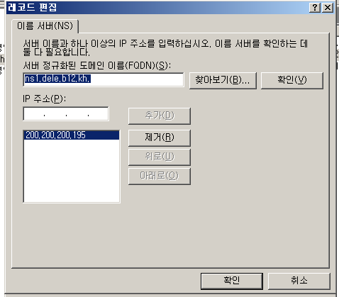
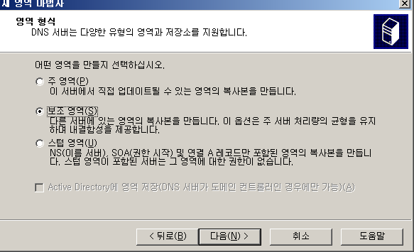
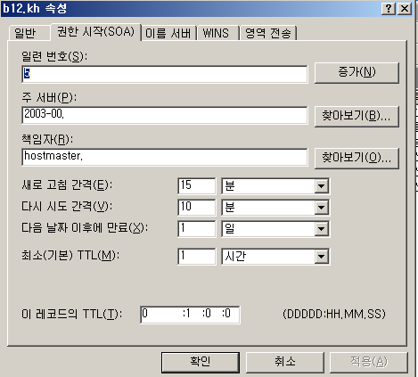

# DNS

##### host 파일의 용도

host 파일은 IP주소 바꿔주는 정보를 가지고 있는 로컬 파일 입니다.

이 파일을 window, linux에서 확인 해 보겠습니다.

 

##### window

c드라이브 > windows > system32 > drivers > etc 로 들어가면 host 파일이 있습니다.

그 파일을 메모장으로 열어서 수정하고 확인 해 보겠습니다.

 

메모장으로 열어서 수정

맨 밑줄에 200.200.200.254 www.nate.com으로 추가해 줍니다.

 

ping으로 확인

설정한 대로 www.nate.com으로 ping을 보내면 200.200.200.254로 나옵니다.

 

메모장에 있던 localhost도 ping을 보내보면

입력되있는 127.0.0.1로 나옵니다.

 

host에서 원래 nate의 주소를 확인해 보겠습니다.

이것이 원래 nate의 ip주소 입니다.

host파일에 ip주소와 이름을 설정하면 ip주소와 이름을 변경 해준다는 것을 window에서 확인해 봤습니다.

 

 

 

##### Linux

이제 linux에서 확인해 보겠습니다.

linux는 /etc/hosts 라는 곳에 host파일이 있습니다.

 

host파일 수정

끝에 쓴 nate, sk로 ping을 보내도 해당 ip주소로 ping이 가능합니다.

 

확인

linux에서도 host파일은 window와 똑같이 ip주소를 바꿔주는 기능이 있는 것을 확인 가능 합니다.

 

 

 

### DNS(domain name system)

host파일에는 문제점이 있습니다.

1. 급격히 증가하는 호스트에 대한 관리 문제가 발생 함

2.  파일의 크기가 증가하면서 업데이트 시 트래픽을 증가 시킴 

3. 호스트의 정보가 갱신될 때 마다 모든 호스트가 파일을 업데이트 해야 함

 

이러한 문제점을 해결하기 위해 나온것이 DNS입니다.

 

 

 

##### DNS 실습

구성도

 

x1 환경설정

 

x2 환경설정, DNS 설치

DNS 설치는 제어판 > 프로그램 추가 제거 > windows 구성요소 추가 제거 > 네트워킹 서비스 > DNS체크 > 확인 > 다음 > CD/DVD ROM 추가 2003관련 iso 선택하여 추가 관리도구 > DNS  확인

이런 아이콘이 생깁니다.

 

 

 

##### A Record 설정

 

문자열을 IP주소로 변환해 주는 역할을 합니다.

DNS 클릭

 

새영역 생성 -> 주영역 체크

 

영역이름에 FQDN 입력

 

생성확인

 

레코드 생성하기

이렇게 레코드를 생성하고 x1에서 ping으로 확인 해보겠습니다.

 

x1에서 ping으로 확인

 

 

 

##### Null host

실제로 있는 개념은 아니지만 이름없는 host도 실행이 가능하기에 null host라고 하겠습니다.

 

이름없이 새 호스트 생성

 

x1에서 ping Test

이름을 설정 안해도 실행이 가능 하다는 것을 확인이 가능 합니다.

 

 

 

##### C NAME

문자열 → A , 또는 다른 CNAME 의 FQDN  ,IP주소를 사용하지 않음

 

새별칭 설정

 

새별칭 이름 입력

 

새별칭 FQDN 설정

 

생성확인 

 

x1에서 ping으로 Test

 

 

 

##### MX

메일서버의 주소를 지정

A Record 하나 생성

 

빈공간에 우클릭 메일교환기 클릭

 

아무것도 안쓰고 찿아보기 들어가서 새로만든 A Record 클릭

 

생성확인

 

 

 

##### SUB - DOMAIN

하위 도메인을 생성하여 직접 관리하는 것을 말 합니다.

 

우클릭 해서 새 도메인 클릭

 

sub라는 이름의 새로운 하위 도메인 생성

 

하위 도메인 들어가서 새 host 생성

 

생성확인

 

x1에서 IP주소 나오는지 확인

DNS는 IP주소로 바꾸는 기능을 합니다.

ICMP나 ping에 관여를 하지 않기 때문에 ping이 가지 않아도 IP주소만 제대로 보여지면 성공 하신 겁니다.

 

 

 

##### delegated domain

하위 도메인의 관리를 직접 하지 않고 다른 서버에 맡기는 것을 말합니다.

 

구성도

 

그 하위 서버 환경을 먼저 구축 하겠습니다.

앞서 진행했던 x5와 똑같이 진행 하면서 IP주소만 다르게 해주시면 됩니다.

 

위임받을 영역 생성 관리도구 > DNS > 서버이름(2003-00-x6) >  정방향 조회 영역(zone) >> 새 영역 > 주 영역 > 영역이름 : dele.b00.kh(위임받을 도메인의 FQDN) > > > 마침  영역안에 NS(NameServer) 의 FQDN 을 생성  dele.b00.kh > 새 호스트 > 이름 : ns1 > 200.200.200.5  순서 입니다.

맨위에 올렸기에 사진은 넘어 가겠습니다.

 

이름서버의 속성  ns1.dele.b00.kh , 200.200.200.x5.1

 

다시 x5로 돌아와서 x5.1로 위임 시킬 준비를 하겠습니다.

빈공간에 우클릭 하고 새위임을 누릅니다.

 

추가 설정을 해줍니다.

 

그리고 x5.1에 A Record를 하나 만들어 줍니다.

 

이제 x1에서 ping으로 Test

 

 

 

##### PTR : 역방향조회 

지금까지는 정방향 조회만 했습니다.

이번에는 역방향 조회 실습 해보겠습니다.

 

역방향 생성

역방향 생성2

역방향은 IP주소가 아니라 Network 주소를 넣는게 다른 점 입니다.

 

우클릭 해서 새포인터 클릭

 

생성확인

역방향은 ping으로 test가 불가능 하기에 test는 나중에 해보도록 하겠습니다.

 

 

 

##### ns lookup

지정된 NameServer 에 ResourceRecord을 조회하는 명령어 입니다.

 

x1에서 ns lookup 명령어 실행

 

Name Server 조회

 

정보확인

 

나머지 정보도 확인

set type으로 레코드 선택을 하고

조회하고 싶은 리소스를 입력하면 조회한 서버이름(Address)와 레코드 값(Name 밑에 Address)이 나옵니다.

 

이제 아까 확인하지 못했던 역방향 조회를 해보겠습니다.

역방향 조회는 정방향과 다르게 IP주소를 입력하여 조회를 합니다.

이 부분이 정방향 과 역방향의 가장 큰 차이점 이라고 할 수 있습니다.

 

SOA

SOA는 도메인시작 , 도메인 영역 정보를 편집할수 있는 권한 , 영역 기본 정보를 보여주는 명령어 입니다.

 

 

 

##### Master Slave

Master - 주영역을 가지고 있는 Server

Slave - 보조영역을 가지고 있는 Server 라고 합니다.

 

구상도

 

x2에 주영역 생성

 

A Record, C name 한개씩 생성

 

x3로 가서 보조영역 생성

여기서 IP주소는 Master의(x2) 주소를 넣어 주셔야 합니다.

  

생성완료

 

Wire Shark로 확인해 보기

x3가 RR정보를 전송해 달라고 x2에 요청을 했지만 거절된 상황입니다. 아직 Master에서 Slave를 지정하지 않아서 이런 상황이 나온 것입니다.

이제 Slave를 지정 해보겠습니다.

 

x2에서 Slave 지정하기

b12.kh 우클릭 > 속성 > 영역전송

 

Master ip주소 입력

적용 > 확인

 

지정된거 확인

 

Wire Shark로 확인

 

ResourceRecord를 추가하기

x2에 새 host를 하나 만들어 줍니다.

 

 x3에서 새로고침 후 확인

추가했던 A Record 확인이 가능 합니다.

 

Wire Shark로 확인

zone change notification 부분이 영역정보가 변경 됨을 x2에서 x3로 전송하는 부분입니다.

 

여기서 Master Slave는 영역에 따라 지정 된다는 점이 중요 합니다. 만약 x3에 주영역을 x2에 보조영역을 설정 했다면 x3가 Master x2가 Slave가 됩니다. 컴퓨터나 Server에 따라 Master Slave가 결정 되는것이 아니라 영역에 따라 지정 된다는 점 유의해서 봐주시기 바랍니다.

 

serial number 의 증가를 이용한  IxFR을 알아 보겠습니다.  

 

x2에서 일련번호를 확인 해 보겠습니다.

b12.kh 우클릭 > 속성 > 권한 시작

보시면 일련번호 5인 것이 보입니다. 여기서 host를 하나 추가 해 보겠습니다.

host 추가하고 확인

host를 하나 추가하고 보니 6으로 올랐습니다.

x3에서도 한번 확인 해보겠습니다.

 

x3에서 확인

x3에도 똑같이 6으로 변경이 되었습니다.

즉 host가 추가 삭제등 변화가  있을 때 마다 일련 번호가 증가하고 이것은 Master에서만 수정이 가능하며 Slave에서는 수정이 불가능 하다를 알 수 있습니다.

 

Wire Shark로 확인 해보겠습니다.

영역정보가 바껴서 아까 위에서 봤던 zone change notification으로 정보를 주고 받는 모습입니다.

IXFR 정보가 움직이는 모습도 확인 가능 합니다.

IXFR은 Zone에 대한 전체 정보가 아닌 변경된 내용만 전송 받는 동기화 방식 입니다.

 

 

 

