# -m : 확장 모듈

### TCP 22,80 포트로 접근을 허용하는 정책을 한 줄로 정의

 

##### -m multiport : 여러개의 포트를 지정을 알아 보겠습니다.

우선 TCP를 사용하기 때문에 httpd 프로그램을 yum을 통해서 설치 합니다.

 

TCP 22,80 포트만 사용 가능하고 나머지는 차단 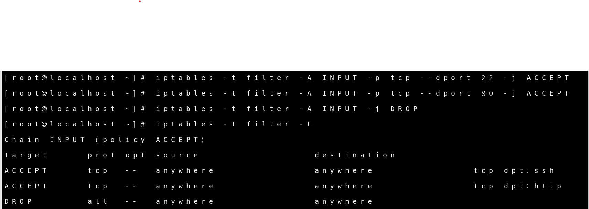

 

ping Test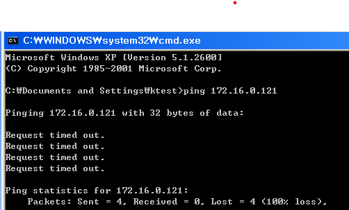

 

SSH Test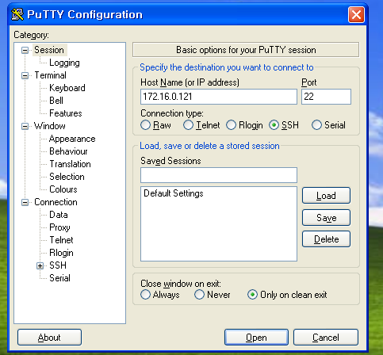

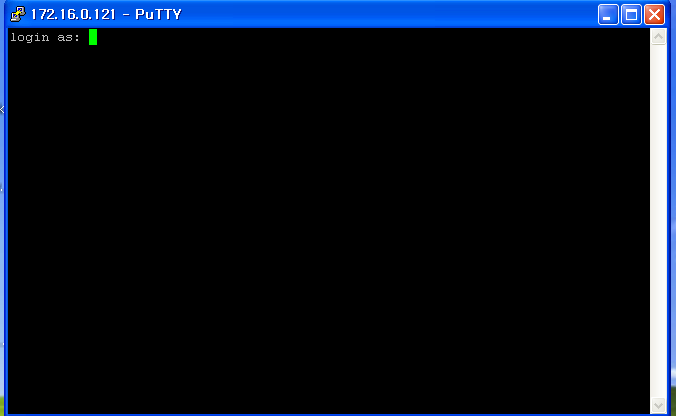

 

Httpd Test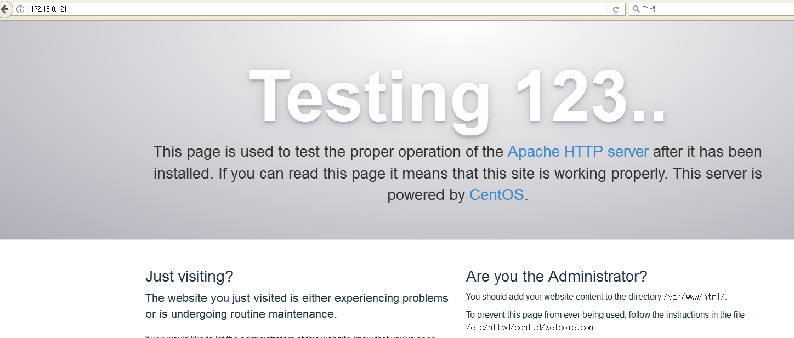

 

이렇게 하나씩 설정하는 것이 아니라 한줄로 요약해서 설정하는 방법을 써 보겠습니다.

-m 명령어에 multuport 라는 옵션을 주면 한줄로 요약이 가능 합니다.

 

한줄로 정의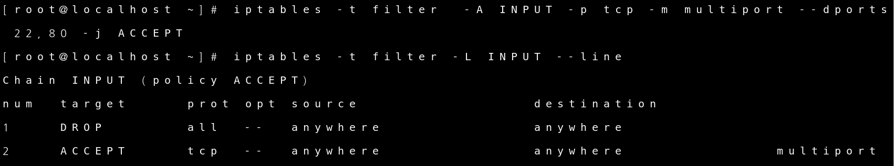

한줄로 정의하고 확인한 설정 입니다.

명령어가 잘못 된 것은 아니나 이것은 잘못 된 설정 입니다.

iptables는 1행부터 정책이 적용이 되기 때문에 all drop이 1행에 있으면 모든 것들이 차단 됩니다.

즉 2행에 방금 설정한 명령어는 쓸모가 없는 명령어가 된다는 것입니다.

iptables는 행의 순서를 맞추는 것이 엄청 중요합니다!!

 

2행을 지우고 -i 옵션으로 1행으로 다시 설정 하겠습니다.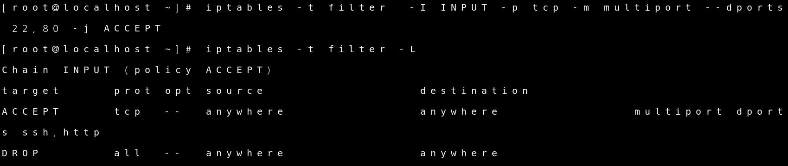

이러면 all drop이 2행으로 내려가기 때문에 1행의 정책이 먼저 실행 됩니다.

 

 

 

### icmp 패킷이 과도하게 전송되는경우 조절하여 일정량 이상은 차단 

 

##### -m limit : 전송량을 조절 , 일정량은 차단을 알아 보겠습니다.

icmp에 특정한 로그가 남도록 설정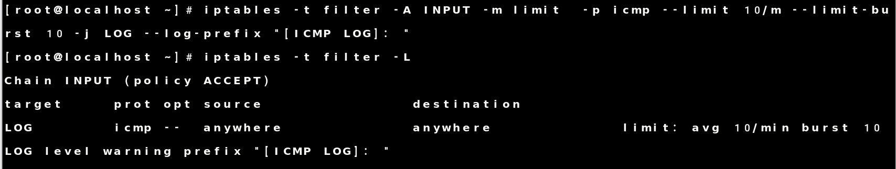

 

XP환경에서 ping보내기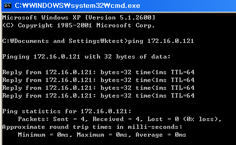

 

tail 명령어로 LOG기록 확인

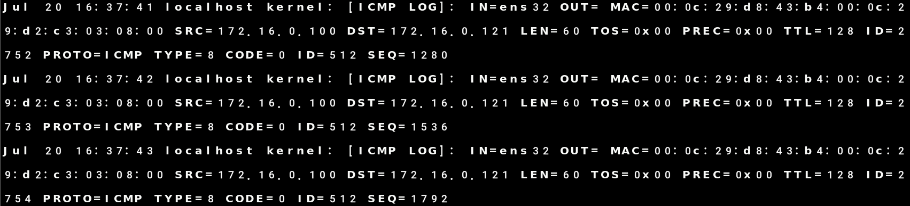

 

INPUT  chain 의 기본정책을 DROP LOG 정책을 ACCEPT 설정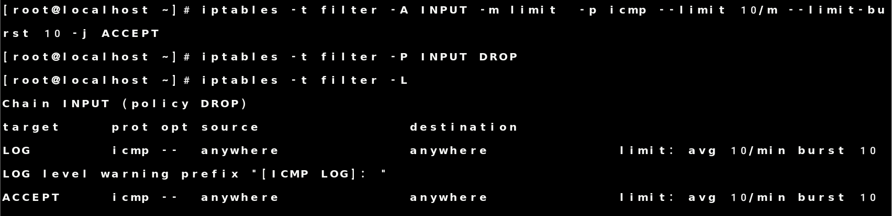

--limit 10/m  : 분당 10회

--limit-burst 10 : limit 적용할때까지 허용할 패킷 갯수 명령어 입니다.

10개까지는 그대로 통과 시키고 6초마다 1개씩 통과 시키라는 뜻 입니다.

 

XP환경에서 -t옵션 으로 ping 보내기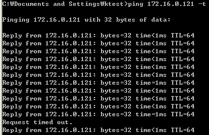

-t 옵션은 ping을 무한으로 보내는 것입니다.

하지만 10번의 ping 이후 끊기는 모습이 보입니다.

이것이 iptables에서 설정 했던 limit의 기능 입니다.

어디든 ping을 무한으로 받게 되면 과부하가 오게 되있습니다. 그러한 일을 방지 하기 위한 설정이라고 보시면 됩니다.

 

 

 

### 상태추적 확인

##### -m state  : TCP 상태를 추적 

TCP 80번 상태 추적 으로 허용 , 22번은 허용 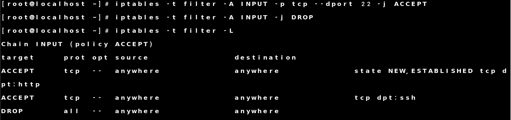

패킷 검사하여 목적지 TCP 22 번이면 무조건 허용

NEW,ESTABLISHED 관련된 tcp 80 번 연결이 있으면 허용으로 설정 합니다.

 

SSH Test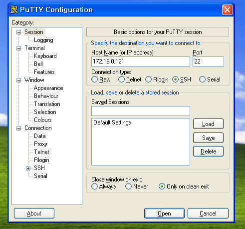

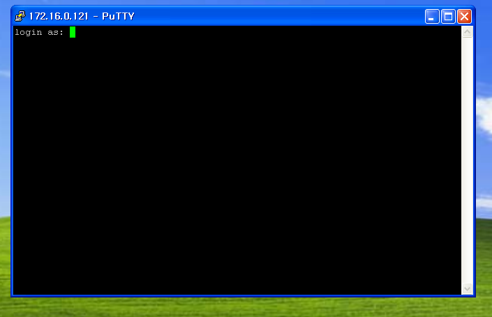

 

Httpd Test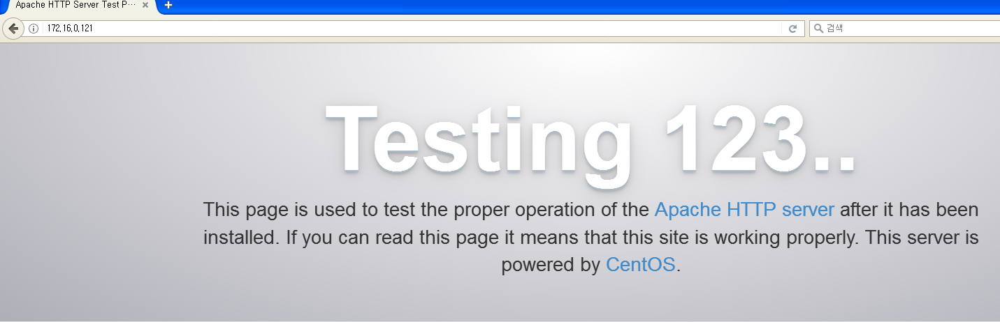

 

서버에 추적된 내용 확인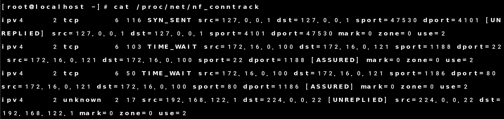

 

