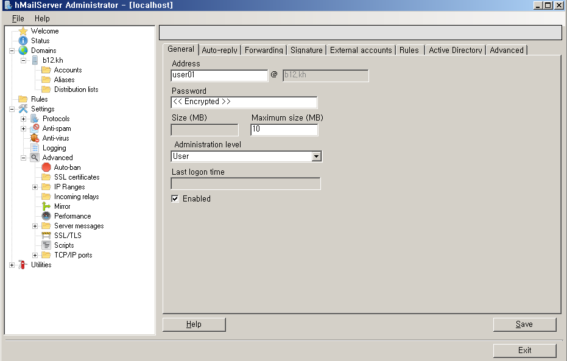
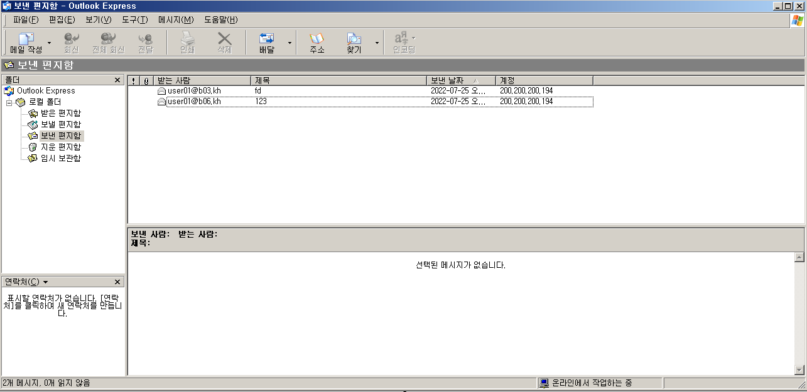

# Mail Service

 

실습 구성도

조원 2명과 같이 메일 서버를 구축하여 서로 메일을 주고 받아 보겠습니다.

 

DNS 부터 설정 하겠습니다.

ns1, mail host 생성하기

 

이름서버 속성 변경

 

메일 교환기 생성

 

x4에서 root hint d1으로 만들기

 

d1 설정

d1에서 d2를 위임하여 d2의 정보를 얻어 오도록 설정 합니다.

 

d2 설정

d2는 d3의 정보를 받아야 하기에 d3-1 d3-2 d3-3을 다 위임하여 정보를 받아 오도록 설정 합니다.

 

d3설정

여기까지 완료 되면 DNS 설정은 끝입니다.

메일 서버 설정을 하러 가겠습니다.

 

Net fx 파일을 설치하고

https://www.hmailserver.com/download 이 홈페이지 에서 메일 서버를 다운 받고 실행, 설정 하겠습니다.

 

메일 서버 설치 전에 Net fx 파일을 설치 해주셔야 합니다.

 

메일 서버 설치

 

설치완료 

다음 다음 install 눌러 주시면 됩니다.

 

메일 서버 설정

Connect를 누르면 password 입력창이 뜹니다.

간단하게 입력 하시고 완료해 주시면 됩니다.

 

Connect 완료

 

x4 환경에서 DNS 삭제

DNS가 충돌 하거나 다른 곳으로 전달 될 수 있어서 삭제 해주도록 하겠습니다.

 

다시 메일 서버 설정으로 돌아와서 enalbe 체크 해제

setting > advanced > autoban > enabled 체크 해제 > save 순으로 해주시면 됩니다.

 

도메인 생성

Domains > add > b00.kh > save  해주시면 생성 완료 입니다.

 

user 생성

address : user01 , Password : 1234 , Maximum size 10

Maximum size는 0으로 두시면 메일이 가지 않습니다.

꼭 설정해 주시기 바랍니다.

 

DNS를 x4로 지정 해주기

DNS설정이 잘못되면 TCP/IP 설정이 잘못되기 때문에 주의 하셔야 합니다.

 

메일 서버 설정 확인하기

set type=mx로 조원들의 주소를 입력해 설정한 대로 ip주소와 이름이 나오는지 확인 해 봅니다.

 

편지 보내기

조원들의 주소인 user01@bxx.kh로 메일을 보내고 받기도 하면서 test 해 보겠습니다.

 

편지 받기

편지 보내고 받기가 정상적으로 되면 성공 입니다.

 

Wire Shark로 dns, pop, smtp를 확인 해 보겠습니다.

 

메일 시작

메일의 시작 부분 입니다.

 

smtp 확인

확장 지원으로 시작 하기 때문에 EHLO로 시작하는 모습이 보입니다. 그 후 나머지 MAIL RCPT DATA QUIT 모두 확인 가능 합니다.

 

