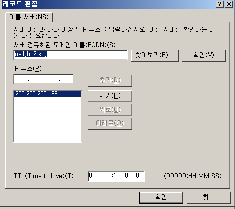

# Mail Service

 

실습 구성도

조원 2명과 같이 메일 서버를 구축하여 서로 메일을 주고 받아 보겠습니다.

 

DNS 부터 설정 하겠습니다.

ns1, mail host 생성하기

 

이름서버 속성 변경

 

메일 교환기 생성

 

x4에서 root hint d1으로 만들기

 

d1 설정

d1에서 d2를 위임하여 d2의 정보를 얻어 오도록 설정 합니다.

 

d2 설정

d2는 d3의 정보를 받아야 하기에 d3-1 d3-2 d3-3을 다 위임하여 정보를 받아 오도록 설정 합니다.

 

d3설정

여기까지 완료 되면 DNS 설정은 끝입니다.

메일 서버 설정을 하러 가겠습니다.

 

Net fx 파일을 설치하고

https://www.hmailserver.com/download 이 홈페이지 에서 메일 서버를 다운 받고 실행, 설정 하겠습니다.

 

메일 서버 설치 전에 Net fx 파일을 설치 해주셔야 합니다.

 

메일 서버 설치

 

설치완료

다음 다음 install 눌러 주시면 됩니다.

 