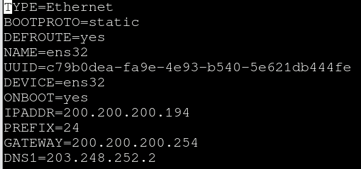
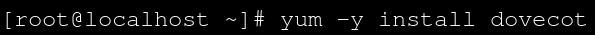

# Linux Mail Server

 

구상도

 

Interface 설정

 

postfix 설치하기

postfix는 smtp 역할을 해주기 때문에 필수로 설치해 주셔야 합니다.

 

postfix 설정변경

`vi /etc/postfix/main.cf` 로 들어가시면 됩니다.

하나라도 틀리면 postfix가 동작하지 않습니다.

정확하게 입력 해주셔야 합니다!!

 

postfix 재시작 상태확인

 

dovecot 설치

dovecot또한 pop3 역할을 해주기 때문에 필수로 설치 해 주셔야 합니다.

 

