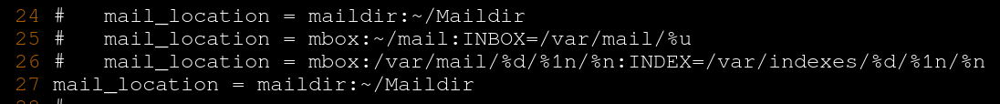
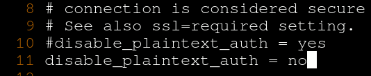
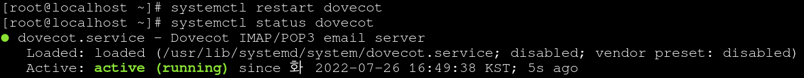
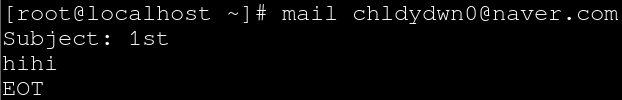
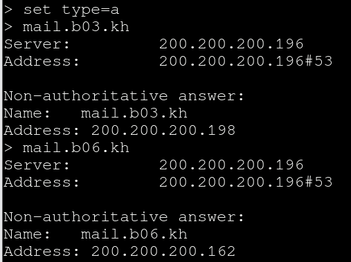

# Linux Mail Server

 

구상도

 

Interface 설정

 

postfix 설치하기

postfix는 smtp 역할을 해주기 때문에 필수로 설치해 주셔야 합니다.

 

postfix 설정변경

`vi /etc/postfix/main.cf` 로 들어가시면 됩니다.

하나라도 틀리면 postfix가 동작하지 않습니다.

정확하게 입력 해주셔야 합니다!!

 

postfix 재시작 상태확인

 

dovecot 설치

dovecot또한 pop3 역할을 해주기 때문에 필수로 설치 해 주셔야 합니다.

 

dovecot 설정변경 1

`/etc/dovecot/dovecot.conf`  들어가서 24행을 복사해서 붙여넣고 주석해제만 해주시면 됩니다.

 

dovecot 설정변경 2

`/etc/dovecot/conf.d/10-mail.conf` 24행을 복사해서 26행 밑에 붙여넣어 주시고 주석을 해제 해주시면 됩니다.

메일함 위치 홈디렉터리 아래 Maildir/ 에 두겠다는 뜻 입니다.

 

dovecot 설정변경 3

10 행을 복사해서 11행에 붙여넣고 10행을 주석처리 해주신 다음에 yes를 no로 바꾸면 됩니다.

암호화를 평문으로 사용 하겠다는 뜻 입니다.

 

dovecot 설정변경 4

8행을 복사 붙여넣고 ssl = no 로 바꿔주시면 됩니다.

 

dovecot 재시작, 상태확인

설정을 변경 했으니 제대로 적용이 되었는지 재시작, 상태확인을 해 봅니다.

 

이제 메일이 잘 보내 지는지 Test를 해 보겠습니다.

 

mailx 확인

 

메일 보내기

마지막에 ctrl + d를 누르시면 종료 됩니다.

 

메일함 가서 확인 하기

아마 스팸 메일함에 메일이 하나 와 있을 겁니다.

naver가 안되시는 분들은 gmail로 시도 해보시기 바랍니다.

 

이제 DNS주소를 x4 주소로 바꿔 줍니다.

 

nslookup을 사용해서 서버 확인 해보기

`set type=mx` 로 먼저 확인 한 상태 입니다.

 

`set type=a ` 로 확인 한 상태 입니다. 

