# Linux Mail Service

 

구상도

 

Interface 변경

 

postfix 설치

postfix는 smtp 역할을 해주기 때문에 필수적으로 설치 해주셔야 합니다.

 

postfix 설정 변경 1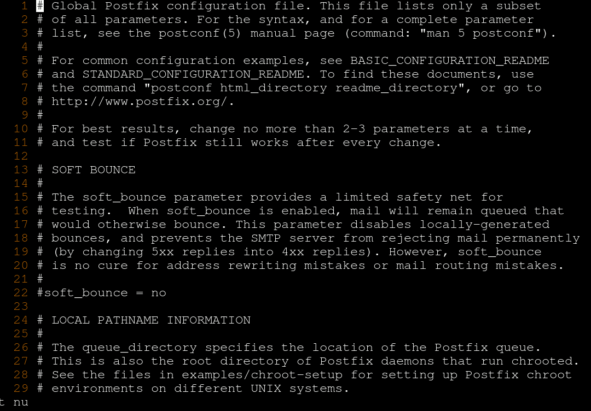

/etc/postfix/main.cf에 들어가셔서 아래와 같이 변경 해주시면 됩니다.

 

postfix 설정 변경 2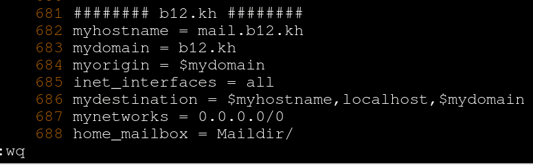

위의 내용을 맨밑에 넣어 주시면 됩니다.

 

postfix 재시작, 상태확인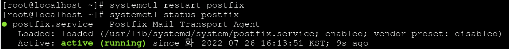

설정을 변경 하였기 때문에 재시작 하고 잘 동작하고 있나 확인 해주는 과정 입니다.

 

dovecot 설치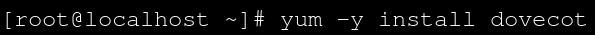

dovecot은 pop3의 역할을 해주기 때문에 역시 필수적으로 설치 해주셔야 합니다.

 

dovecot 설정 변경 1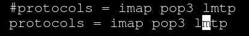

/etc/dovecot/dovecot.conf에서 24번행 복사 25행에 붙여넣기

24번행 주석처리 25번행 주석해제 해주시면 됩니다.

 

dovecot 설정 변경 2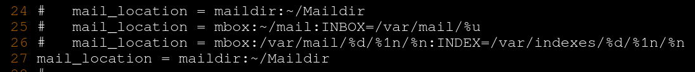

/etc/dovecot/conf.d/10-mail.conf에서 24번행 복사 27행에 붙여넣기 하고 주석해제 해주시면 됩니다.

메일함의 위치를 홈디렉터리 아래 Maildir로 하겠다 라는 뜻 입니다.

 

dovecot 설정 변경 3

/etc/dovecot/conf.d/10-auth.conf에서 10번행 복사 11번행에 붙여넣기 하고 yes를 no로 수정 해주시면 됩니다.

 

dovecot 설정 변경 4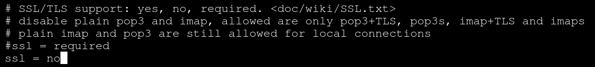

/etc/dovecot/conf.d/10-ssl.conf에서 8번행 복사 9번행에 붙여넣기 하고 no로 수정 해주시면 됩니다.

 

dovecot 재시작, 상태확인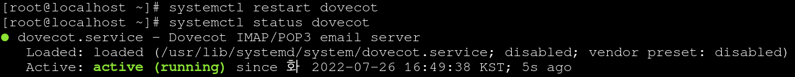

이번에도 설정을 변경 하였기에 재시작 하고 잘 동작하는지 확인 해 주셔야 합니다.

 

mailx 확인

 

mail 보내기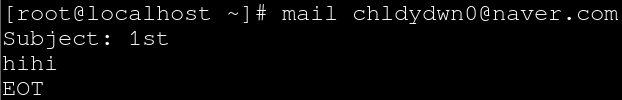

마지막에 ctrl + d를 누르시면 종료 됩니다.

 

mail 확인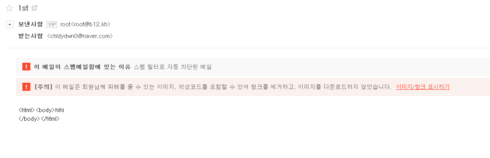

naver로 하시면 보통 스팸 메일함에 있습니다. naver로 했는데 안되신 분들은 gmail로 해보시기 바랍니다.

 

DNS 주소변경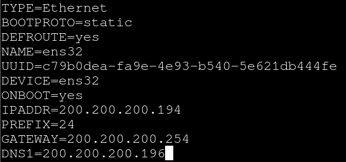

 

서버 구성 확인 1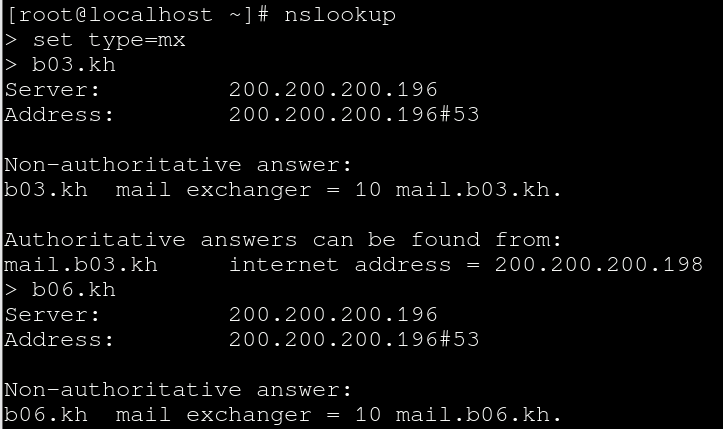

set type = mx 입니다.

 

서버 구성 확인 2

set type = a 입니다.

두개의 명령어 다 서버 구성을 확인 할 때 쓰는 명령어 입니다.

 

test용 user01 생성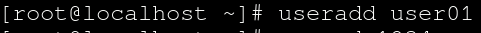

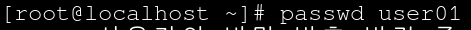

 

x1에서 아웃룩 설정 변경

리눅스 에서는 계정 이름에 user01만 써주셔야 합니다.

 

메일 주고 받기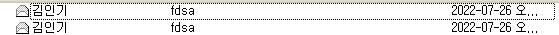

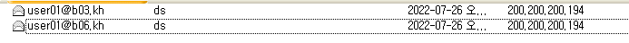

메일 주고 받기 성공입니다!!

 

Linux에서 pop3 smtp 확인하기

정상적으로 동작하는 것도 확인 하였습니다.

 

