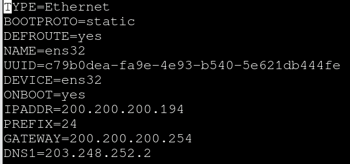
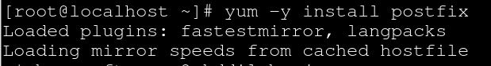
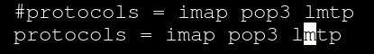
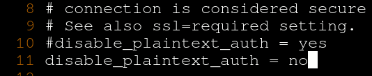
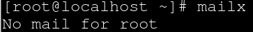
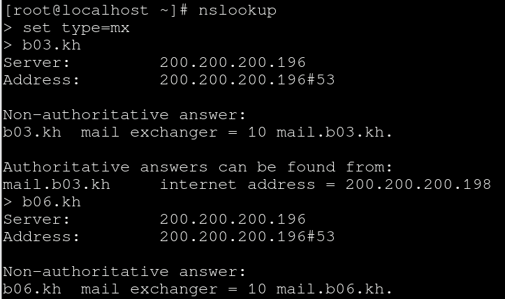
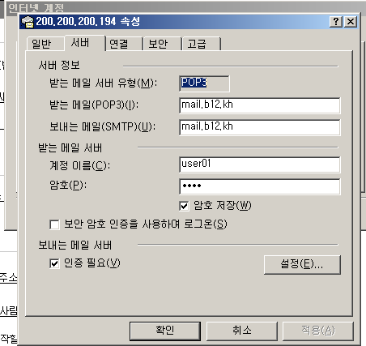
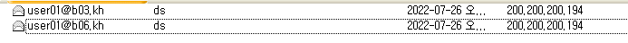
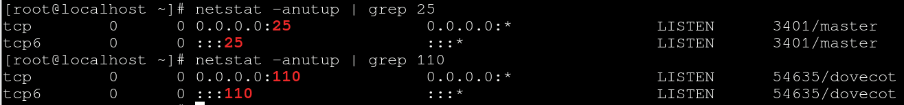

# Linux Mail Serviece

 

구상도

 

interface 설정

 

postfix 설치

postfix는 smtp 역할을 합니다. 필수적으로 설치 해주셔야 합니다.

 

postfix 설정 변경

vi etc/postfix/main.cf에 들어가시면 됩니다.

 

postfix 설정 변경 2

위의 내용들을 맨 밑줄에 추가해 주시면 끝 입니다.

 

postfix 재시작, 상태확인

설정을 변경 하였으니 재시작 하고 제대로 작동하는지 확인을 해줍니다.

 

dovecot 설치

 

dovecot 설정 변경 1

/etc/dovecot/dovecot.conf에 가서 24행을 복사 25행에 붙여넣고 주석해제

 

dovecot 설정 변경 2

/etc/dovecot/conf.d/10-mail.conf에 가서 24행 복사 27행에 붙여넣고 주석해제

메일함 위치를 홈 디렉터리 밑에 /Maildir로 지정하겠다 입니다.

 

dovecot 설정 변경 3

/etc/dovecot/conf.d/10-auth.conf에 가서 10행을 복사 11행에 붙여넣기 주석해제 yes를 no로 수정 합니다.

 

dovecot 설정 변경 4

/etc/dovecot/conf.d/10-ssl.conf에 가서 8행을 복사 9행에 붙여넣기 ssl = no 로 수정해 주시면 됩니다.

 

dovecot 재시작, 상태확인

설정을 수정 했으니 재시작 하고 제대로 작동하는지 확인해 줍니다.

 

mailx 확인

 

mail 보내기

마지막에 ctrl + d를 눌러 주시면 끝납니다.

 

메일함 가서 확인

위에서 입력 하신 메일함으로 가서 확인해 보시면 메일이 아마 스팸 메일함에 있을 겁니다. naver가 안되시는 분들은 gmail로 해보시기 바랍니다.

 

DNS 주소 변경

 

서버 구축 확인 set type=mx

 

서버 구축 확인 set type=a

서버가 제대로 구축 되었는지 조원들과 자신의 서버를 확인 해 볼 수 있는 명령어 입니다.

 

test용 user01 생성

 

아웃룩 설정 변경

Linux는 window와 다르게 계정 이름에 주소를 넣으면 안됩니다.

계정 이름 user01만 넣으시기 바랍니다.

 

메일 주고 받기

메일 주고 받기에 성공 하였습니다.

 

Linux에서 tcp pop3 확인

제대로 작동하는 모습을 확인 가능 합니다.

 

