# DHCP Service

 

### Host 설정 종류

##### maual configuration : 직접 입력

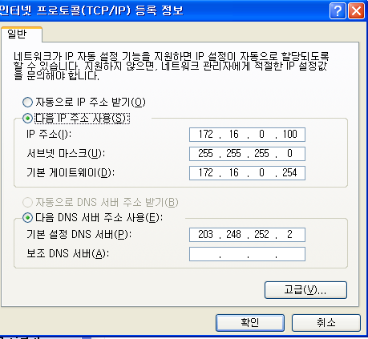

win + r 을 누르고 ncpa.cpl을 누르고 속성에 들어 가시면 나오는데 여기에 직접 사용할 주소를 입력 하는 방법 입니다.

 

##### dynamic configuration : 다른 서버에서 주소를 부여받는 방법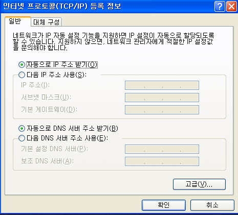

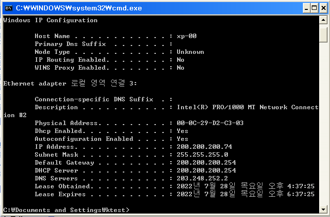

자신이 사용할 주소를 직접 입력 하는게 아니라 다른 서버에서 주소를 부여 받아오는 방법 입니다.

  

##### auto configuration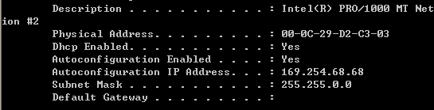

중간에 Autoconfiguration이 보이는데 이것은 주소를 서버로 부터 부여받지 못하는 경우 통신을 위해 자동으로 입력되는 주소 입니다.

  

##### APIPA : B class 의 bogon IP주소 

###### bogon IP주소 종류

  

###### zero 주소

특수 목적으로 사용되는 예약 주소

###### Network 주소

각 네트워크를 대표하는 네트워크 주소

###### Direct Brodcast 주소

각 네트워크에서만 사용되는 Brodcast 주소

###### Local Brodcast 주소

전체 네트워크에서 사용되는 Brodcast 주소

###### Multicast 주소

Multicast Group을 위해 할당되는 주소

###### Loopback 주소

자기자신을 나타내는 로컬 주소

###### 자동 대체 할당 주소

자동 할당에 실패했을 때 임의로 할당하는 주소

###### 사설 IP 주소

공식적인 승인 없이 임의로 사용할 수 있는 주소

내부 통신용으로만 사용 가능

  

##### TCP/IP configuration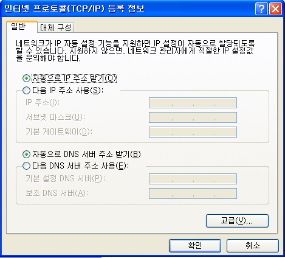

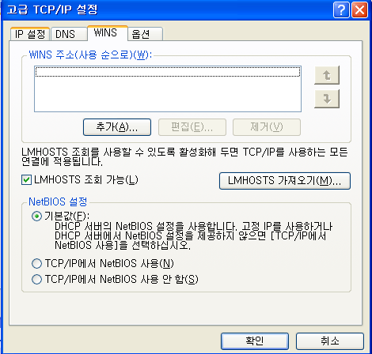

IP address, Subnet mask, routing(G/W), DNS Server 는 네트워크내에서의 유일성을 위해 필요

  

  

##### DHCP  서버 만들기

구상도

  

Client 설정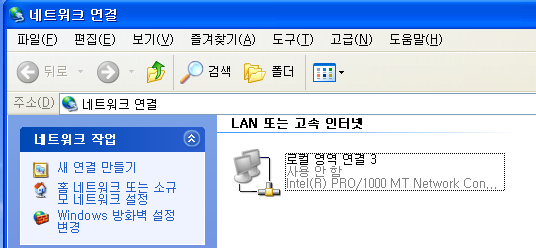

ncpa.cpl > 로컬 영역 연결 사용안함 

  

Server 구성 1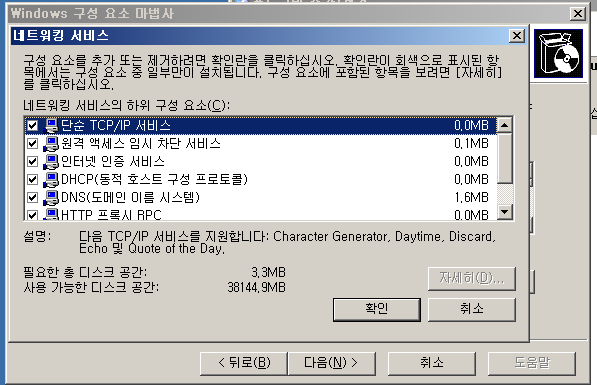

제어판 > 프로그램 추가 제거 > Windows 구성요소 > 네트워킹 서비스 > DHCP 서비스 추가

  

Server 구성 2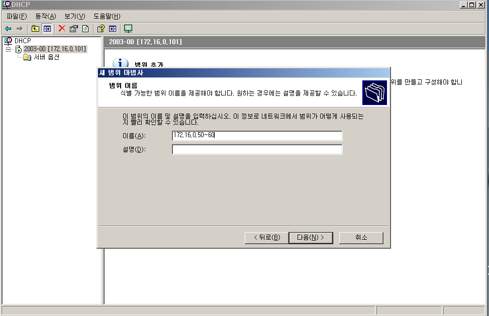

관리도구 > DHCP

컴퓨터 이름 > 새 범위 > 이름 : 172.16.0.50~60 >

 

Server 구성 3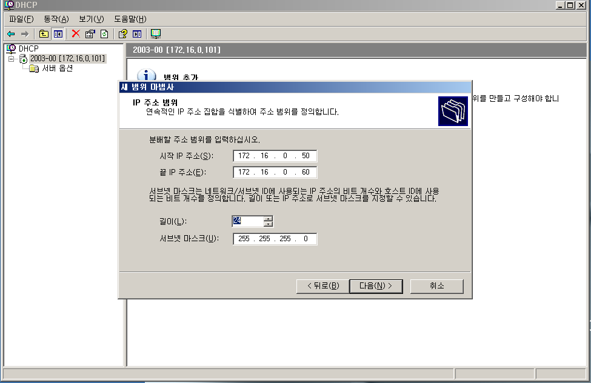

 

Server 구성 4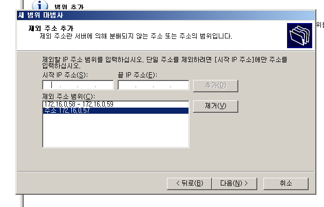

 

Server 구성 5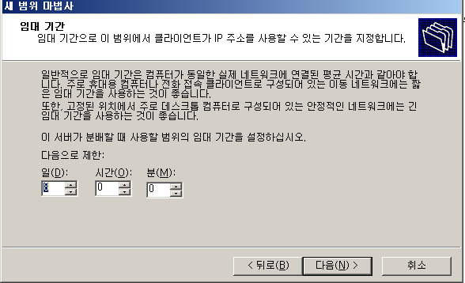

 

Server 구성 6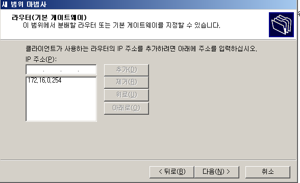

 

Server 구성 7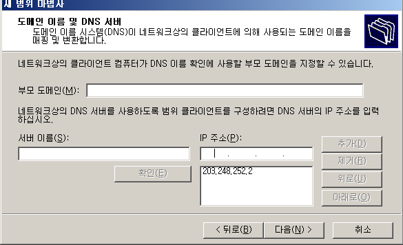

 

Server 구성 8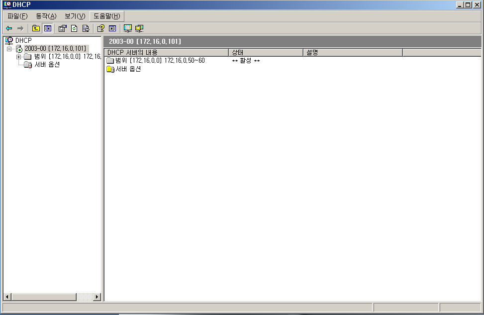

완료 입니다.

 

2003에서 Wire Shark 실행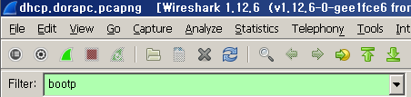

Filter에 bootp 입력

 

Client 네트워크 연결 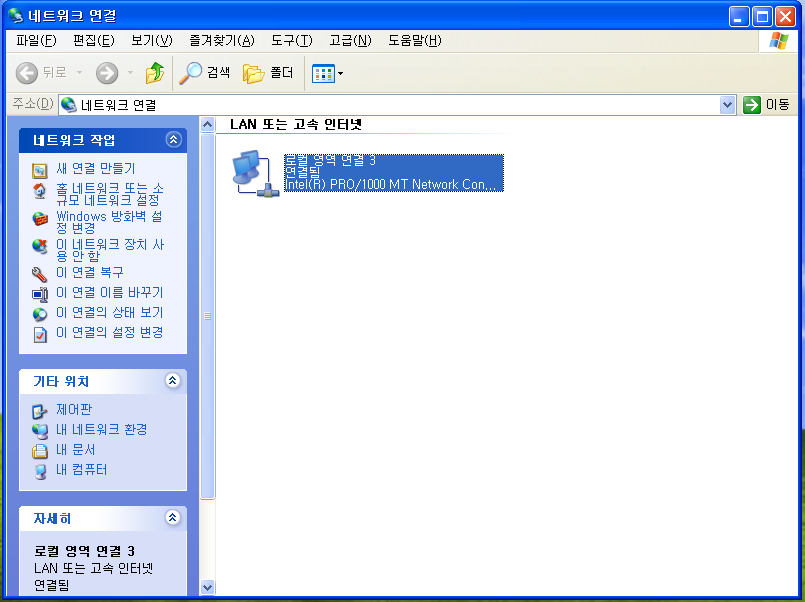

 

Wire Shark 확인

