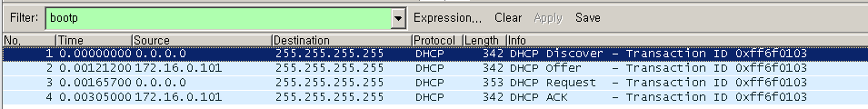

# DHCP Service

 

### Host 설정 종류

##### maual configuration : 직접 입력

win + r 을 누르고 ncpa.cpl을 누르고 속성에 들어 가시면 나오는데 여기에 직접 사용할 주소를 입력 하는 방법 입니다.

 

##### dynamic configuration : 다른 서버에서 주소를 부여받는 방법

자신이 사용할 주소를 직접 입력 하는게 아니라 다른 서버에서 주소를 부여 받아오는 방법 입니다.

  

##### auto configuration

중간에 Autoconfiguration이 보이는데 이것은 주소를 서버로 부터 부여받지 못하는 경우 통신을 위해 자동으로 입력되는 주소 입니다.

  

##### APIPA : B class 의 bogon IP주소 

###### bogon IP주소 종류

  

###### zero 주소

특수 목적으로 사용되는 예약 주소

###### Network 주소

각 네트워크를 대표하는 네트워크 주소

###### Direct Brodcast 주소

각 네트워크에서만 사용되는 Brodcast 주소

###### Local Brodcast 주소

전체 네트워크에서 사용되는 Brodcast 주소

###### Multicast 주소

Multicast Group을 위해 할당되는 주소

###### Loopback 주소

자기자신을 나타내는 로컬 주소

###### 자동 대체 할당 주소

자동 할당에 실패했을 때 임의로 할당하는 주소

###### 사설 IP 주소

공식적인 승인 없이 임의로 사용할 수 있는 주소

내부 통신용으로만 사용 가능

  

##### TCP/IP configuration

IP address, Subnet mask, routing(G/W), DNS Server 는 네트워크내에서의 유일성을 위해 필요

  

  

##### DHCP  서버 만들기

구상도

  

Client 설정

ncpa.cpl > 로컬 영역 연결 사용안함 

  

Server 구성 1

제어판 > 프로그램 추가 제거 > Windows 구성요소 > 네트워킹 서비스 > DHCP 서비스 추가

  

Server 구성 2

관리도구 > DHCP

컴퓨터 이름 > 새 범위 > 이름 : 172.16.0.50~60 >

 

Server 구성 3

 

Server 구성 4

 

Server 구성 5

 

Server 구성 6

 

Server 구성 7

 

Server 구성 8

완료 입니다.

 

2003에서 Wire Shark 실행

Filter에 bootp 입력

 

Client 네트워크 연결 

 

Wire Shark 확인

Wire Shark를 보면 Discover, Offer, Request, Ack가 보이는데 이것들은 DHCP 메시지 입니다. (주소 할당 순서)

동작 방식은 위의 사진대로 Client가 IP주소를 Server에 요청하면 Server가 응답하며 IP주소를 주는 방식 입니다.

이 방식은 Ack가 끝날때 까지는 주소를 사용할 수 없습니다.!!!!

 

이 과정을 하나씩 뜯어서 보면

Discover

Client가 Server에 IP주소를 달라고 요청하는 과정입니다.

 

Offer

Server가 Client에게 IP주소를 주는 모습 입니다.

 

Request

A를 가진 Client가 C에게 offer 받은 주소 B를 사용 하겠다 라는 뜻 입니다.

 

Ack

Server에서 사용 요청한 172.16.0.50를 승인을 해주고

사용기간은 8일(lease time)

4일(50% ,Renewal time) 이내에 재사용 요청 (request) 만약에 못하

면 7일(87.5% rebinding time) 정도까지 하되 그안에 못하면 8일

(lease time)되면 취소 라는 뜻의 내용들이 적혀 있습니다.

 

 

 

###  DHCP 임대기간 - 자동 갱신

 

현재 임대시간 확인

Client에서 ipconfig /all로 확인

 

Server에서 lease time 2분으로 변경

 

주소 임대 해제

 

주소 재임대

주소를 재임대 하면 임대 기간이 2분으로 바뀐것이 확인 가능 합니다.

 

Wire Shark 확인

Request -> Ack가 2분 간격으로 이뤄지는데 계속 갱신이 되는 과정이 잡 Wire Shark에 나타난 부분 입니다.

 

DHCP 작업중지

일시중지 를 한번 해보고 Wire Shark를 보겠습니다.

 

Wire Shark 확인

계속 renewal을 시도 하다가 rebinding time 임대해제 된 모습 입니다.

 

Client 확인

APIPA - Bclass의 bogon IP주소로 설정이 된 모습 입니다.

 

filter를 해제하고 Wire Shark를 다시 보겠습니다.

Gratuitous ARP가 보입니다.

Gratuitous ARP는 APIPA 겹치는것 또는 일반적으로 컴퓨터 시작시 IP주소 중복 체크를 합니다.

 

 

 

### DHCP 임대기간 - 자동 갱신

DHCP 다시 시작

DHCP를 다시 시작하면 Wire Shark에 inform이 잡히는데 이게 다시 시작하는 과정 입니다.

 

임대기간 변경

임대기간을 다시 8일로 변경 하겠습니다.

 

주소 재 임대

ipconfig /release      ipconfig/renew로 재임대 해주시면 됩니다.

 

재 임대 확인 ipconfig /all

 

수동 갱신 ipconfig /renew

 

Wire Shark 확인

Client에서 수동 갱신 후 Server에서 Wire Shark를 확인 해 보시면 Request Ack가 확인 가능 합니다.

 

 

 

### DHCP 임대주소가 중복되는경우

구상도

 

이번에는 임대주소가 중복되는 경우를 보기 위해 172.16.0.50을 사용하는 컴퓨터를 한 대 더 만들어 주시면 됩니다.

 

Server에서 DHCP 정지

 

추가한 컴퓨터 IP주소 변경

 

Server에서 DHCP 사용

 

임대주소 중복 확인

DHCP Decline이 임대주소가 중복이 되었다는 뜻 입니다.

이렇게 임대주소 중복이 확인 가능 합니다.

 

 

 

