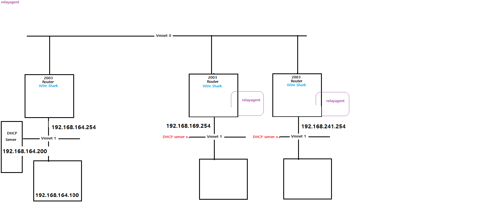
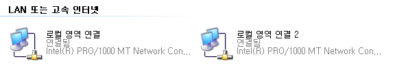
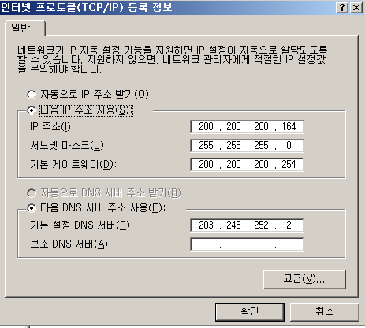
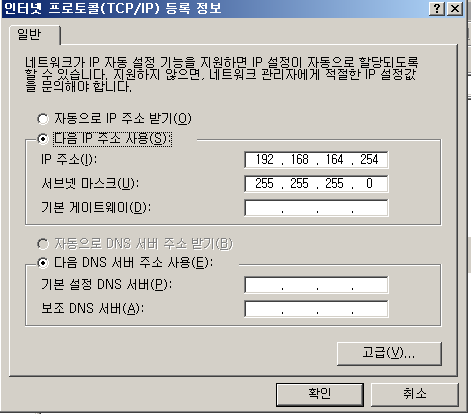
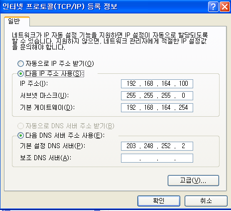
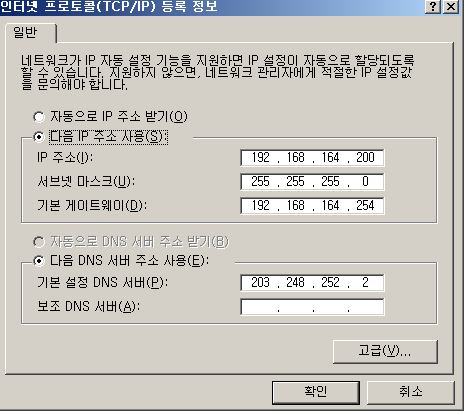
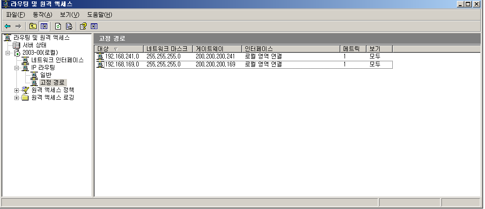
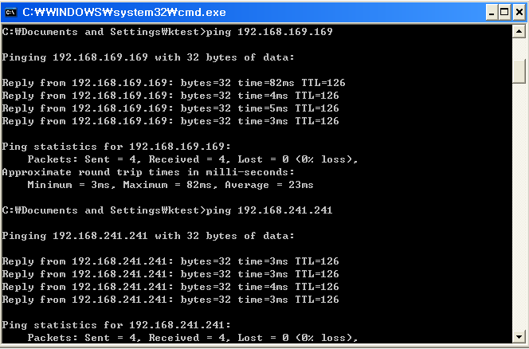
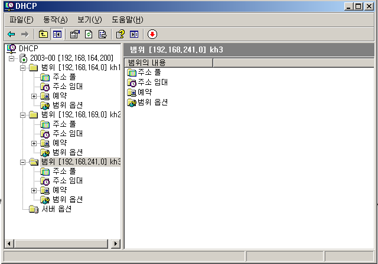
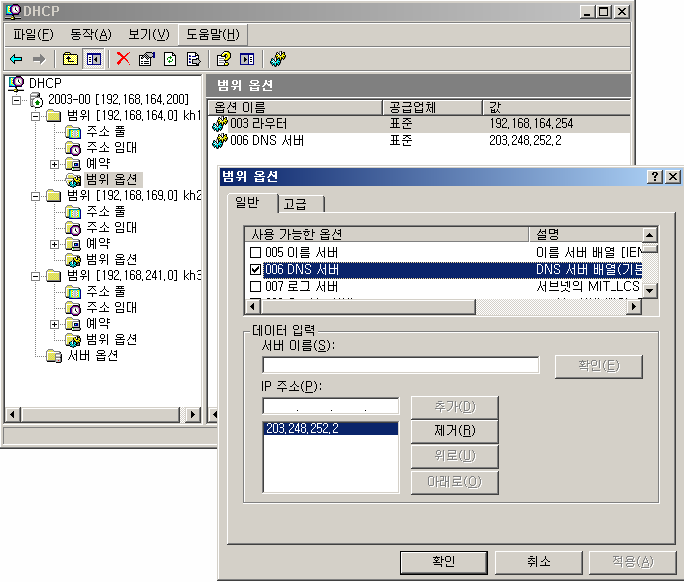

# DHCP Relay agent

 

구상도

 

Router 인터페이스 설정

하나는 정상적인 ip주소를 넣어 사용하고 다른 한개는 Vmnet1로 설정하고 게이트웨이로 사용하기 위해 위와 같이 설정 했습니다.

 

Client 인터페이스 설정

 

DHCP Server 인터페이스 설정

 

Static Routing

조원 2명과 Static Routing을 적용 합니다.

 

ping 확인

Client에서 조원들의 Client와 통신이 되는지 확인 합니다.

 

DHCP Server에서 DHCP 생성

범위는 각자 192.168.x.50 ~ 60으로 공통적으로 설정 하였습니다.

 

DNS 설정

범위옵션 에서 DNS서버로 들어가서 DNS 주소를 추가 해 주도록 합니다.

 

