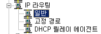

# DHCP Relay agent

 

구상도

 

Router 인터페이스 설정

하나는 정상적인 ip주소를 넣어 사용하고 다른 한개는 Vmnet1로 설정하고 게이트웨이로 사용하기 위해 위와 같이 설정 했습니다.

 

Client 인터페이스 설정

 

DHCP Server 인터페이스 설정

 

Static Routing

조원 2명과 Static Routing을 적용 합니다.

 

ping 확인

Client에서 조원들의 Client와 통신이 되는지 확인 합니다.

 

DHCP Server에서 DHCP 생성

범위는 각자 192.168.x.50 ~ 60으로 공통적으로 설정 하였습니다.

 

DNS 설정

범위옵션 에서 DNS서버로 들어가서 DNS 주소를 추가 해 주도록 합니다.

 

DHCP Relay agent 설정 1

Router PC에서 일반 > 우클릭 > 새 라우팅 프로토콜

DHCP 릴레이 에이전트 생성 누르고 확인

 

DHCP Relay agent 설정 2

왼쪽에 DHCP 릴레이 에이전트 생성된거 확인

 

DHCP Relay agent 설정 3

새 인터페이스 선택

 

DHCP Relay agent 설정 4

이 설정은 discover 수신 전달할 영역을 설정하는 것이기 때문에 아무거나 선택 하시면 안되고 discover에 맞는 영역을 선택 해 주셔야 합니다.

 

DHCP Relay agent 설정 5

DHCP Server IP주소를 넣어 주시면 됩니다.

 

Wire Shark 확인

Wire Shark를 2개 켜주시면 됩니다.

 

Wire Shark 확인.PNG)

.PNG)

Discover, Offer, Request, Ack 모두 잘 잡혔습니다.

DHCP가 정상적으로 작동 했다는 뜻입니다.

 

Wire Shark를 2개를 킨 이유는 Relay agent가 있고 없고의 차이를 보기 위해서 입니다.

왼쪽은 Relay agent가 안 잡힌 모습

오른쪽은 Relay agent가 잡힌 모습 입니다.

이것을 통해서 Relay agent의 역할을 알 수 있습니다.

offer의 기준은 discover 의 relayagent IP address 와 NA  가 같은 

범위를 찾아서 offer 한다. 라고 할 수 있겠습니다.

 