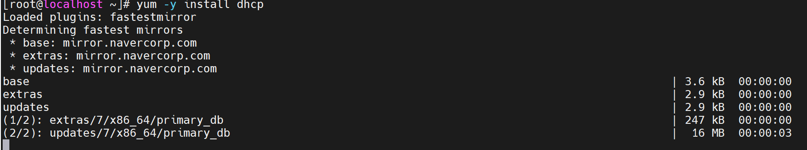
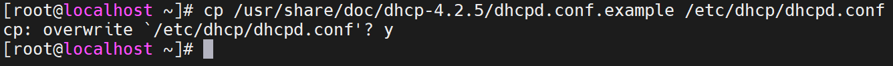
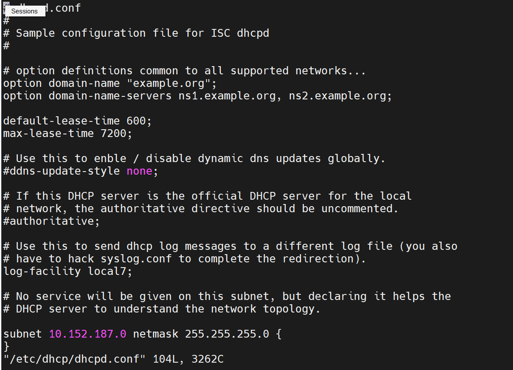
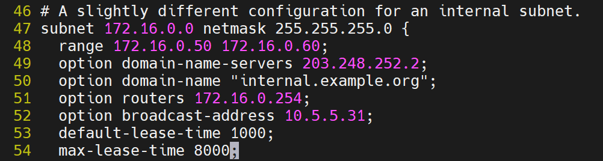
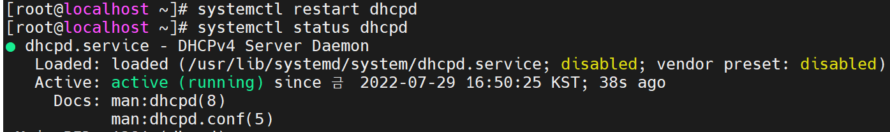
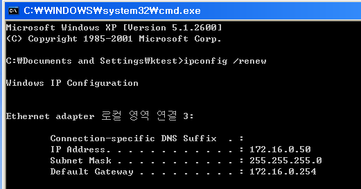
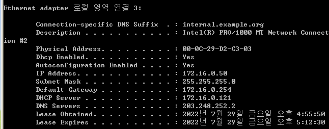

# Linux DHCP

 

필요한 환경 설치

 

DHCP는 설치파일이 비어 있습니다.

설치파일은 vi /etc/dhcp/dhcpd.conf인데 안에 주석처리 몆줄 되어있고 내용이 없기에 샘플파일에서 내용을 끌어 오겠습니다.

이렇게 파일을 끌어오면

이렇게 내용이 채워지게 됩니다.

 

파일 수정

 

DHCP 재시작

설정을 변경 했으니 데몬을 재시작 하고 상태를 확인 합니다.

 

Client에서 확인

주소를 제대로 받은 모습이 확인 가능 합니다.

 

자세히 확인

DHCP Server에 Linux IP주소가 들어가 있습니다.

Linux Server에서 제대로 DHCP를 받아온 모습 입니다.

 

