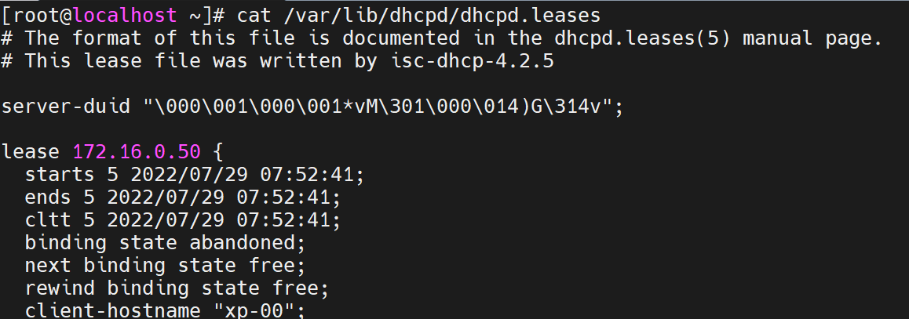

# Linux DHCP

 

필요한 환경 설치

 

DHCP는 설치파일이 비어 있습니다.

설치파일은 vi /etc/dhcp/dhcpd.conf인데 안에 주석처리 몆줄 되어있고 내용이 없기에 샘플파일에서 내용을 끌어 오겠습니다.

이렇게 파일을 끌어오면

이렇게 내용이 채워지게 됩니다.

 

파일 수정

 

DHCP 재시작

설정을 변경 했으니 데몬을 재시작 하고 상태를 확인 합니다.

 

Client에서 확인

주소를 제대로 받은 모습이 확인 가능 합니다.

 

자세히 확인

DHCP Server에 Linux IP주소가 들어가 있습니다.

Linux Server에서 제대로 DHCP를 받아온 모습 입니다.

 

이번엔 Linux Client로 하나 더 만들어서 해 보겠습니다.

Linux Client 인터페이스 설정

DHCP로 주소를 받을 예정이기 때문에 bootproto=dhcp로 해주시고 밑에 IP주소 관련된 것들은 주석처리 해주시면 됩니다.

 

Network 재시작

인터페이스 설정을 바꿧으니 Network 재시작을 한번 해줍니다.

 

그러고 나서 IP확인

이제 IP주소를 확인해 보시면 설정해 놨던 DHCP 주소로 들어가 있는 모습이 확인 됩니다.

 

DNS정보 확인

 

G/W정보 확인

DHCP가 정사적으로 들어 왔음을 확인 하는 방법들 입니다.

 

Server에서 확인

Server에서도 IP가 제대로 배정 되었는지 확인 가능 합니다.

 

