# FTP

 

구상도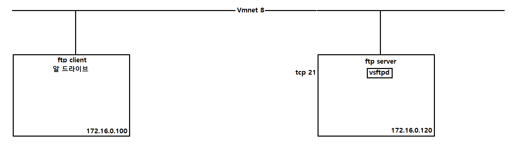

 

ftp client 환경구성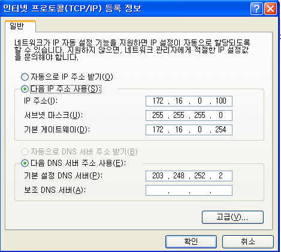

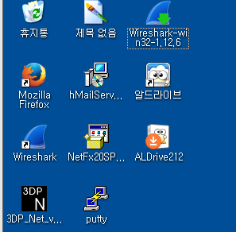

인터페이스 주소를 넣고 알 드라이브를 설치 합니다.

 

server 환경구성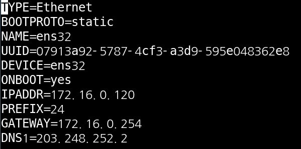

 

ping 확인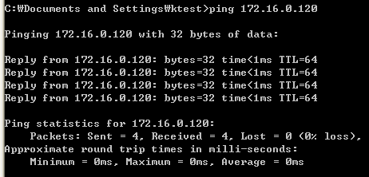

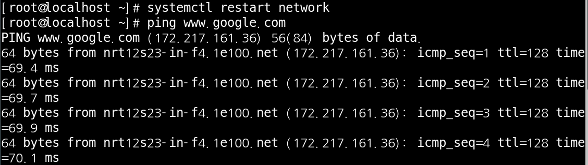

 

server에서 ftp 설치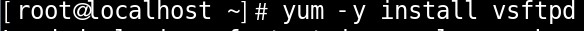

 

server ftp 확인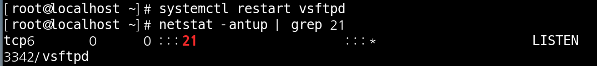

 

client에서 알 드라이브 접속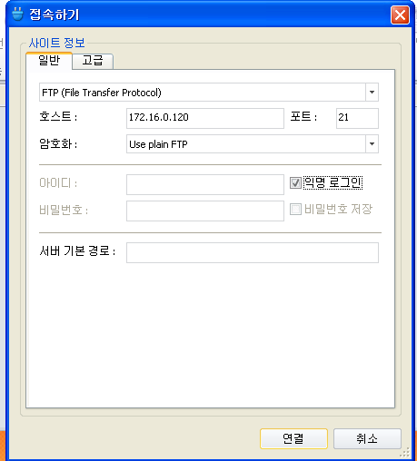

 

Wire Shark로 확인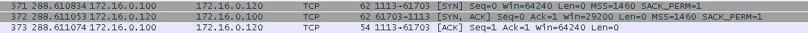

3way-hand shake : TCP 21 확인 가능

 

ktest 로그인 해서 확인 해보기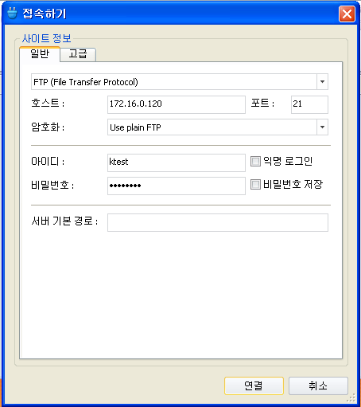

 

Wire Shark 확인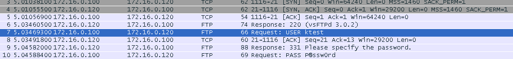

ID Password가 그대로 드러나는 모습이 보입니다.

보안에 매우 취약한 모습이 그대로 드러나는 모습 입니다.

 

root 로그인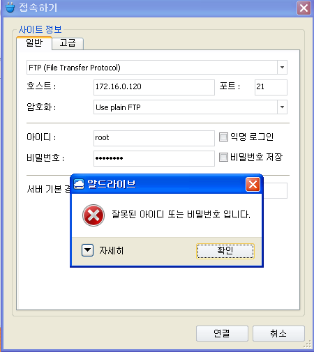

로그인이 안되는데 Wire Shark로 확인 해보겠습니다.

 

Wire Shark 확인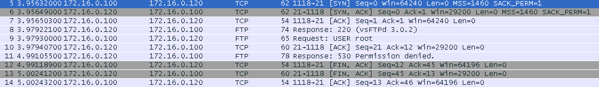

ktest와 다르게 비밀번호 입력이 되기 전에 막히는 모습 입니다.

root는 기본적으로 접근이 안되게 설정이 되어 있기 때문 입니다.

이제 이 root가 차단되어 있는 곳에 가서 그 설정을 바꾸고 다시 로그인 해 보겠습니다.

 

root 차단해제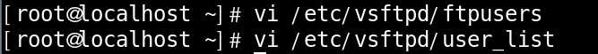

위의 2군데에 들어가서 root를 주석처리 해주시면 됩니다.

 

root 주석처리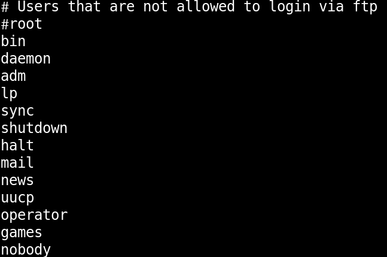

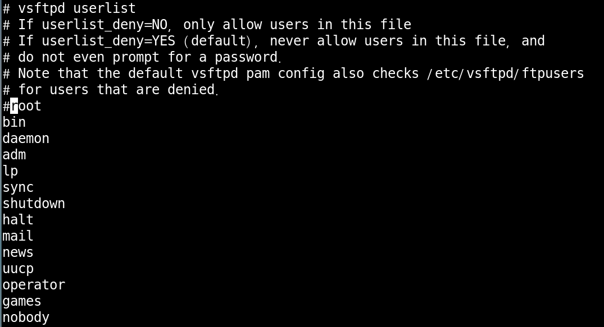

 

client에서 root 로그인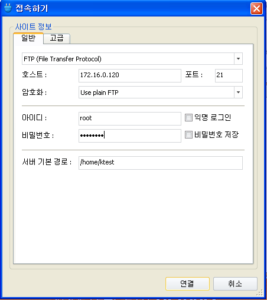

 

Wire Shark 확인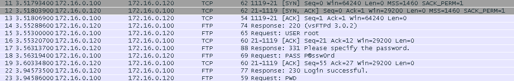

root 차단을 해제하니 로그인이 되는 모습 입니다.

 

업로드 다운로드 해보기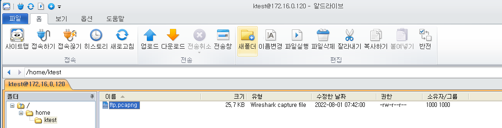

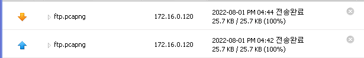

업로드 다운로드 둘 다 성공 했습니다.

root ktest는 다운로드 업로드 둘 다 가능 하지만 익명유저는 업로드는 안되지만 다운로드는 가능 합니다.

 

익명유저 파일 만들기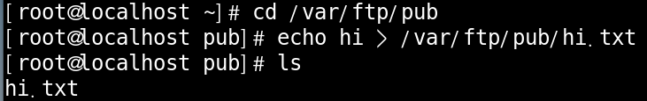

`/var/ftp/pub` 가 익명유저가 있는 곳 입니다.

여기서 파일을 하나 만들고 다운로드를 시도 해 보겠습니다.

 

익명유저 다운로드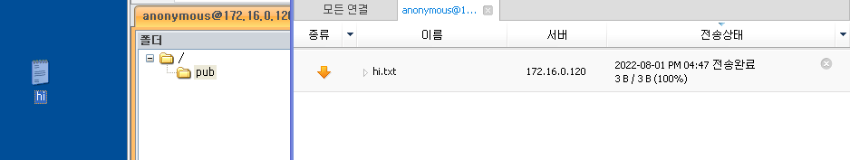

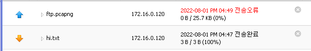

다운로드는 가능 합니다. 하지만 업로드는 불가능 합니다.

 

 

 

### FTP 연결 방식

ftp 연결 방식은 control connection, data connection 2가지가 있습니다. 

접속할때 control connection (TCP 21)과 data connection (TCP 20) 2번 접속이 됩니다.

control connection (TCP 21)

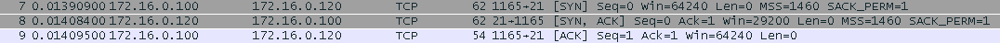

data connection (TCP 20) 

각자 다른 포트 번호로 접속하는 모습 입니다.

 

data connection은 2가지의 방법이 있습니다.

active, passive 방식이 있는데 구분하는 방법은 3way handshake의 시작점에 따라 달라 집니다.

active는 data connection의 시작점이 server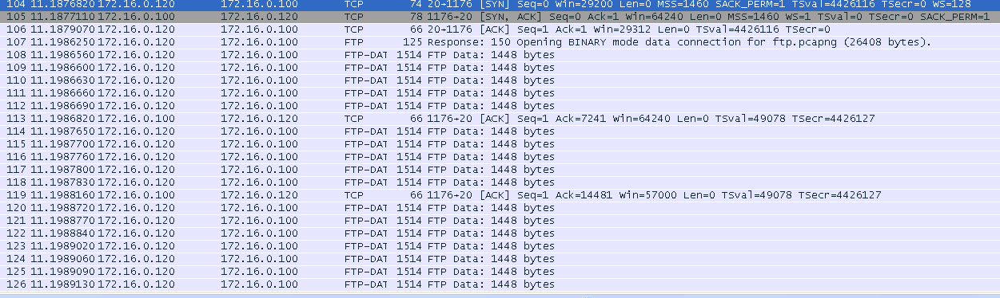

passive는 data connection의 시작점이 client 입니다.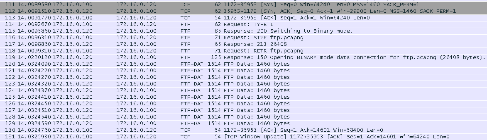

 

 

 

### 익명사용자 접근거부

익명사용자 파일 찿기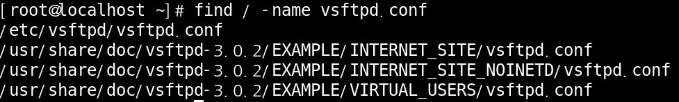

 

익명사용자 파일 수정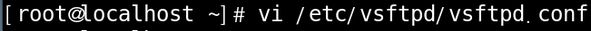

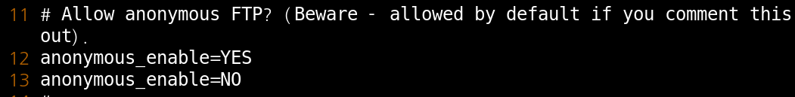

 

데몬 재시작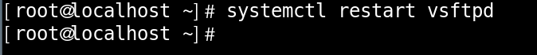

 

익명사용자 로그인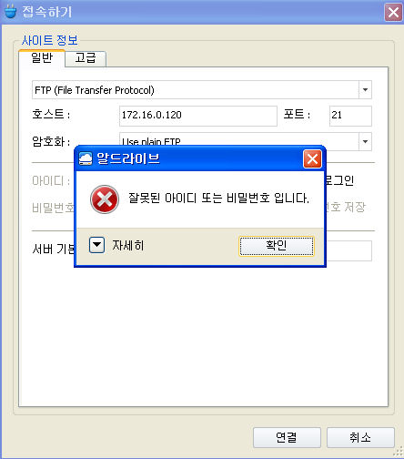

접근 거부 완료.

 

 

 

### 익명사용자 pub 하위로 디렉터리및 파일 생성

파일 수정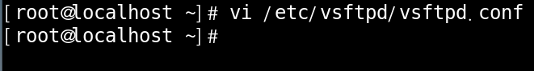

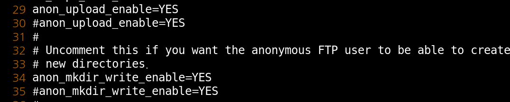

 

재시작

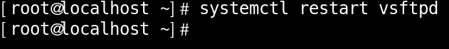

 

이렇게 해도 아직 디렉터리가 생성되지 않습니다.

익명사용자의 디렉터리 권한을 확인 해 보겠습니다.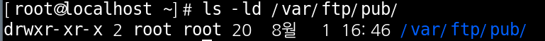

w 퍼미션이 없는 것이 보입니다.

 

익명사용자 라는 사용자가 있는지 확인 해 보겠습니다.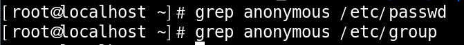

아무것도 나오지 않습니다. 익명 사용자라는 사용자는 없는 것으로 확인이 됩니다.

 

ftp 사용자 확인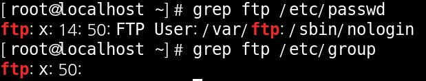

ftp 사용자는 있는 것으로 확인 됩니다.

익명사용자가 접속하면 -> ftp 사용자로 인정되서 관련 디렉터리에 접근 가능 하다는 것을 알 수 있습니다.

 

퍼미션 부여

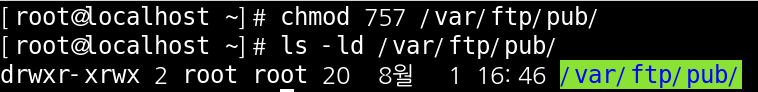

퍼미션을 부여하고 데몬 재시작 후 다시 테스트 해 보겠습니다.

 

client에서 Test

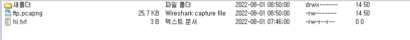

폴더도 만들어 지고 업로드도 잘 됩니다.

 

 

 

### ftp connection port 를 변경 21→21000 으로 변경

파일 수정

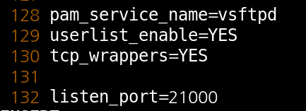

 

client 확인

포트번호 21번은 접속불가

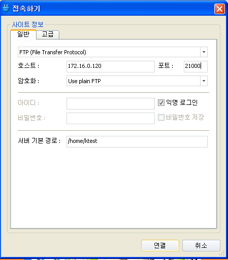

포트번호 21000은 접속 가능

 

 

 

### 일반 사용자 에 대한 chroot  기능 적용

파일 수정

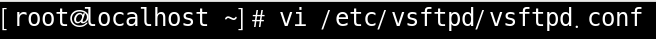

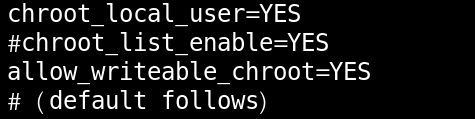

 

데몬 재시작

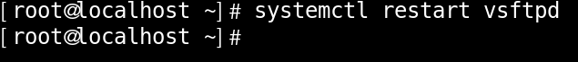

 

chroot 적용 확인

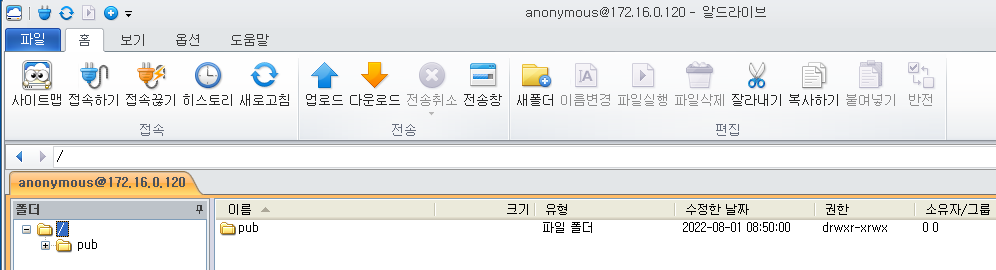

최상위 파일에 도달할 수 없음이 확인 가능 합니다.

 

 

 

### 특수 사용자 에 대한 chroot  기능 적용

사용자 추가

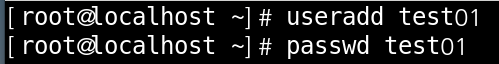

 

파일 수정

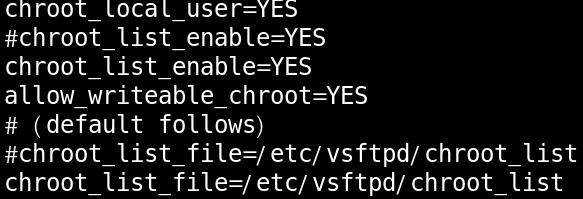

 

chroot_list 파일 생성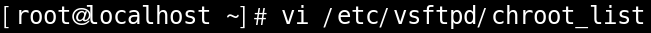

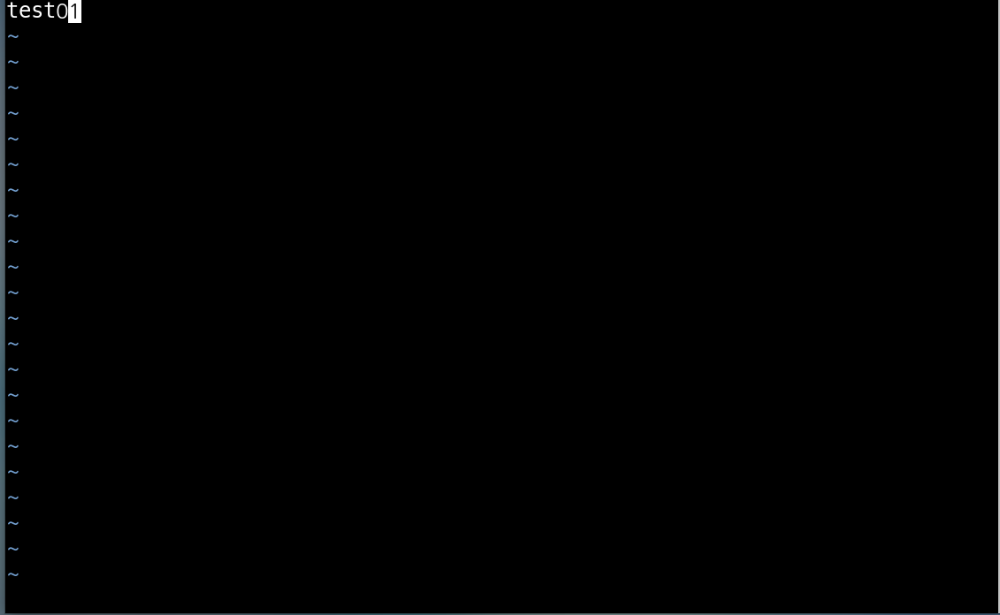

내용에 test01 추가

 

test01 client에서 접속

 

ktest client에서 접속

test01은 chroot가 적용되지 않았고 ktest는 chroot가 적용 된 모습 입니다.

결론적으로 chroot는 디렉터리의 최상위를 변경 해주는 모습이 보입니다.

 

