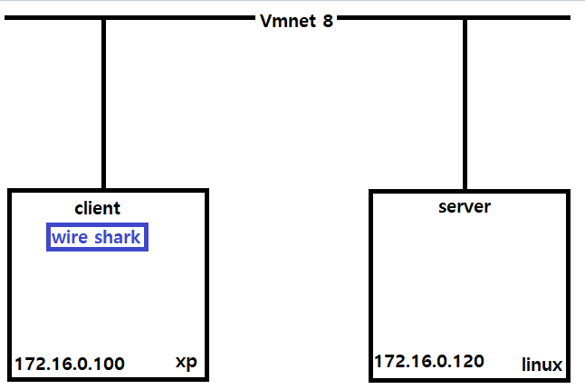
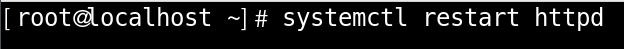
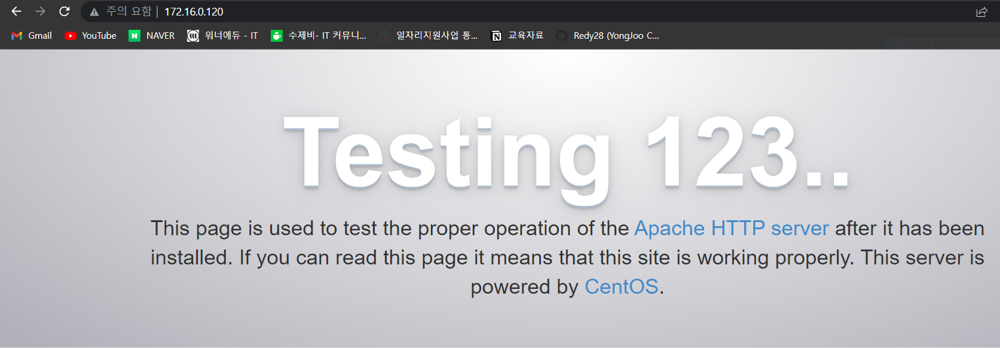
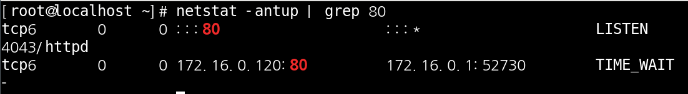
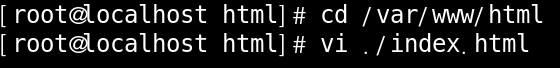
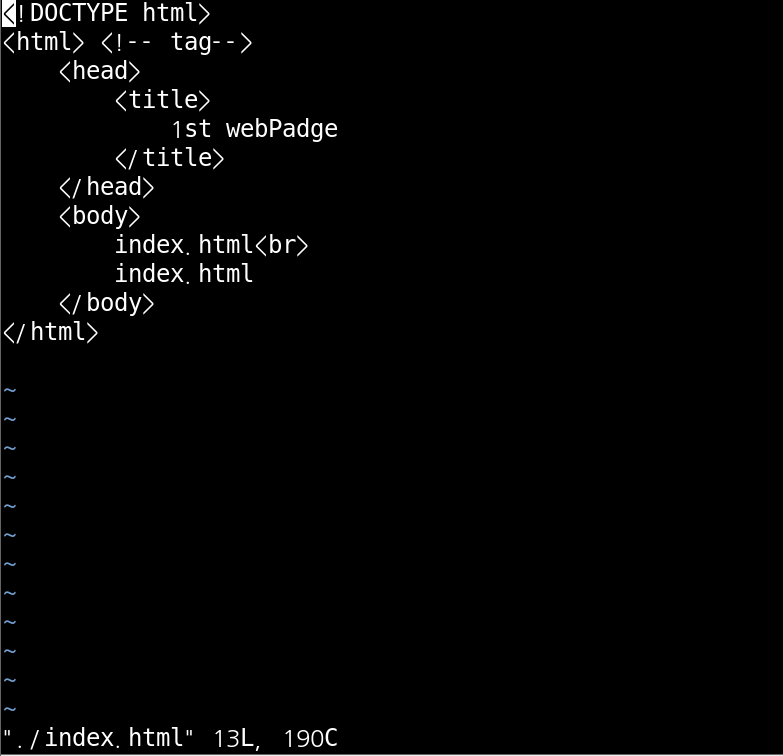
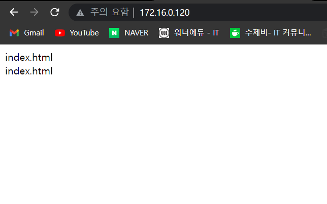
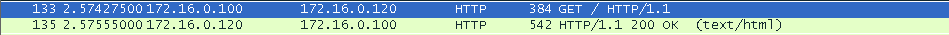
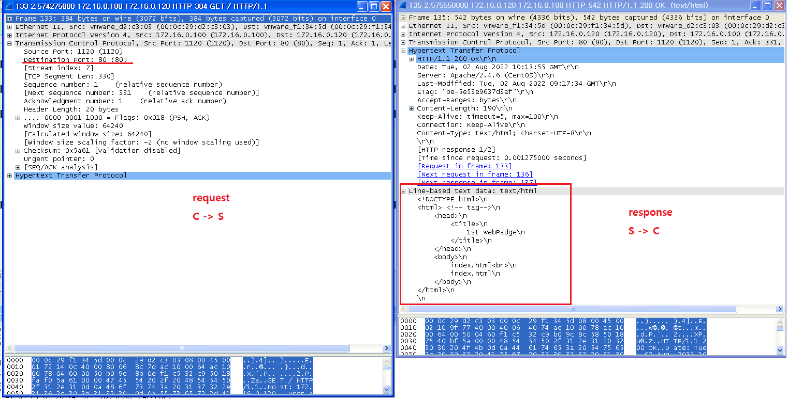

# HTTP Service

 

구상도

 

### 웹서버 기본문서 index.html 만들기

 

httpd 설치

 

httpd 시작

 

httpd Test

 

httpd 상태확인

 

web server 기본문서 만들기 1

 

web server 기본문서 만들기 2

 

web server 기본문서 Test

 

Wire Shark 확인

html의 헤더와 포트번호 해당 페이지의 내용등 확인이 가능 합니다.

 

 

 

##### 전역 설정 파일

 

전역 설정 파일 위치

 
