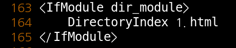

# HTTP Service

 

구상도

 

### 웹서버 기본문서 index.html 만들기

 

httpd 설치

 

httpd 시작

 

httpd Test

 

httpd 상태확인

 

web server 기본문서 만들기 1

 

web server 기본문서 만들기 2

 

web server 기본문서 Test

 

Wire Shark 확인

html의 헤더와 포트번호 해당 페이지의 내용등 확인이 가능 합니다.

 

 

 

### 전역 설정 파일

 

전역 설정 파일 위치

 

파일 수정, 주요 내용

http://서버주소  를 입력하면 사용자에게 최상위로 보여지는 디렉터리 입니다.

1.html로 수정 해주시면 됩니다.

 

파일 생성

1.html 파일을 생성 해주시고

 

재시작

 

Client에서 확인

확인 해보시면 1.html 파일 안에 있는 내용이 나오게 됩니다.

 

 

 

### Port번호 바꾸기

Server의 전역 파일 들어가서 수정

 

바뀐 Port번호 확인

 

Client에서 확인

끝에 바꾼 Port번호를 넣어 주시면 확인 가능 합니다.

 

 

 

### 지역 설정 파일

