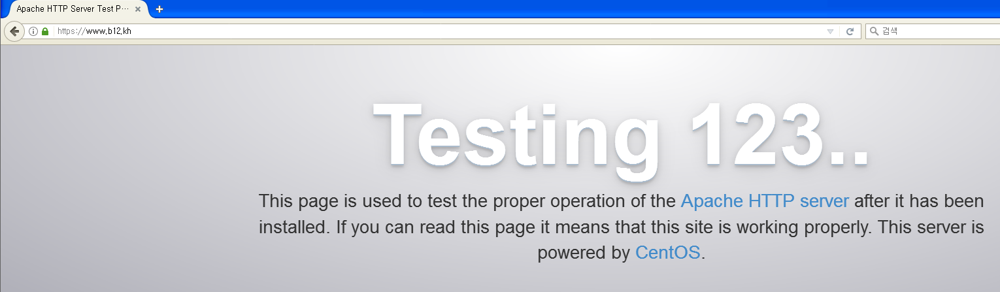
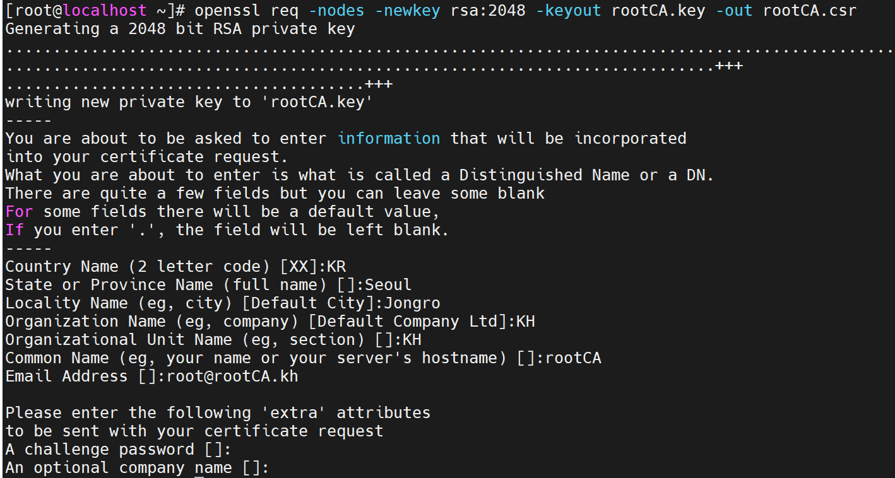

# SSL

 

### Window CA를 이용한 인증서 실습

구상도

 

Win cap 이용해서 인증서 옮기기

CA에서 받은 인증서를 Webserver로 옮겨 주시면 됩니다.

 

Webserver에서 인증서 확인

 

httpd 설치

 

ssl 설치

 

ssl 설정 변경

인증서와 사설키의 위치를 지정해 주시면 됩니다.

 

httpd 설정 변경

 

인증서 추출

아까 Win cap을 이용해 옮겨놧던 인증서에서 인증서와 개인키를 추출 해주시면 됩니다.

개인키 추출

 

인증서 개인키 복사

 Client에서 확인

고급을 눌러주시면 됩니다.

 

예외추가 보안예외 확인

눌러주시면 됩니다.

 

누른 후

평소에 저희가 실습했던 화면이 나오게 됩니다.

 

네이버 와 좌측 상단 자물쇠 비교

네이버는 초록색 httpd는 느낌표가 있는게 보입니다.

초록색은 인증서 인증이 완료된 것이고 느낌표는 아직 인증이 덜 된 상태인 겁니다.

나머지 인증을 더 해보도록 하겠습니다.

 

Client에서 CA인증서 다운

CA 인증서 설치를 해주셔야 합니다.

 

인증서 설치

 

인증서 설치 2

 

인증서 설치 확인

도구 > 인터넷옵션에 들어가시면 확인 가능 합니다.

 

확인해 보기

아직 자물쇠가 바뀌지 않았습니다.

DNS를 설정 해주고 다시 해 보겠습니다.

 

DNS 설정

구상도에 없었지만 DNS를 활욜 해보도록 하겠습니다.

저는 2003Window를 활용해서 DNS를 설정 하였습니다.

 

확인하기

자물쇠가 초록색으로 변한 모습이 확인 가능 합니다.

인증서 인증이 완료 된 것입니다.

 

 

 

### Linux CA를 이용한 인증서 실습

 

구상도

 

CA에 ssl 설치

 

인증서 만들기

Common Name은 중요합니다. 인증서 이름과 관련이 되있는 곳이니 신중하게 써주시기 바랍니다.

 

인증서 확인

 

인증서 생성 요청

유효기간 365일의 x509형태의 내가 가진 키로 인증을 하겠다 라고 만든 겁니다.

 

webserver 인증서 발급

 

개인키 생성

 

개인키 확인

 

인증서 생성

인증서 생성까지 완료 하였습니다.

 

인증서 Web Server로 옮기기

Window 실습때 Win cap을 쓴것과 똑같은 역할을 해주는 명령어 입니다.

 

Web Server에서 확인

제대로 옮겨진 것이 확인 되었습니다.

똑같은 방법으로 webserver-2.key도 옮겨주시면 됩니다.

 

관련 디렉터리로 이동

옮겨온 파일을 관련 디렉터리로 옮겨주시면 됩니다.

 

인증서, 사설키 위치 변경 1

이렇게 위치를 바꿔주시면 됩니다.

 

인증서, 사설키 위치 변경 2

위와 똑같이 경로만 webserver-2.key로 바꿔주시면 됩니다.

 

데몬 재시작, 상태확인

설정을 바꾸었으니 재시작 해서 동기화를 해주시고 잘 동작 하는지 상태를 한번 확인 해봅니다.

 

Client에서 확인

아까랑 똑같이 고급 > 예외추가 > 보안예외 확인 눌러 주시면 됩니다.

 

확인 2

자물쇠 누르고 > 더보기 누르시고

 

확인 3

인증서 보기 > 상세정보에 가서 아까 만들었던 인증서가 들어가 있으면 성공 입니다.

 

Win cap 사용해서 rootCA 가져오기

rootCA를 Client로 옮겨 주셔야 합니다.

 

가져오기

 

인증서 호출

설정 > 고급 > 인증서 > 인증서 가져오기 순으로 들어 가셔서 인증서를 호출 하시면 됩니다.

 

DNS 만들기

이번에도 2003을 이용해서 DNS에 c12.kh를 만들어 줍니다.

 

인증서 보기

https://www.c12.kh 로 들어가시면 아까 https://172.16.0.120에 들어 갔을때와 똑같이 화면이 나올 겁니다.

똑같이 예외추가 > 보안 예외 확인 눌러주시고 인증서 똑같이 확인 해 주시면 됩니다.

 

