# http virtual host

 

구상도

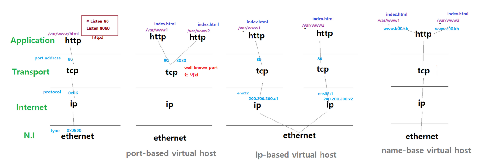

 

### port-based virtual host

 

Server에서 파일수정 1

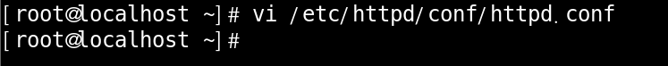

 

Server에서 파일수정 2

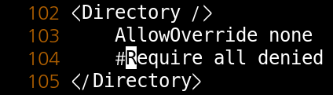

 

Server에서 파일수정 3

포트번호를 8080까지 쓰겠다 선언 해주시면 됩니다.

 

Server에서 파일수정 4

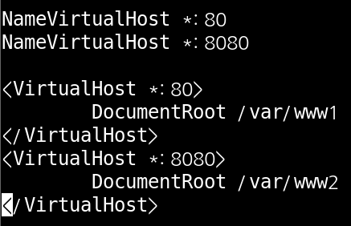

host를 2개 만들면서 무슨 ip주소가 오든 포트번호가 같으면 /var/ww1,2 로 가겠다 라는 설정 입니다.

 

Server에서 필요한 디렉터리와 피일 생성

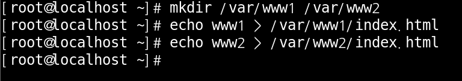

구상도에 나와있는 대로 /var 밑에 파일과 디렉터리를 생성 해주시면 됩니다.

 

Client에서 확인

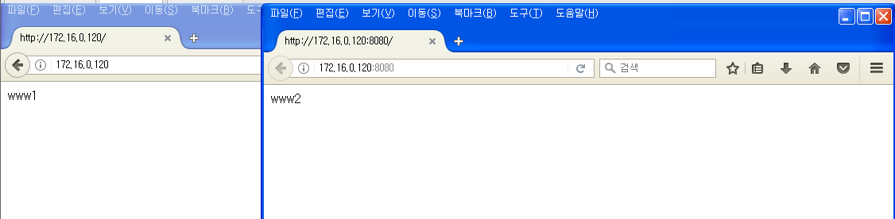

포트번호에 따라서 다르게 나오는 모습이 확인 되었습니다.

 

 

 

### ip-based virtual host

 

Server에서 ip주소 추가

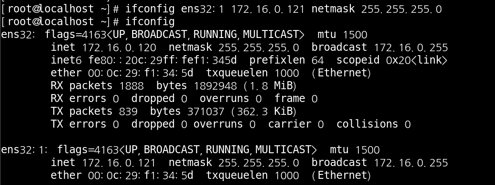

ens32를 2개로 나누어서 사용 하겠습니다.

 

Client에서 ping 확인

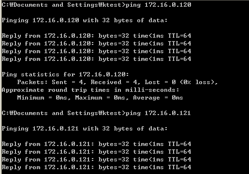

나눈 ip주소 들이 제대로 통신이 되는지 확인 한번 해주시고

 

MAC주소 확인

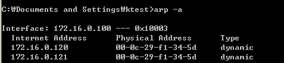

MAC주소가 똑같은지 확인 도 한번 해주시면 좋습니다.

 

Server에서 파일 수정

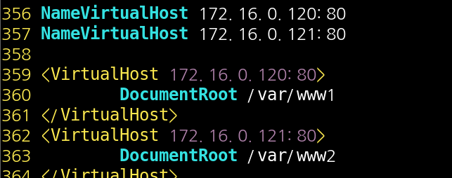

아까는 어떤 주소가 들어오든 포트번호만 같으면 그쪽으로 가줘라 였지만 이번에는 IP주소에 다라 달라 지도록 설정을 해 줍니다.

 

Server에서 데몬 재시작

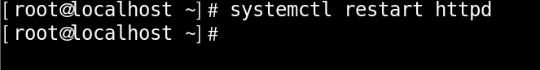

 

Client 확인

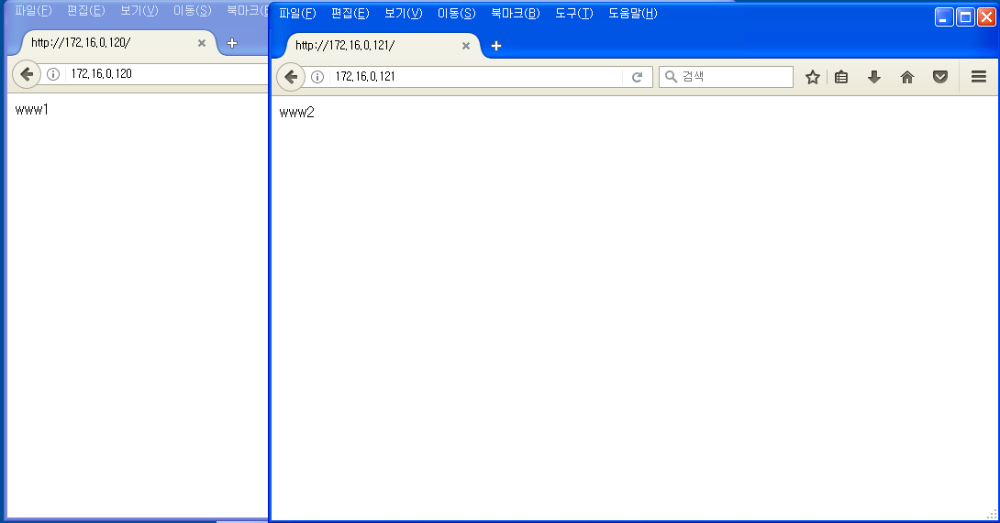

IP주소에 따라 제대로 나오는 모습 입니다.

 

 

 

### name-based virtual host

 

구상도

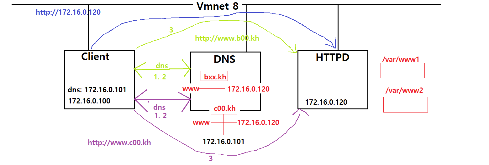

 

DNS 생성

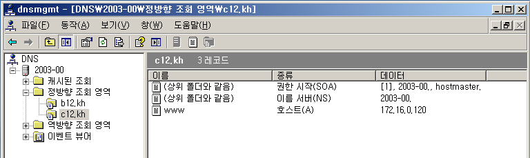

우선 DNS를 2개 생성해 주시면 됩니다.

 

Server에서 파일 수정

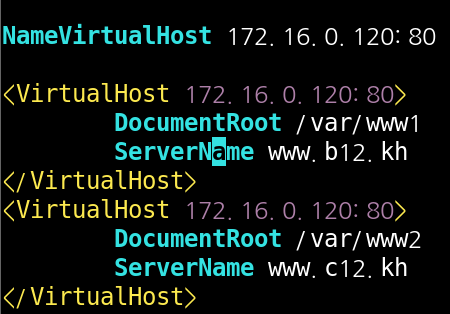

Server에서 파일을 수정 해주시는데 ServerName을 선언하여 주소로 구분 하겠습니다.

 

Client DNS주소 변경

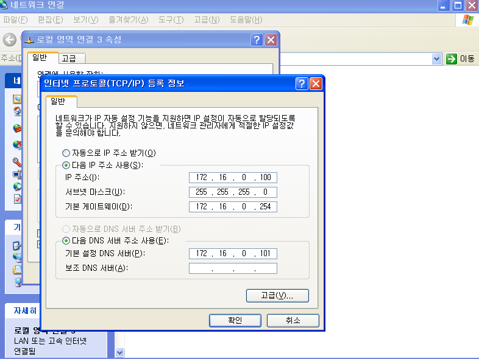

DNS의 IP주소로 변경 해주시면 됩니다.

 

Client에서 확인

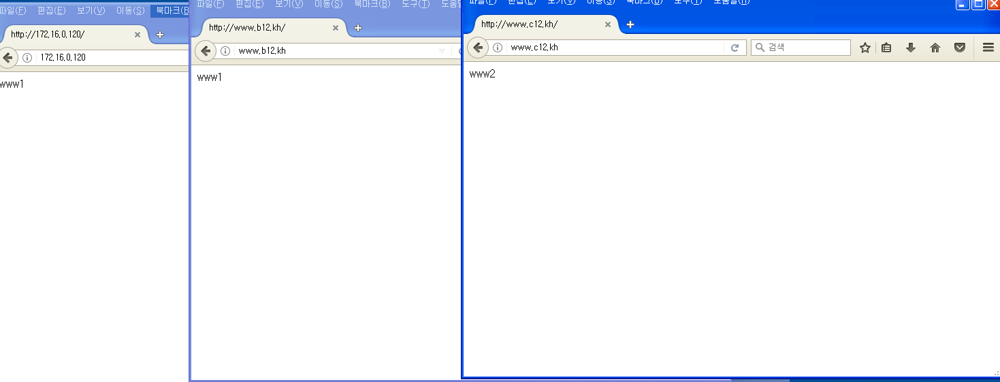

3가지 다 설정한 대로 나오시면 성공 입니다.

 

Client에서 Wire Shark 확인

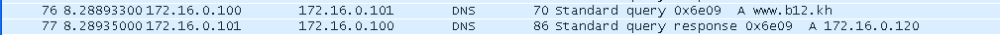

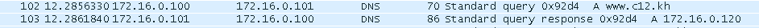

www.b12.kh   www.c12.kh 가 정상적으로 dns를 통해 생성된 모습 입니다.

 

