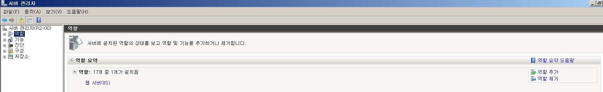
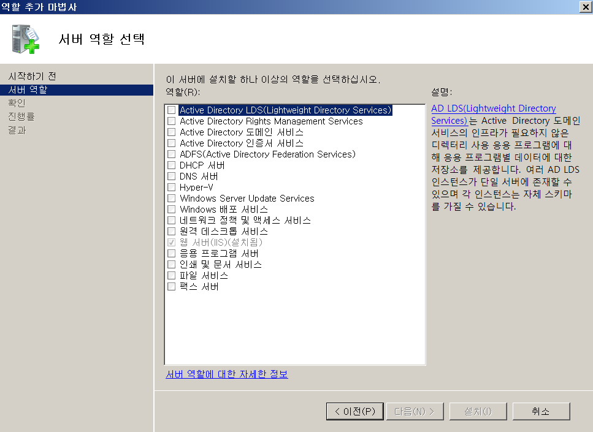
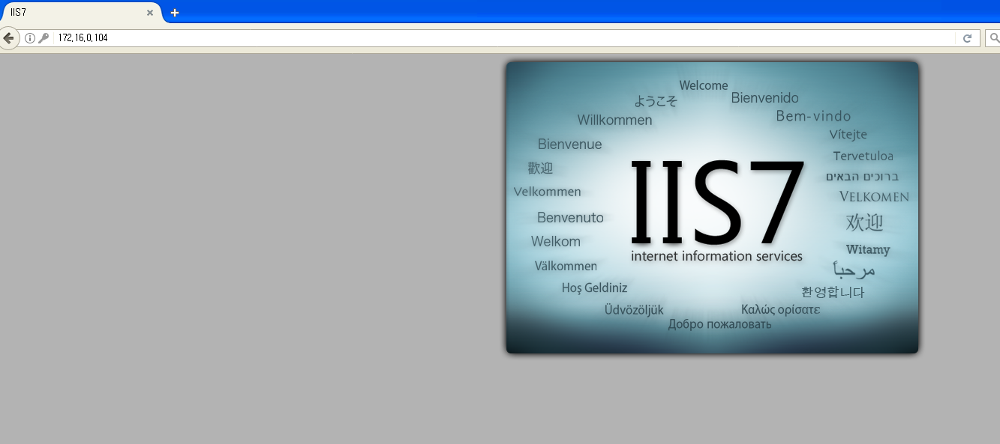
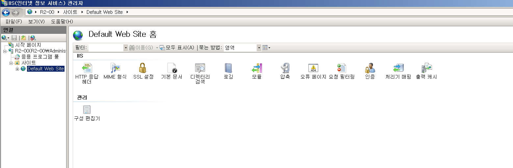
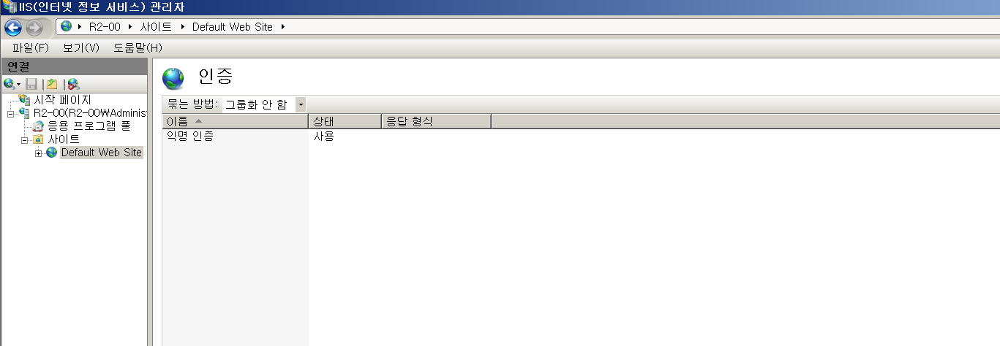
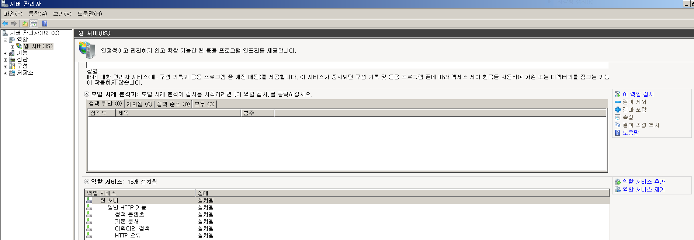
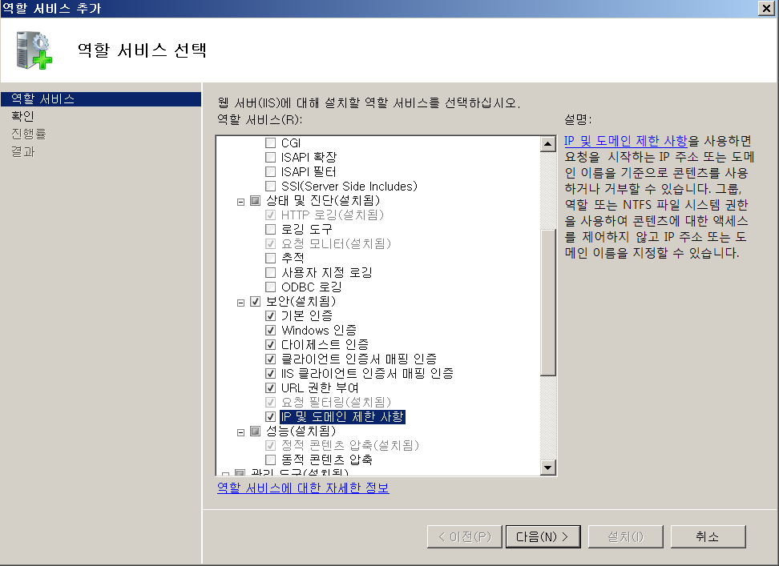
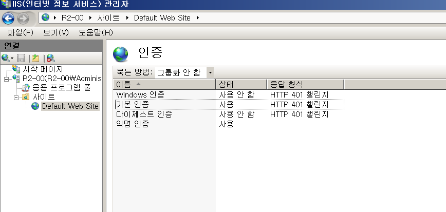
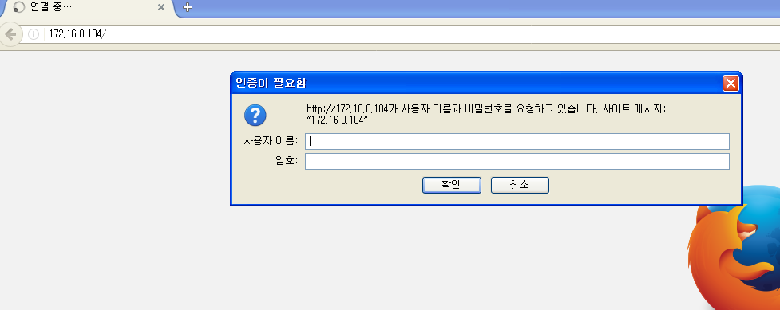
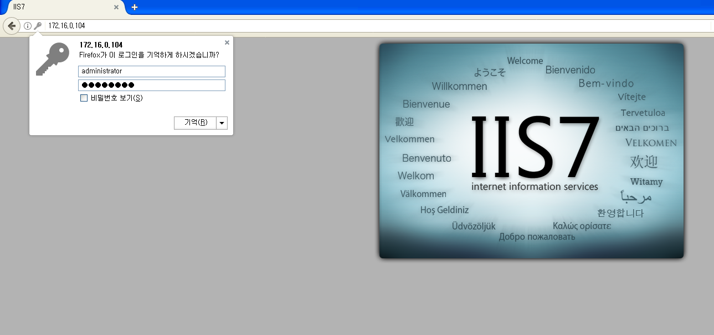

# Web Authenticaton

2008 R2를 Web Server로 사용 하겠습니다.

 

환경설정

관리도구 > 서버관리자 > 역할 > 역할  추가 > 웹서버(IIS) > 설치

 

Client(xp)에서 확인

 

2008 R2 WebServer

관리도구 > IIS 관리자 > 사이트 > default website > 인증 확인

여기까지 들어와 주시기만 하면 됩니다.

 

관리도구 > 서버관리자 > 역할 > IIS > 역할 서비스 추가 > 보안 부분 전부체크 > 다음 > 설치

설치해 주시고 다시 인증창으로 넘어 오시면 됩니다.

 

기본 인증만 사용 나머지 사용 안함

익명인증 사용 안함 해주시고 기본 인증 사용으로 설정 해주시면 됩니다.

 

Client에서 확인

이렇게 익명 사용자 접근을 방지 하기위해 위처럼 로그인을 한 뒤 접속이 가능 합니다.

 

