# Web Language

 

### Java script 

test.html 생성

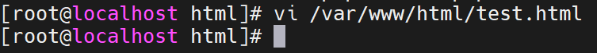

 

내용 수정

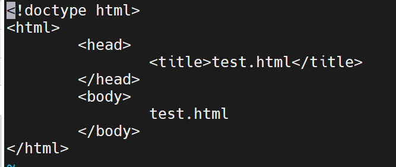

 

Client에서 확인

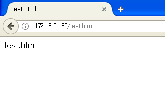

 

Java script 내용 추가해 보기

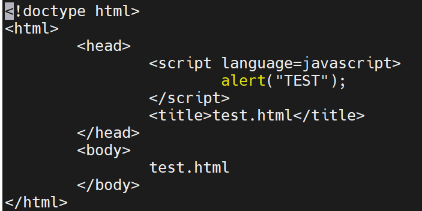

 

Client에서 확인

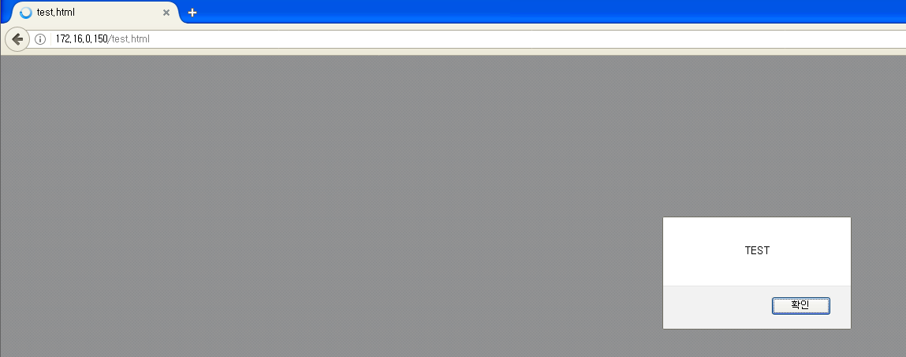

 

Java script는 Web 문서의 동적인 동작을 구현하기 위해 사용되는 객체 지향 언어 입니다.

 

파일 수정

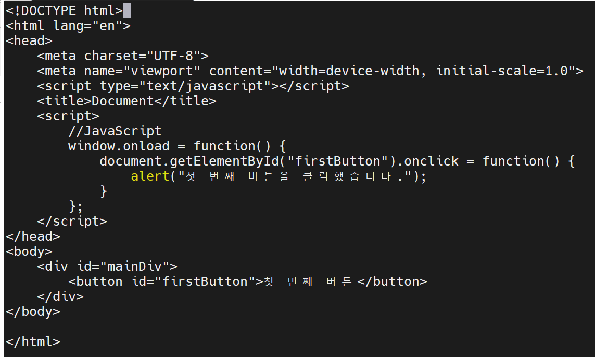

 

Client에서 확인

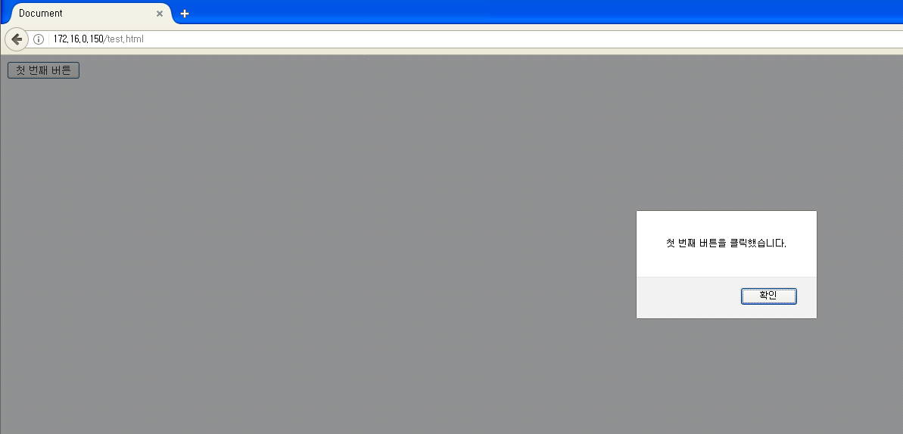

java script는 위와 같이 클릭 했을때 무엇인가 동작하는 형식의 동적인 모습을 주로 보입니다.

 

#####  J Query랑 비교해 보기

파일 수정

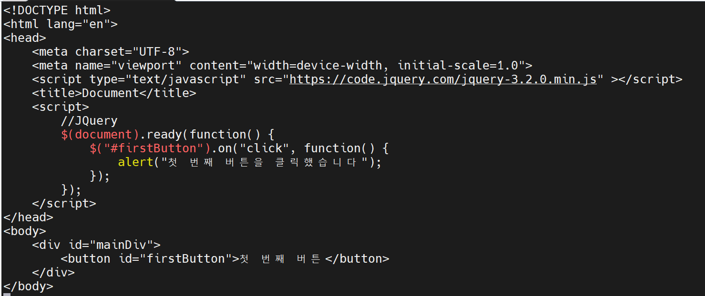

 

Client에서 확인

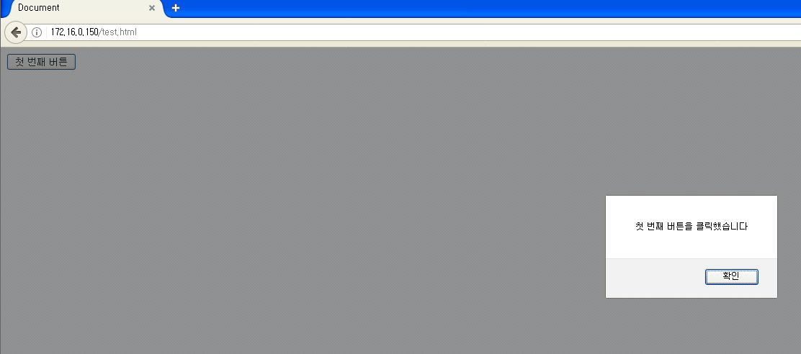

동작하는 모습은 똑같습니다.

하지만 java script는 code를 직접 써야 하지만 J Query는 WEB Browser에서 동작하는 오픈소스 java script 라이브러리에서 기능을 가져오는 방식 입니다.

동일한 이벤트 연결을 쉽게 구현이 가능하며 시각적 효과를 쉽게 구현 할 수 있다는 장점이 있습니다.

 

이러한 기능을 가진 java script와  J Query는 CSS(Client Side Script)라고 불리며 WEB Browser가 해석하여 결과를 보여주는 방식이다.

 

 

 

### SSS(Server Side Script)

서버가 해석하여 결과를  html 을 통해서 알려주는 방식 입니다.

SSS중 하나인 php의 일부분만 보여 드리겠습니다.

 

php 파일 만들기

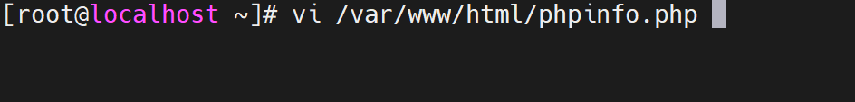

 

내용 추가

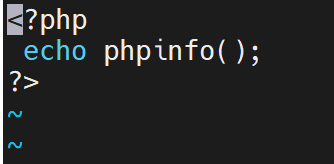

 

Client에서 확인

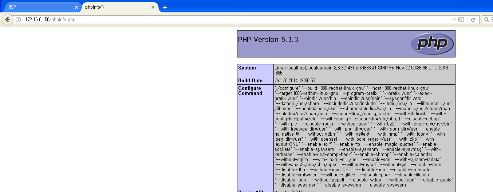

이렇게 Server가 결과를 해석하여 보이는게 SSS 입니다.

