# Shell script

shell 확인하는 방법

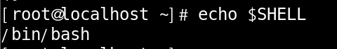

 

shell을 변경을 하는데는 2가지 방법이 있습니다.

/etc/passwd 파일의 내용을 수정하는 방법과 chsh 명령어를 이용하여 수정하는 방법이 있습니다.

 

##### /etc/passwd 파일의 내용을 수정

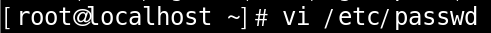

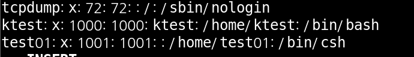

/etc/passwd 파일에 들어가서 shell을 변경 해주시면 됩니다.

 

쉘 수정 확인

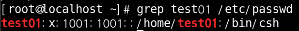

 

##### chsh 명령어 사용

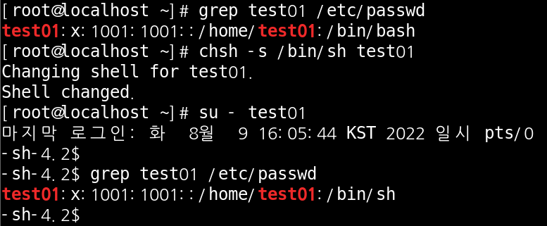

test01이 사용하는 shell은 bash였습니다.

`chsh -s /bin/sh test01` 명령어를 사용해 shell을 sh로 변경하고 확인 한 모습 입니다.

 

 

 

##### compile

compile이란 해당 언어의 코드를 시스템이 인식할수 있는 기계어로 변역하는 것 입니다.

 

c언어 컴파일러 설치

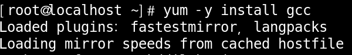

 

컴파일 테스트

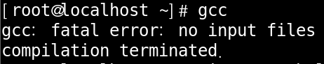

 

컴파일 파일 만들기

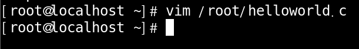

 

컴파일 작성

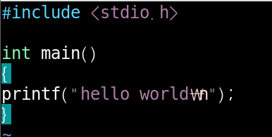

 

a.out 파일 확인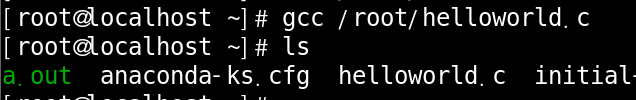

 

c언어 확인

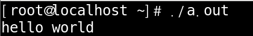

 

 

 

##### batch

일괄적으로 모아서 처리하는 작업을 말 합니다.

**batch job**은 시스템이 작업해야 할 내용을  순서대로 정의해놓은 것을 말 합니다.

 

##### script

입력된 행을 순차 적으로 처리 하는 것을 말 합니다.

 

script 파일 생성

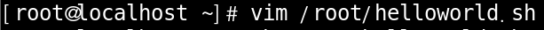

 

source code 작성

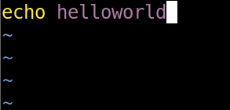

 

출력

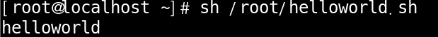

 

script 언어는 입력된 행을 순차 적으로 처리 한다고 하는데 진짜로 그렇게 처리 하는지 확인 해 보겠습니다.

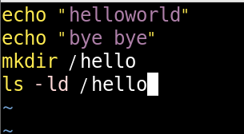

 

출력

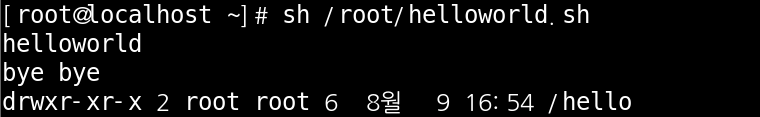

입력한 helloworld, byebye, mkdir, ls 순으로 처리하는 것이 눈에 보입니다.

 

여기서 궁금증이 하나 더 생깁니다. 디렉토리는 계속 만들어 지는 것일까??

결과론적 으로는 아닙니다.

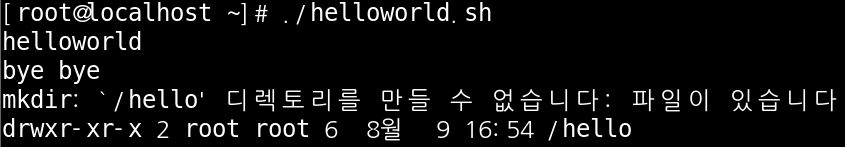

이미 생성된 디렉토리 이기 때문에 생성은 되지 않지만 시도는 계속 하는 모습 입니다.

 

