# DB

Database의 정의

- 체계화된 데이터의 모임 - 구조적으로 데이터를 저장하는 공간(파일/파일모음)
- 데이터를 효율적으로 처리, 관리하기 위해 도입 됨
- table 형태로 데이터를 관리

 

mariaDB 설치

 

DB버전 확인

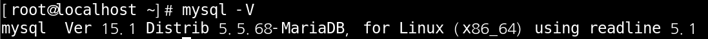

 

설정파일 구성 확인

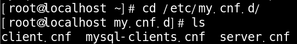

 

설정파일 백업 후 수정

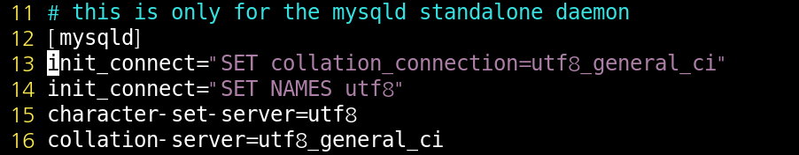

각 나라별 문자 인코딩 방식이 다르기 때문에 utf-8로 통일 하겠다 라는 뜻의 문장들 입니다.

 

데몬 재시작

 

enable

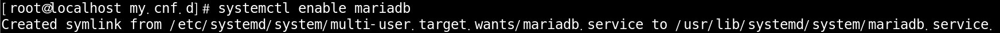

컴퓨터를 재시작 할 때마다 mariaDB가 실행 되도록 enable 상태로 설정을 바꿔 줍니다.

 

enable 상태 확인

정상적으로 설정이 변경된 것을 확인 해보는 명령어 입니다.

 

DB Login, Logout

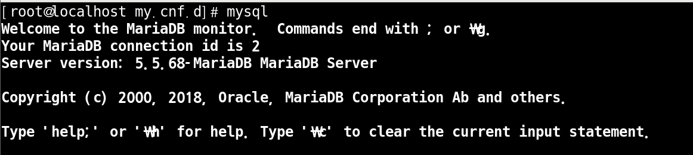

로그인은 mysql 로그아웃은 exit 입력해 주시면 됩니다.

 

비밀번호 설정

 

비밀번호 입력하고 Login

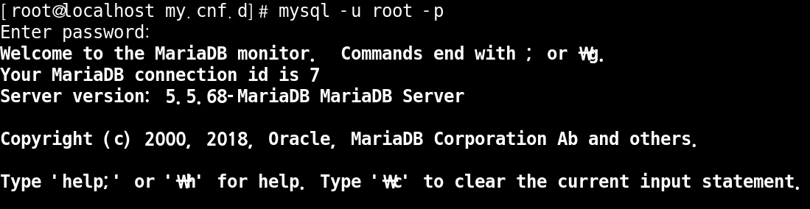

비밀번호를 입력하고 Login하는 방법은 위와 같이 2가지 방법이 있습니다.

편한 방법을 사용하시면 됩니다.

 

user 확인

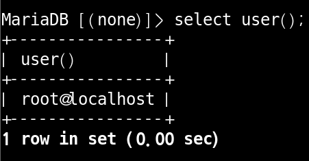

 

UTF - 8 확인

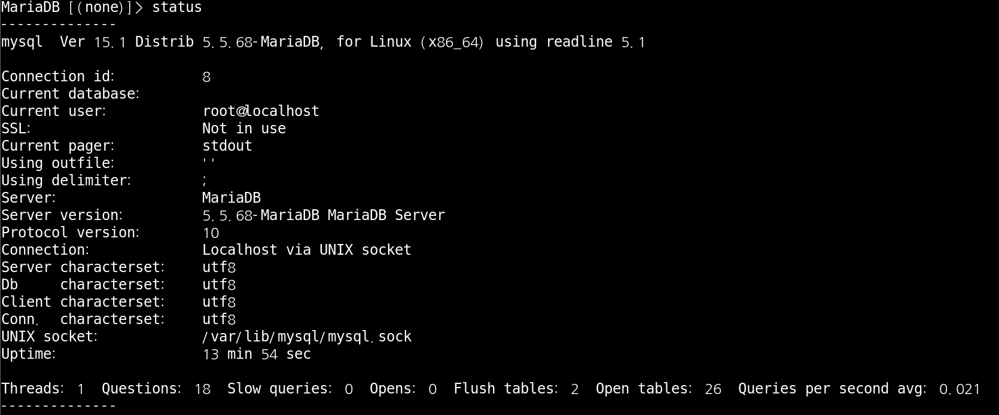

아까 설정 파일에서 변경 했던 UTF - 8 내용이 제대로 적용이 되었는지 확인해 봅니다.

 

snapshot

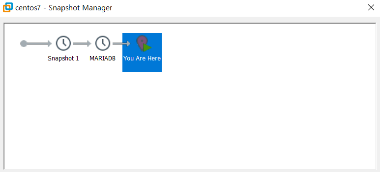

혹시 모르는 상황을 대비해 초기 설정을 snapshot으로 잡아 두겠습니다.

 

enable 확인

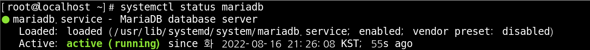

재접속 한 김에 enable 설정이 제대로 유지되고 있는지도 확인 한번 해 봤습니다.

 

database 확인

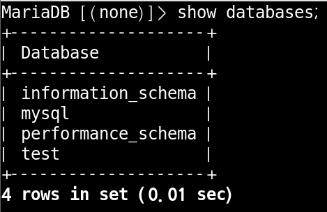

 

database 변경

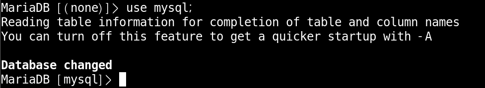

자세히 보시면 none에서 mysql로 바뀐 부분이 보입니다.

 

table 목록 보기

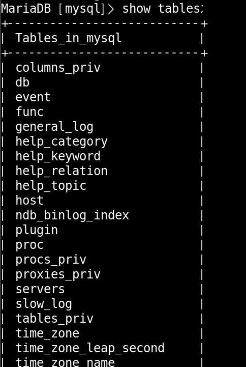

 

테이블 지정해서 찾기

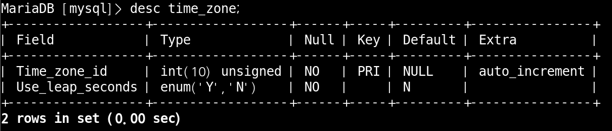

많은 table중에 time_zone이라는 테이블을 지정해서 찾은 모습 입니다.

여기서 Field는 column 목록 입니다.

 

