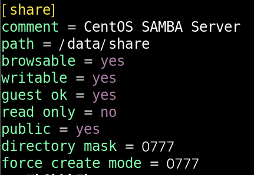
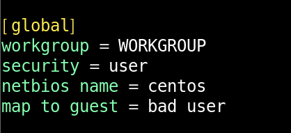
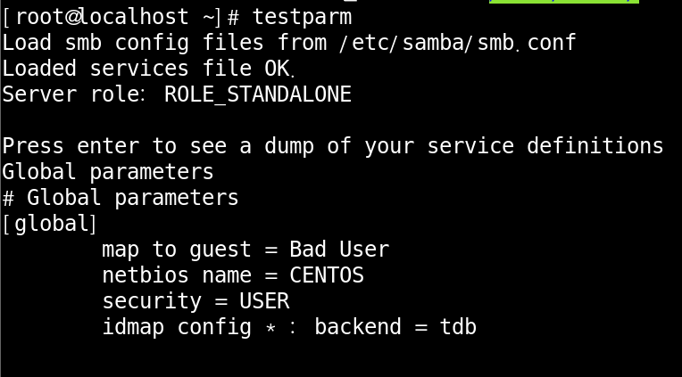
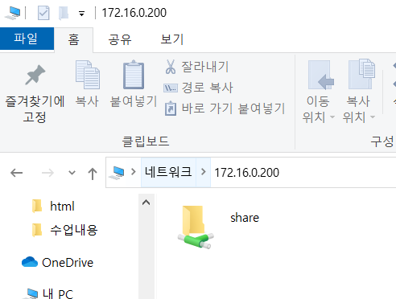
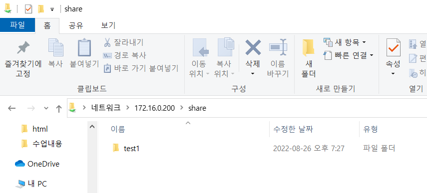

# SMB Service

 

smb service란 Windows 공유 폴더/공유 프린터 를 사용하는 프로토콜 입니다.

 

#### Centos7에 SMABA Server  구성하기

 

패키지 설치

 

기존 설정 파일 이동후 백업후 새로 생성

 

파일설정 변경

 

디렉터리 생성후 퍼미션 부여

 

문법검사 실행

 

관련 데몬 2개 실행

 

test 해보기

host pc로 접속하여 share안에 test1 파일을 하나 만들고 제대로 만들어졌나 test해보시면 됩니다.

 

test해보기 2

host pc가 아닌 다른 pc에서도 확인이 가능 합니다.

 

