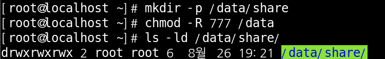
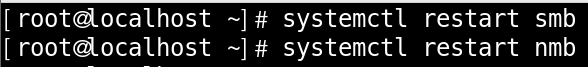
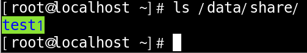
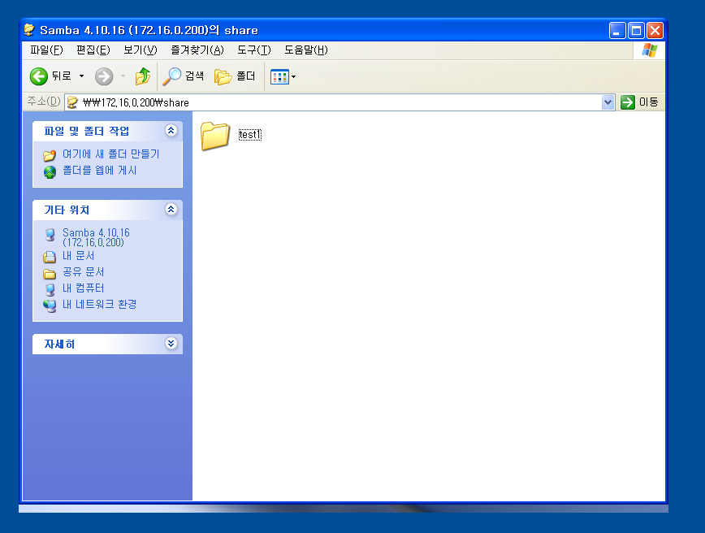
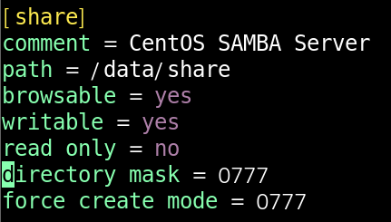
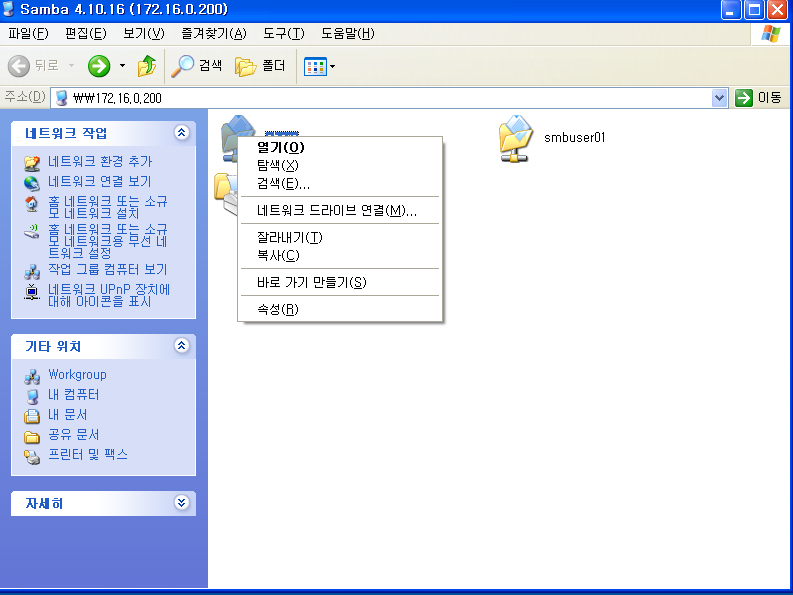

# SMB Service

 

smb service란 Windows 공유 폴더/공유 프린터 를 사용하는 프로토콜 입니다.

 

#### Centos7에 SMABA Server  구성하기

 

패키지 설치

 

기존 설정 파일 이동후 백업후 새로 생성

 

파일설정 변경

 

디렉터리 생성후 퍼미션 부여

 

문법검사 실행

 

관련 데몬 2개 실행

 

test 해보기

host pc로 접속하여 share안에 test1 파일을 하나 만들고 제대로 만들어졌나 test해보시면 됩니다.

 

test해보기 2

host pc가 아닌 다른 pc에서도 확인이 가능 합니다.

 

위의 방법은 사용자 인증 없이 해보는 방법 이였습니다.

이번에는 사용자 인증을 받고 해보는 방법을 해 보겠습니다.

 

파일설정 변경

lanman auth = yes    ntlm auth = yes

이번에 추가한 저 2 문장은 xp용으로 사용되긴 하나 보안성이 매우 낮아 추천 해드리지는 않습니다.

지금 쓰는 이유는 이렇게 설정 해놔야 window xp에서 사용자 로그인이 가능합니다.

window10으로 test 하실 분들은 굳이 내용을 넣지 않으셔도 됩니다.

 

user 생성

linux user가 생성 되있어야 smbuser가 생성 가능 합니다.

꼭 linux user부터 생성 하셔야 합니다.

 

문법 검사

 

test 해보기

사용자 인증을 하고 들어오는 방법 입니다.

 

##### smb service 활용

네트워크 드라이브 만들기

shared 파일을 우클릭 하고 네트워크 드라이브 연결 눌러주시면 끝 나는 간단한 작업 입니다.

 

