# NFS Service

 

NFS란 (Network File System)원격 파일 시스템으로 원격의 디렉터리를 로컬 디렉터리로 마운트 하는 방식 입니다.

 

구상도

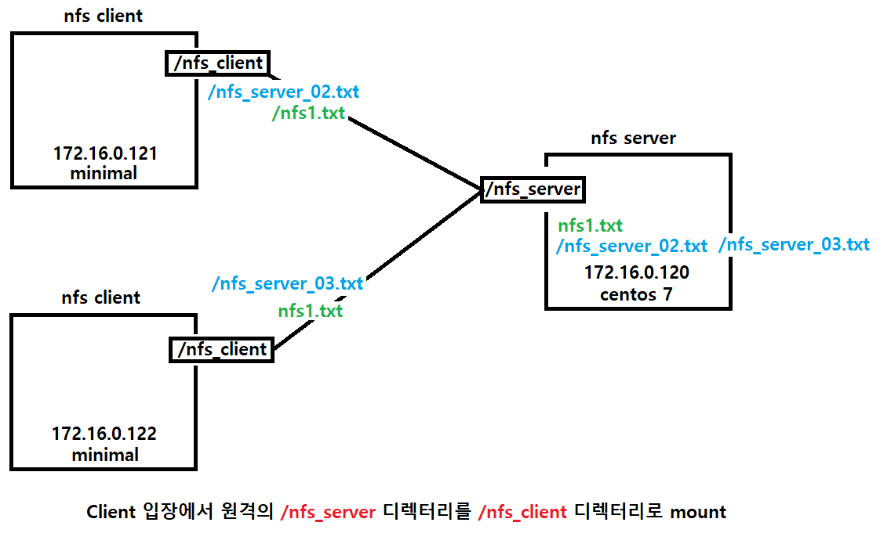

 

##### NFS Server 환경

패키지 설치

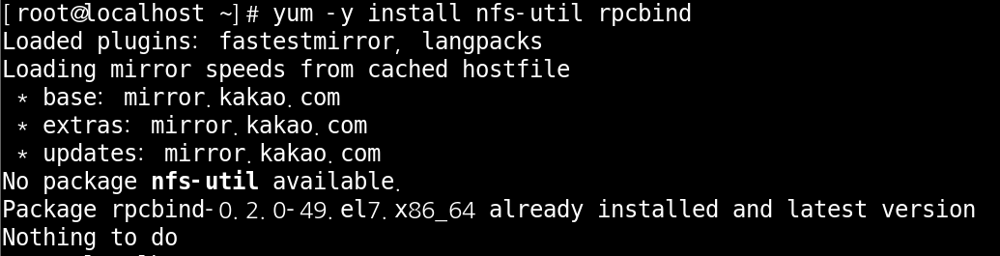

 

파일설정 변경

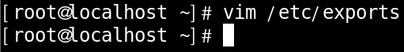

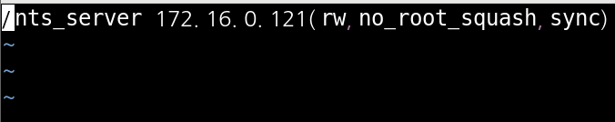

exports파일은 빈 파일 입니다. 내용을 채워 주시면 됩니다.

 

디렉터리, 파일 생성

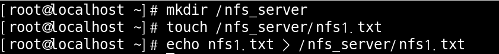

 

관련 패키지 실행

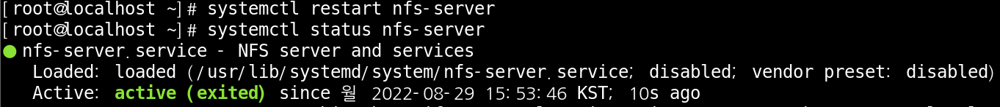

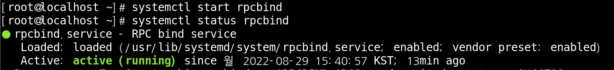

설정 파일의 내용을 변경 했으니 패키지를 재실행 해주셔야 변경 사항이 저장 됩니다.

 

nfs 목록 확인

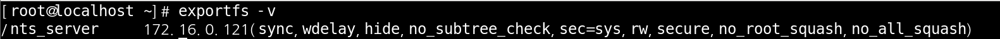

 

##### NFS Client 환경

패키지 설치

 

디렉터리, 파일 생성

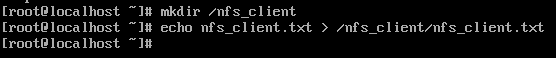

 

Mount

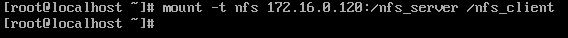

 

Server에서 만든 파일 확인

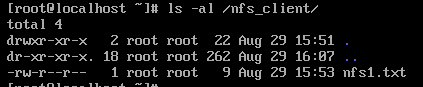

 

Mount 확인

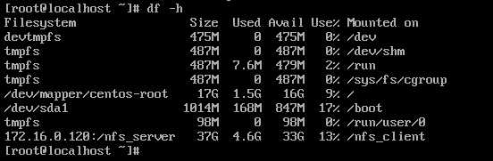

 

 

 

##### NFS 응용 (httpd)

구상도

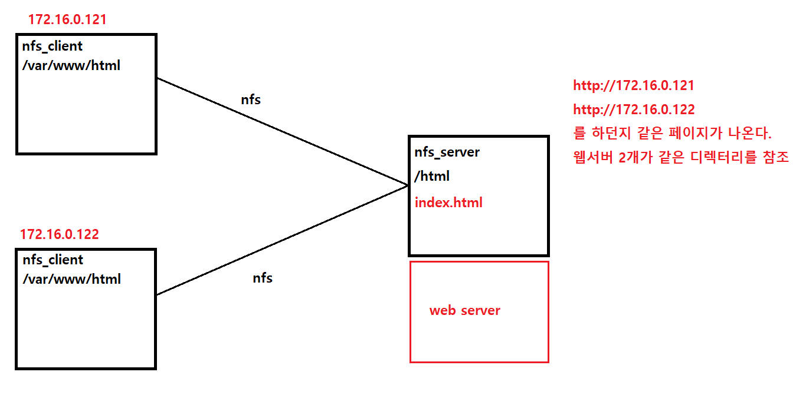

 

NFS 경로 설정

/www 디렉터리를 server로 설정하고 시작 하겠습니다.

 

확인 및 패키지 재시작

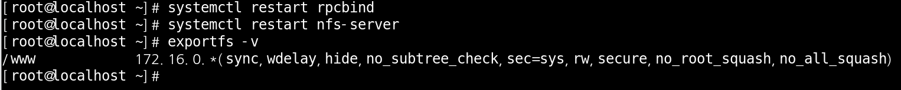

변경한 설정으로 제대로 변경이 되었는지 확인 합니다.

 

client에서 mount하기

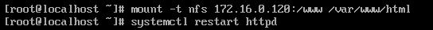

2개의 client에서 똑같이 mount를 설정하고 httpd service를 재시작 해줍니다.

 

host pc에서 확인

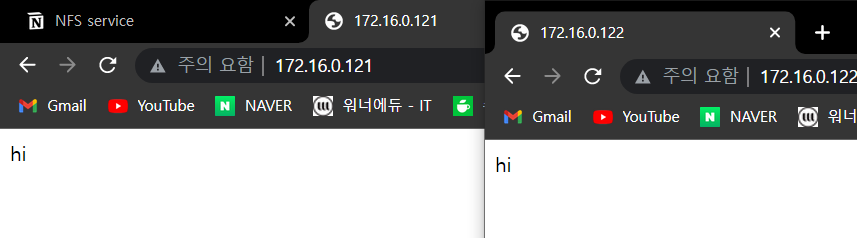

똑같은 webserver를 참조 하기에 똑같은 내용이 나오게 됩니다.

 