# PHP

 

PHP란 C언어를 기반으로 만들어진  서버 측에서 실행된 ServerSideScript입니다.

 

##### 기본 설정

php 설치

mariaDB 설치

vsftpd 설치하고 root 접근 가능하도록 허용

 

mariaDB 설치

yum -y install을 사용해서 mariaDB를 설치 해주시면 됩니다.

 

root 접근 가능하도록 허용

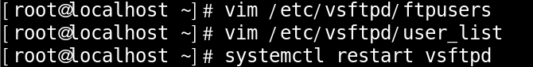

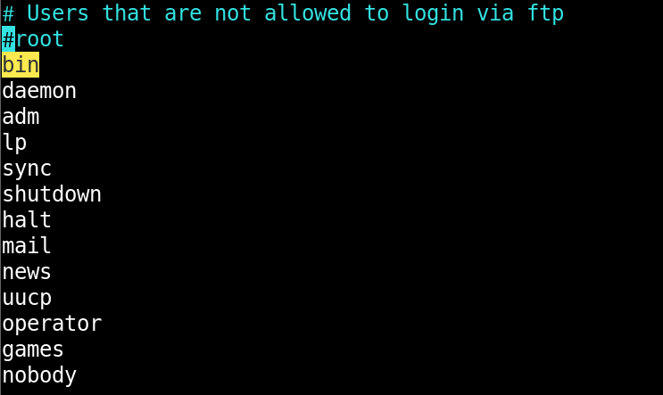

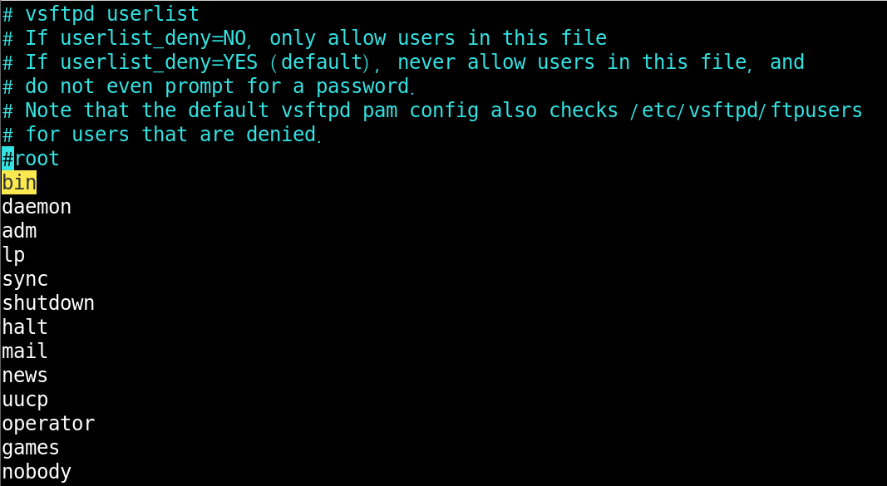

위의 2개 파일에 들어가서 root만 주석처리 해주시면 됩니다.

 

알 드라이브 사용하여 접속

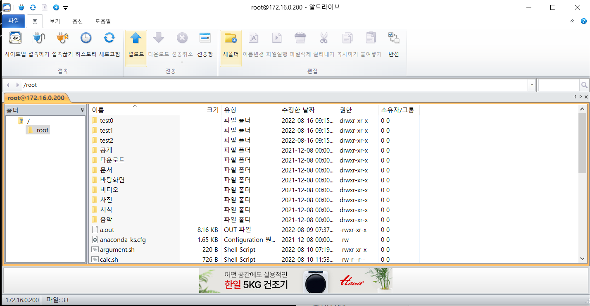

알 드라이브를 설치 하시고 root 사용자로 접속 해주시면 됩니다.

 

PHP 설치

httpd도 같이 설치 해주도록 하겠습니다.

 

PHP 기본 설정

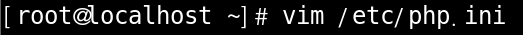

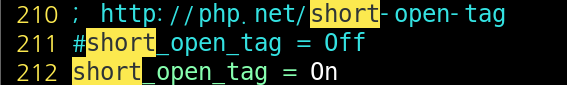

PHP로 해석해라 라는 부분 입니다.

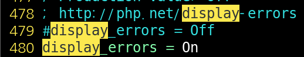

Error 메시지 출력과 관련된 부분 입니다.

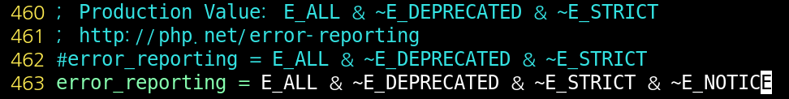

undefined index 관련 부분 입니다.

 

PHP 파일 만들기

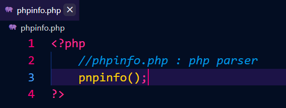

 

PHP 파일 옮기기

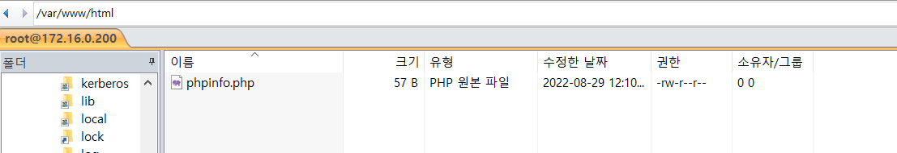

알 드라이브를 이용하여 PHP 파일을 /var/www/html에 옮겨 줍니다.

 

host pc로 확인

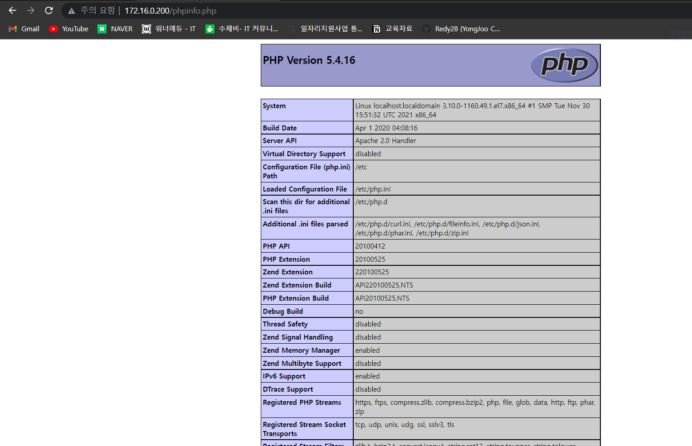

 

PHP 변수

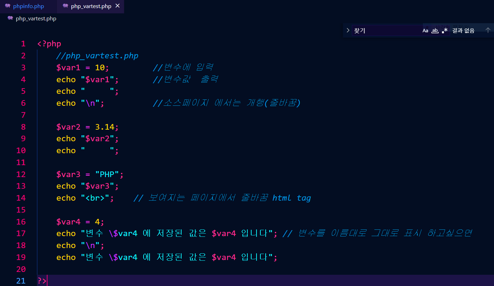

 

host pc에서 확인

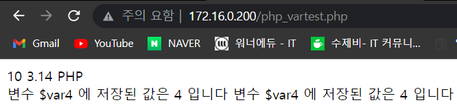

 

 

 

##### PHP 자료형 : 정수

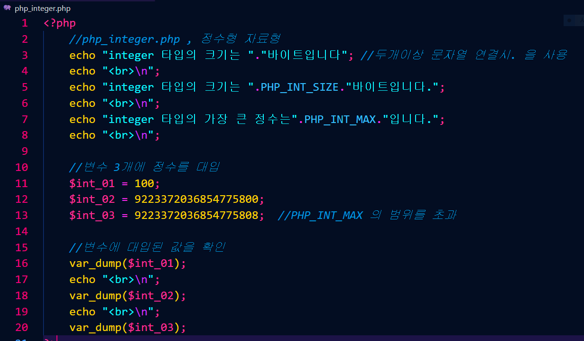

 

확인

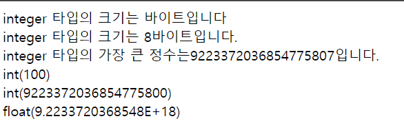

INT3은 최대값을 넘어서 실수로 표현됨.

 

 

 

##### PHP 자료형 : 실수

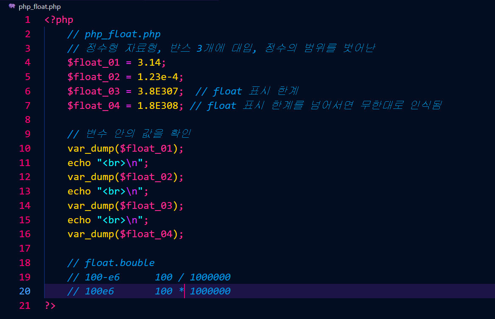

 

확인

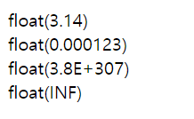

 

 

 

##### PHP 자료형 : 문자열

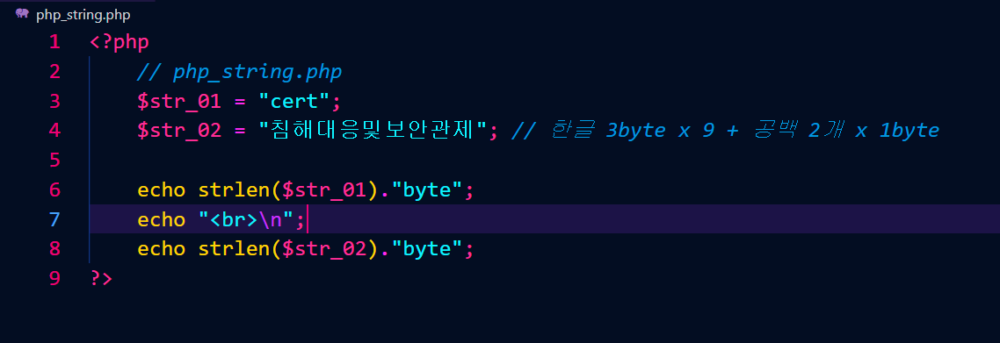

 

확인

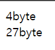

 

 

 

##### PHP 자료형 : 상수

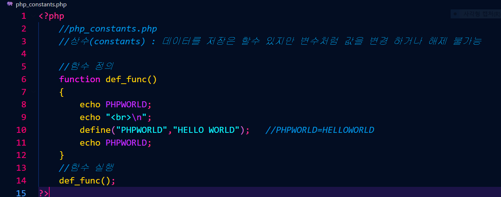

 

확인

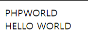

 
