# PHP

<br>

PHP란 C언어를 기반으로 만들어진  서버 측에서 실행된 ServerSideScript입니다.

<br>

##### 기본 설정

php 설치

mariaDB 설치

vsftpd 설치하고 root 접근 가능하도록 허용

<br>

mariaDB 설치

yum -y install을 사용해서 mariaDB를 설치 해주시면 됩니다.

<br>

root 접근 가능하도록 허용


위의 2개 파일에 들어가서 root만 주석처리 해주시면 됩니다.

<br>

알 드라이브 사용하여 접속


알 드라이브를 설치 하시고 root 사용자로 접속 해주시면 됩니다.

<br>

PHP 설치


httpd도 같이 설치 해주도록 하겠습니다.

<br>

PHP 기본 설정


PHP로 해석해라 라는 부분 입니다.


Error 메시지 출력과 관련된 부분 입니다.


undefined index 관련 부분 입니다.

<br>

PHP 파일 만들기


<br>

PHP 파일 옮기기


알 드라이브를 이용하여 PHP 파일을 /var/www/html에 옮겨 줍니다.

<br>

host pc로 확인


<br>

### PHP 자료형

##### PHP 변수


<br>

host pc에서 확인


<br>

<br>

<br>

##### PHP 자료형 : 정수


<br>

확인


INT3은 최대값을 넘어서 실수로 표현됨.

<br>

<br>

<br>

##### PHP 자료형 : 실수


<br>

확인


<br>

<br>

<br>

##### PHP 자료형 : 문자열


<br>

확인


<br>

<br>

<br>

##### PHP 자료형 : 상수


<br>

확인


<br>

<br>

<br>

##### PHP 자료형 :  NULL


<br>

확인


마지막 echo "$x"는 출력되지 않음이 확인 가능 합니다.

<br>

<br>

<br>

### PHP 와 DB

##### PHP를 이용한 MariaDB 연결

패키지 설치


<br>

DB파일 만들기


<br>

DB파일 불러오기


<br>

DB 내용 확인


<br>

연결 해보기


연결실패 code는 password에서 마지막에 d를 빼서 일부러 틀리게 해놨습니다.

위의 예시들은 구버전용 입니다. 현재 centos7는 다른 방식이 있습니다. 지금부터 최신버전으로 예시를 다시 해 보겠습니다.

<br>

DB연결 성공


<br>

DB연결 실패


DB연결이 성공하면 con 변수안에 들어있는 DB정보들이 출력 되지만 연결에 실패하면 아무것도 안나오고 DB 선택 실패가 출력되는 모습 입니다.

<br>

<br>

<br>

##### PHP 를 이용한 MariaDB 에 SQL 문 전송  I - create 


성공하면 이렇게 TRUE가 출력이 되고 실패할시 FALSE가 출력 됩니다.

<br>

<br>

<br>

##### PHP 를 이용한 MariaDB 에 SQL 문 전송  II - insert 


<br>

확인


<br>

<br>

<br>

##### PHP 를 이용한 MariaDB 에 SQL 문 전송  II - select

#####  

<br>

확인


여태까지 해왔던 방식대로 select를 해보려 했으나 오류가 뜨는 모습 입니다. select는 다른 방식으로 출력을 해야 합니다.

<br>

select 출력 code


만약 여기서 while문을 사용하지 않는다면 1개만 출력되고 끝나는 상황이 발생하기에 while문을 사용 했습니다.

<br>

확인


<br>

추가


<br>

확인


만약 while문을 쓰지 않았다면 첫번째 행만 출력되고 새로 삽입한 2번째 행은 출력되지 않았을 것입니다. 이러한 이유로 while문을 사용 했습니다.

<br>

<br>

<br>

##### WebTest 웹사이트 구조


이렇게 구조를 만들어 보겠습니다.

<br>

일단 기본적인 파일들을 만들어 두겠습니다.

###### index.php


###### dbcon.php


<br>

###### head.php


<br>

###### style_contents.css


<br>

###### style_head.css


이렇게 기본적인 파일들을 먼저 구성해 두고 시작 하겠습니다.

<br>

<br>

<br>

##### member

<br>

###### 로그인/로그아웃 과정

<br>

http 분석


로그인을 하게 되면 위의 member_login 파일이 정보를 전송 해 주는 방식 입니다. 첫번째 사진은 그 모습을 Wireshark로 잡은 모습 입니다.

<br>

회원정보 테이블 추가


이렇게 가상의 회원을 1명 추가해 보고 로그인 성공 실패를 분석 해 보겠습니다.

<br>

###### member_login_check.php


이렇게 파일을 만들고 실행을 해 보겠습니다.

<br>

파일 실행


로그인 실패라고 출력이 됩니다.

SQL준비 부분에서 u_pass 부분이 틀렸기 때문 입니다.

이번엔 로그인 성공이 출력 되도록 실패한 부분을 주석처리 하고 실행 해보시면 됩니다.


로그인 성공이 출력 됩니다.

<br>

###### member_login_check.php


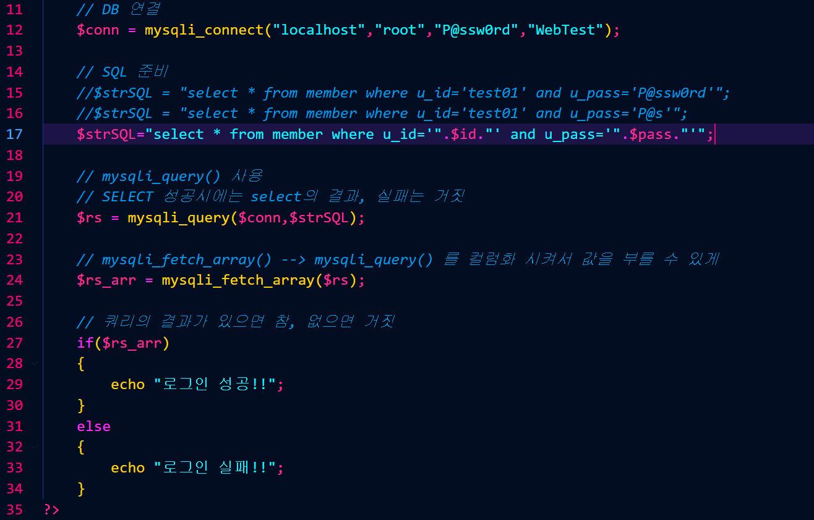

이렇게 파일을 완성 하였습니다. 사용자를 추가하여 로그인을 해 보겠습니다.

<br>

사용자 추가


<br>

로그인 시도


로그인에 성공 하였습니다.

<br>

로그인 성공, 실패시 팝업창이 출력 되도록 JAVAscript를 이용하여 만들어 보겠습니다.

<br>

###### member_login_check.php


script를 조금 추가해 주었습니다.

alert가 팝업창을 생성해주는 명령어 입니다.

<br>

팝업창 확인


팝업창이 생성 되었습니다.

<br>

history.back();

로그인이 실패하든 성공하든 저희가 보던 사이트는 원래 페이지로 돌아가는 기능이 있습니다.

지금 추가할 history.back(); 명령어가 그러한 기능을 해줍니다.


<br>

확인


로그인 전 입니다.


확인을 누르고 확인 해보시면


이렇게 전에 있던 페이지로 돌아가게 됩니다.

전에 있던 페이지로 돌아는 가지만 로그인 성공했던 기록을 가지고 돌아가는 것이 아닙니다. 이제부터는 그 기록을 가지고 페이지로 돌아가도록 해 보겠습니다.

<br>

location.replace();


location.replace(); 명령어를 사용해 주시면 됩니다.

history.back은 전에 실행됫던 페이지로 가지만 정보를 가지고 가지 않았습니다.

location.replace는 설정한 페이지로 이동이 가능 합니다.

<br>

확인


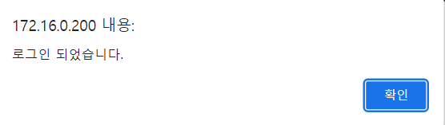

여기서 확인을 눌러 주시면


index.php로 넘어가는 모습 입니다.

<br>

이제 환영합니다 앞에 이름이 들어가도록 설정 해보겠습니다.


session_start(); 명령어로 시작 합니다.

로그인에 성공하면 이정보를 가지고 index.php로 가는 것입니다.


index.php에도 이미 session 명령어가 있습니다.

<br>

로그인 성공시


로그인에 성공하면 이렇게 환영합니다 앞에 nickname이 붙어서 출력되게 됩니다.

<br>

로그아웃 기능을 만들어 보겠습니다.

###### member_logout.php


logout 기능이 담긴 파일을 먼저 만들어 주시고 member디렉터리에 넣어 주시면 됩니다.

<br>

확인


로그아웃이 되고 파일에서 설정한 대로 member_login.php 파일로 돌아가는 모습을 볼 수 있습니다.

<br>

아무것도 넣지않고 로그인 할 경우


아무것도 입력하지 않고 로그인 할 경우 알림창과 전 페이지로 돌아가는 기능을 넣었습니다.(member_login_check.php)

<br>

확인


<br>

데이터베이스 연결 파일 지정

###### dbcon.php


한줄 빼고 모두 주석처리 해주시면 됩니다.

<br>

###### member_login_check.php


여기서도 기존 연결은 주석처리 해주시고 다시 써주시면 됩니다.

기존에 있던거 그대로 사용하면 사용자의 비밀번호나 다른 정보들이 바뀌었을 때 페이지 하나하나 들어가서 수정해야 되는 불편함이 있지만 위처럼 require 명령어를 사용해 주시면 dbcon.php만 수정해 주면 다른곳들은 자동으로 수정이 되기 때문에 훨씬 편리해 집니다.

<br>

<br>

<br>

###### 닉네임 수정

이번에는 닉네임 수정하는 기능을 추가하려고 합니다.


닉네임 수정을 눌렀을 때 닉네임 수정이 가능하도록 해 보겠습니다.

<br>

###### member_nick.php


이렇게 만들어 주시면 됩니다.

<br>

확인


닉네임 수정을 누르면 페이지는 나오나 아직 수정이 되지 않습니다.

member_nick_change.php 파일이 아직 없기 때문입니다.

<br>

###### member_nick_change.php


<br>

확인

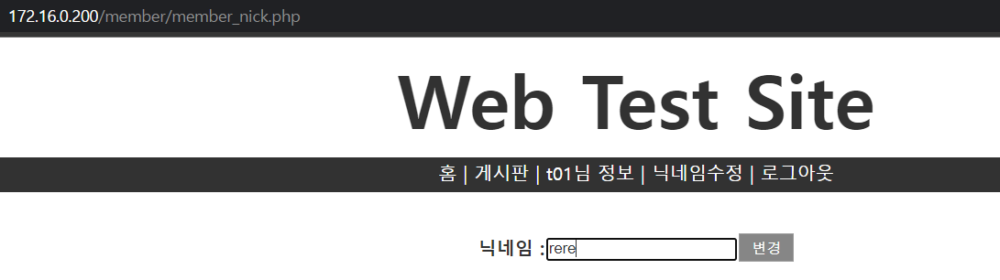


닉네임이 변경 되었습니다.

<br>

이제 회원가입 부분을 시작해 보겠습니다.

###### member_register.php

```
<!doctype html>
<html>
	<!-- head 부분 -->
	<head> 
		<!-- 상단 title -->
		<title>회원 가입</title>	
		<!-- CSS Style 지정 -->
		<link rel="stylesheet" href="../style_contents.css" type="text/css">
		<script>
			function ck(){				
				if(document.mform.user_id.value == "" || document.mform.user_id.value.length < 4 || document.mform.user_id.value.length > 12){
					alert("아이디를 다시 입력하세요.");
					mform.user_id.focus();
					return false;
				}
				if(document.mform.user_id.value=="admin" || document.mform.user_id.value=="master" || document.mform.user_id.value=="root"){
					alert("사용할 수 없는 계정입니다.");
					mform.user_id.focus();
					return false;
				}
				if(document.mform.name.value == ""){
					alert("이름 다시 입력하세요.");
					mform.name.focus();
					return false;
				}
				if(document.mform.user_pw1.value == "" || document.mform.user_pw1.value.length < 6 || document.mform.user_pw1.value.length > 20){
					alert("비밀번호를 다시 입력하세요.");
					mform.user_pw1.focus();
					return false;
				}
				if(document.mform.user_pw1.value != document.mform.user_pw2.value){
					alert("비밀번호가 일치하지 않습니다.");
					mform.user_pw2.focus();
					return false;
				}
				document.mform.submit();
			}
		</script>
	</head>
	<body>
		<!-- 화면 상단 header 부분 -->
			<iframe src="../head.php" id="bodyFrame" name="body" width="100%" frameborder="0"></iframe>

		<!-- 화면 하단 body 부분 -->
		<div id="register_contents"  class="contents">			
		<form name="mform" method="post" action="member_register_ok.php">
			<table width="550" cellpadding="3" class="grayColor">
				<tr>
				<th colspan="2" style="background-color: #323232" >
					<font style="color: white; font-size: 150%;" >회 원 등 록</font>
				</th>
				</tr>
				<tr>
					<th width="120px"><font>*ID</font></th>
					<td>
						<input type="text" name="user_id" size="15" maxlength="12">
						&nbsp;&nbsp;&nbsp;<font style="color:red;">4~12(영문/숫자)</font>
					</td>
				</tr>
				<tr>
					<th><font>*이   름</font></th>
					<td><input type="text" name="name" size="15" maxlength="10"></td>
				</tr>
				<tr>
					<th><font>*비밀번호</font></th>
					<td>
						<input type="password" name="user_pw1" size="20" maxlength="20">
						&nbsp;<font style="color:red;">6~20(영문/숫자/특수문자)</font>
					</td>
				</tr>

				<tr>
					<th><font>*비밀번호 확인</font></th>
					<td><input type="password" name="user_pw2" size="20" maxlength="20"></td>
				</tr>
				<tr>
					<th><font>나이</font></th>
					<td><input type="number" name="age" size="30" min="0" max="150"></td>
				</tr>
				<tr>
					<th><font>닉네임</font></th>
					<td><input type="text" name="nick" size="30" maxlength="30"></td>
				</tr>				
				<tr>
					<th><font>EMAIL</font></th>
					<td><input type="text" name="email" size="30" maxlength="30"></td>
				</tr>
			</table>
			<p>
				<font size=2>* 는 필수 입력 항목입니다.</font><br/><br/>
				<input type="button" value="등록" onclick="ck();" class="btn_default btn_gray" >
				<input type="reset" value="삭제" class="btn_default btn_gray" >
			</p>
		</form>
		</div>
	
	</body>
</html>
```

<br>

###### member_register_ok.php

```
<?php
    error_reporting(E_ALL);
	ini_set("display_errors", 1);
    
    // $_SESSION 변수 사용 선언
    session_start();

    // DB연결 페이지 
    require("../dbcon.php");

    //member_register.php 에서 POST method로 전달한 값을 변수에 입력할때 
    $id = $_REQUEST['user_id'];     
    $name = $_POST['name'];    
    $pw1  = $_POST['user_pw1']; 
    $pw2  = $_POST['user_pw2'];     
    $age  = $_POST['age'];    
    $nick  = $_POST['nick'];     
    $email  = $_POST['email'];
    
  // nickname,age 가 입력이 안되서 들어온 경우 
  if(!$nick) $nick=$name;
  if(!$age) $age=0;

  // 중복 ID 회원이 가입 되는것을 확인 
  //$strSQL = "select u_id from member where u_id='$id'";
  $strSQL = "select u_id from member where u_id='".$id."'";
  $rs = mysqli_query($conn,$strSQL);
  $rs_arr = mysqli_fetch_array($rs);

  //SELECT 결과가 있다 : 참 , 없다 : 거짓 
  if($rs_arr)
  {
      echo "<script>
                  alert('중복 회원 ID 회원 가입 실패!');
                  history.back();
                  </script>";
  }
}else{
    $strSQL = "insert into member set u_id='$id', u_pass='$pw1', u_name='$name', nickname='$nick', age=$age, email='$email', reg_date=now()";
    #mysql_query($strSQL,$conn);
    mysqli_query($conn,$strSQL);
//$rs_arr = mysql_fetch_array($rs);
$rs_arr = mysqli_fetch_array($rs);
    echo "<script>
        alert('회원 가입을 축하드립니다!!');
        location.replace('../index.php');
    </script>";
}

   //echo "$id";
   //echo "&nbsp";
   //echo "$name";
   //echo "<br>\n";
   //echo "$pw1";
   //echo "&nbsp";
   //echo "$pw2";
   //echo "<br>\n";
   //echo "$age";
   //echo "&nbsp";
   //echo "$nick";
   //echo "&nbsp";
   //echo "$email";

    // SQL문 작성
   $strSQL = "insert into member set u_id='$id' , u_pass='$pw1' , u_name='$name' , nickname='$nick', age='$age', email='$email', reg_date=now()";
    
   // SQL문 실행
    mysqli_query($conn,$strSQL);

    // DB연결 종료
    mysqli_close($conn);
?>
```

<br>

회원가입 확인


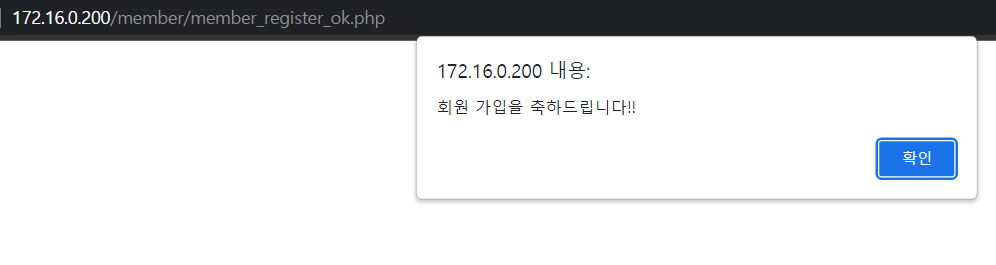


<br>

회원정보 수정 부분 입니다.

###### member_info.php

```
<!doctype html>
<html>
	<!-- head 부분 -->
	<head> 
		<!-- 상단 title -->
		<title>회원 정보</title>
		<!-- CSS Style 지정 -->
		<link rel="stylesheet" href="../style_contents.css" type="text/css">
		<script>
			function ck(){	
				if(!document.mform.user_pw1.value == "" && document.mform.user_pw1.value.length < 6 || document.mform.user_pw1.value.length > 20){
					alert("비밀번호를 다시 입력하세요.");
					mform.user_pw1.focus();
					return false;
				}
				if(document.mform.user_pw1.value != document.mform.user_pw2.value){
					alert("비밀번호가 일치하지 않습니다.");
					mform.user_pw2.focus();
					return false;
				}
				document.mform.submit();
			}
		</script>	
	</head>
	<body>
		<!-- 화면 상단 header 부분 -->
			<iframe src="../head.php" id="bodyFrame" name="body" width="100%" frameborder="0"></iframe>
		<!-- 화면 하단 body 부분 -->
		<div id="info_contents" class="contents">	
		<?php 
			session_start(); 
			if(!$_SESSION[user_id]){
				echo "<script>
					alert('로그인 후 이용하세요!');
					location.replace('member_login.php')</script>";
				exit;
			}
			
			require "../dbcon.php";
			$strSQL="select * from member where u_id='$_SESSION[user_id]'";
			$rs = mysqli_query($conn, $strSQL);
			$rs_arr = mysqli_fetch_array($rs);

			if($_GET[ch]==1)
				echo "<h5>성공적으로 변경되었습니다.</h5>";
			else if($_GET[ch]==2)
				echo "<h5>회원정보를 변경하지 못하였습니다.</h5>";
		?>
			<form name="mform" method="post" action="member_info_change.php">
			<table width="500" cellpadding="3" class="grayColor">
				<tr>
				<th colspan="2" style="background-color: #323232" >
					<font style="color: white; font-size: 150%;" >회 원 정 보</font>
				</th>
				</tr>
				<tr>
					<th width="120px"><font>*ID</font></th>
					<td><?=$rs_arr[u_id]?></td>
				</tr>
				<tr>
					<th><font>*이   름</font></th>
					<td><?=$rs_arr[u_name]?></td>
				</tr>
				<tr>
					<th><font>*비밀번호</font></th>
					<td>
						<input type="password" name="user_pw1" size="20" maxlength="20">
						&nbsp;<font style="color:red;">6~20(영문/숫자/특수문자)</font>
					</td>
				</tr>

				<tr>
					<th><font>*비밀번호 확인</font></th>
					<td><input type="password" name="user_pw2" size="20" maxlength="20"></td>
				</tr>
				<tr>
					<th><font>나이</font></th>
					<td><input type="number" name="age" size="30" min="0" max="150" value=<?=$rs_arr[age]?>></td>
				</tr>
				<tr>
					<th><font>닉네임</font></th>
					<td><input type="text" name="nick" size="30" maxlength="30" value=<?=$rs_arr[nickname]?>></td>
				</tr>				
				<tr>
					<th><font>EMAIL</font></th>
					<td><input type="text" name="email" size="30" maxlength="30" value=<?=$rs_arr[email]?>></td>
				</tr>
			</table>
			<p>
				<font size=2>* 는 필수 입력 항목입니다.</font><br/><br/>
				<input type="button" value="수정" onclick="ck();" class="btn_default btn_gray" >
				<input type="reset" value="삭제" class="btn_default btn_gray" >
			</p>
		</form>
		</div>
	</body>
</html>
```

<br>

###### member_info_change.php

```
<?php
		session_start();
		require "../dbcon.php";

		$pw1=$_POST["user_pw1"];
		$pw2=$_POST["user_pw2"];
		$age=$_POST["age"];
		$nick=$_POST["nick"];
		$email=$_POST["email"];
		if(!$nick) $nick=$_SESSION[nickname];

		$strSQL = "update member set nickname='$nick' ";

		if($pw1) $strSQL .= ", u_pass='$pw1'";
		if($age) $strSQL .= ", age=$age";
		if($email) $strSQL .= ", email='$email'"; 

		$strSQL .= " where u_id='$_SESSION[user_id]'";
		$rs = mysqli_query($conn, $strSQL);
		if($rs){
			$_SESSION[nickname]=$nick;
			header("Location: member_info.php?ch=1");
		}else{
			header("Location: member_info.php?ch=2");
		}

?>
```

<br>

수정 확인

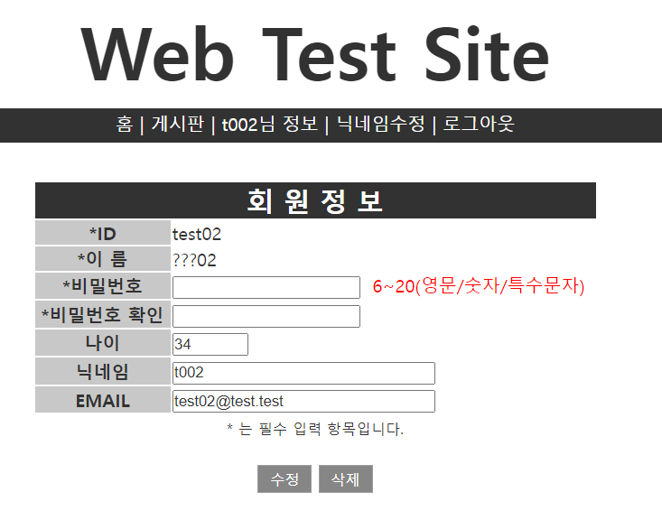

<br>

<br>

<br>

##### Board

###### 게시판 만들기

upload용 디렉터리 생성

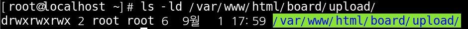

<br>

DB에서 Board 테이블 확인

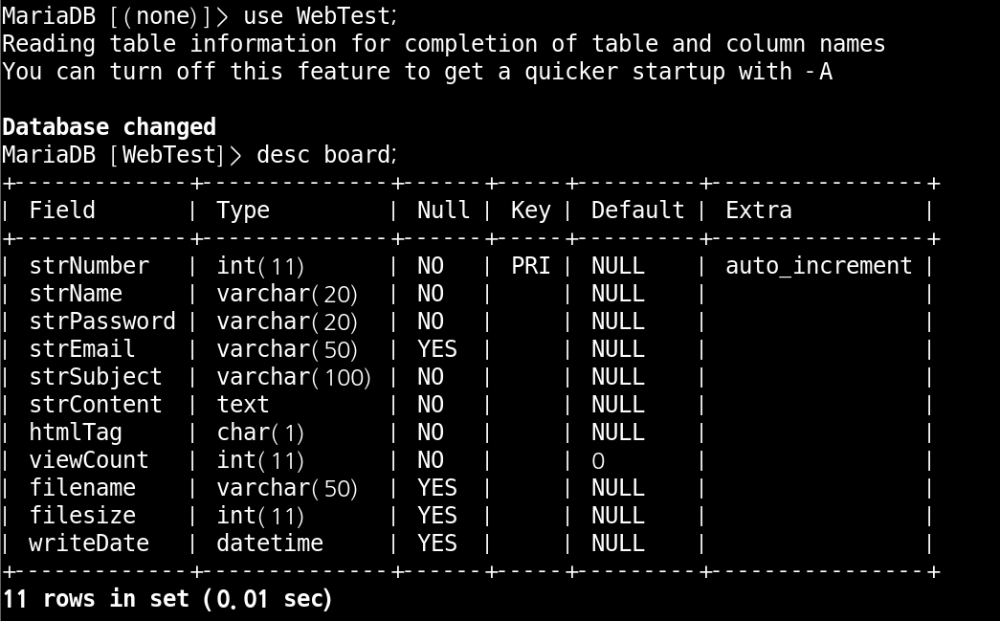

<br>

###### board_list.php

```
<!doctype html>
<html>
	<!-- head 부분 -->
	<head>
		<!-- 상단 title -->
		<title>게시판</title>
		<!-- CSS Style 지정 -->
		<link rel="stylesheet" href="../style_contents.css" type="text/css">
	</head>
	<body>
		<!-- 화면 상단 header 부분 -->
		<iframe src="../head.php" id="bodyFrame" name="body" width="100%" frameborder="0"></iframe>
		<!-- 화면 하단 body 부분 -->
		<div id="board_contents" class="contents">
			<table width="600" border="1">
			<!-- 제목 -->
			<tr>
			<th colspan="5" style="background-color: #323232" >
				<font style="color: white; font-size: 150%;" >게 시 판</font>
			</th>
			</tr>
			<tr bgcolor="#c8c8c8">
				<th width="7%"><font>번호</font></th>
				<th width="41%"><font>제목</font></th>
				<th width="15%"><font>작성자</font></th>
				<th width="30%"><font>등록일</font></th>
				<th width="7%"><font>조회</font></th>
			</tr>
		<?php
			require "../dbcon.php";
			$strSQL = "";
			// 키워드 조회
			if($_GET[keyword]){
				$key = $_GET[keyword];
				$k_s = $_GET[k_s];
				switch($k_s){
					case '1':
						$strSQL="select * from board where strSubject like '%$key%' order by strNumber desc"; break;
					case '2':
						$strSQL="select * from board where strContent like '%$key%' order by strNumber desc"; break;
					case '3':
						$strSQL="select * from board where strName like '%$key%' order by strNumber desc"; break;
					default:
						$strSQL = "select * from board order by strNumber desc";
				}
			}else{
				// 키워드 없으면 전체 조회
				$strSQL = "select * from board order by strNumber desc";
			}
			//$rs = mysql_query($strSQL);
			$rs = mysqli_query($conn, $strSQL);
			
			//레코드 셋의 갯수 반환 
			$rs_num = mysqli_num_rows($rs);
			
			// 연결 객체 해제 
			mysqli_close($conn);

			// 조회된 결과 없을 경우
			if($rs_num == 0): ?>
				<tr>
					<td colspan="5" class="center"><font><b>등록된 게시물이 없습니다.</b></font></td>
				</tr>

		<?php	else:
			// 조회된 결과 있을 경우
				while($rs_arr = mysqli_fetch_array($rs)){
					$b_num = $rs_arr["strNumber"];
					$b_name = $rs_arr["strName"];
					$b_email = $rs_arr["strEmail"];
					$b_sub = $rs_arr["strSubject"];
					$b_no = $rs_arr["viewCount"];
					$b_date = $rs_arr["writeDate"];
		?>
					<tr>
						<td width="7%"><font size="2"><?=$b_num;?></font></td>
						<td width="41%"><font size="3"><a href="board_view.php?num=<?=$b_num;?>"><?=$b_sub;?></a></font></td>
						<td width="15%"><font size="3"><?=$b_name;?></font></td>
						<td width="30%"><font size="1"><?=$b_date;?></font></td>
						<td width="7%"><font size="2"><?=$b_no;?></font></td>
					</tr>
		<?php	}
			endif; ?>
			</table>
			<br/>
			<p align="center">
			<!-- 글쓰기 버튼 -->
			<input type="button" value="글쓰기" class="btn_default btn_gray" onclick='location.replace("board_write.php")'>
			<br/>
			<br/>
			<!-- 검색 -->
		<?php
				if($key)
					echo "<font size=2>[$key] 검색 결과입니다.</font>";
				else
					echo "<font size=2>전체 글 검색 결과입니다.</font>";
			?>
			<form action="board_list.php">
				<select name="k_s">
					<option value="1">글제목</option>
					<option value="2">글내용</option>
					<option value="3">작성자</option>
				</select>
				<input type="text" name="keyword">
				<input type="submit" class="btn_default btn_gray" value="검색">
			</form>
			</p>
		</div>
	</body>
</html>
```

<br>

WebTest.board 레코드를 1줄 입력 

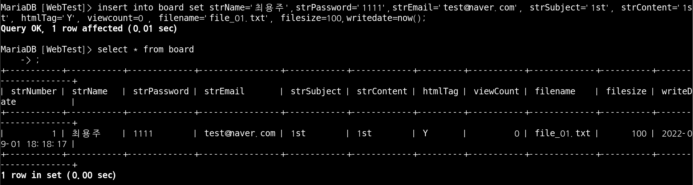

<br>

게시판 확인

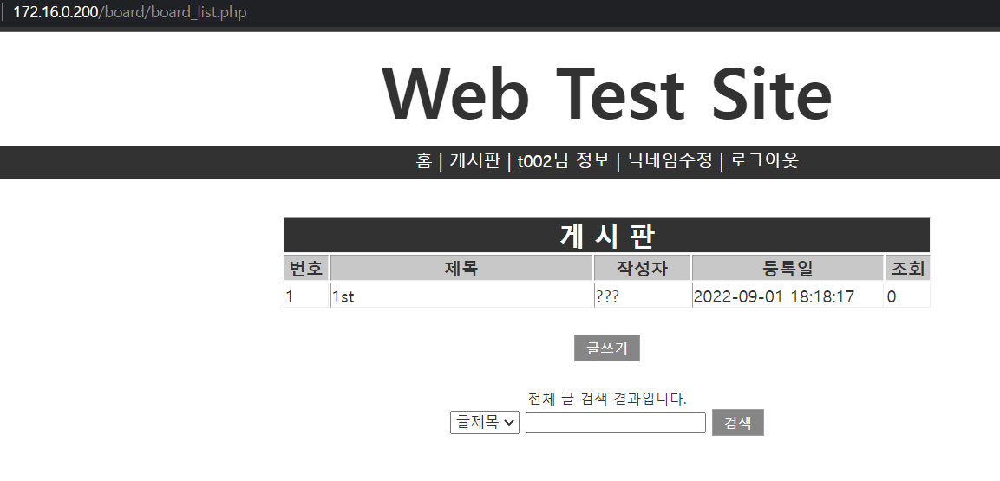

<br>

###### board_write.php

```
<!doctype html>
<html>
	<!-- head 부분 -->
	<head>
		<!-- 상단 title -->
		<title>게시판</title>
		<!-- CSS Style 지정 -->
		<link rel="stylesheet" href="../style_contents.css" type="text/css">
		<script>
			function ck(){
				if(document.wform.name.value == ""){
					alert("이름을 입력해 주세요.");
					document.wform.name.focus();
					return false;
				}
				if(document.wform.pw.value == ""){
					alert("비밀번호를 입력해 주세요.");
					document.wform.pw.focus();
					return false;
				}
				if(document.wform.sub.value == ""){
					alert("제목을 입력해 주세요.");
					document.wform.sub.focus();
					return false;
				}
				if(document.wform.cont.value == ""){
					alert("내용을 입력해 주세요.");
					document.wform.cont.focus();
					return false;
				}
				document.wform.submit();
			}
		</script>
	</head>
	<body>
		<!-- 화면 상단 header 부분 -->
		<iframe src="../head.php" id="bodyFrame" name="body" width="100%" frameborder="0"></iframe>
		<!-- 화면 하단 body 부분 -->
		<div id="board_contents" class="contents">
			<?php
				session_start();
				if($_SESSION[user_id]){
					require "../dbcon.php";
					$strSQL="select u_name,email from member where u_id='$_SESSION[user_id]'";
					$rs = mysqli_query($conn, $strSQL);
					$rs_arr = mysqli_fetch_array($rs);
					$name = $rs_arr[u_name];
					$email = $rs_arr[email];
				}
			?>
			<form name="wform" method="post" action="board_write_ok.php" enctype="multipart/form-data">
				<table width="600" class="grayColor">
					<tr>
						<th colspan="5" style="background-color: #323232" >
							<font style="color: white; font-size: 150%;" >게 시 글 작 성</font>
						</th>
					</tr>
					<tr>
						<th width="100"><font>이  름</font></th>
						<td><input type="text" name="name" size="11" value="<?=$name;?>"></td>
					</tr>
					<tr>
						<th><font>비밀번호</font></th>
						<td><input type="password" name="pw" size="12"></td>
					</tr>
					<tr>
						<th><font>이메일</font></th>
						<td colspan="3"><input type="text" name="email" size="40" value="<?=$email;?>"></td>
					</tr>

					<tr>
						<th><font>제  목</font></th>
						<td colspan="3"><input type="text" name="sub" size="40"></td>
					</tr>
					<tr>
						<th><font>HTML적용</font></th>
						<td colspan="3">
							<input type="radio" name="tag" value="T" checked><font size="3">적용</font>
							<input type="radio" name="tag" value="F"><font size="3">비적용</font>
						</td>
					</tr>
					<tr>
						<th><font>내  용</font></th>
						<td colspan="3" align="center"><textarea name="cont" cols="60" rows="10" style="border: 0px;"></textarea></td>
					</tr>
					<tr>
						<th><font>파일첨부</font></th>
						<td colspan="3"><input type="file" name="att_file"><font size="2">&nbsp;&nbsp;(최대 4MB)</font></td>
					</tr>
				</table>
			</form>

			<p align="center">
				<input type="button" value="등록" class="btn_default btn_gray" onclick='ck();'>
				<input type="reset" value="다시작성" class="btn_default btn_gray" >
				<input type="button" value="목록" class="btn_default btn_gray" onclick="location.replace('board_list.php');">
			</p>
		</div>
	</body>
</html>
```

<br>

게시판 작성 확인

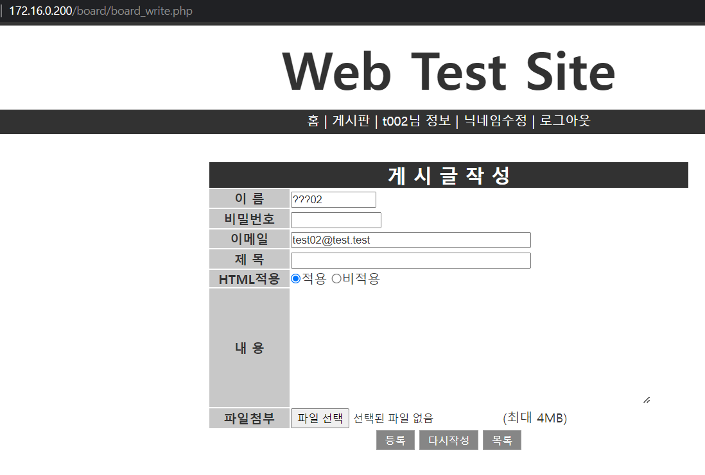

<br>

###### board_write_ok.php

```
<?php

	$b_name=$_POST["name"];
	$b_pw=$_POST["pw"];
	$b_email=$_POST["email"];
	$b_sub=$_POST["sub"];
	$b_cont=$_POST["cont"];
	$b_tag=$_POST["tag"];

	// html 사용안하는 게시글은 html encoding 처리
	if($b_tag == "F"){
		$b_cont = htmlspecialchars($b_cont);
	}

	// file 정보 받기
	// $_FILES : form 에서 file type으로 넘어오면 여러가지 정보가 넘어오는데 이런 정보를 받아주는 슈퍼글로벌 변수
	$f_error=$_FILES["att_file"]["error"];
	if($f_error==0){
		$f_name=$_FILES["att_file"]["name"];
		$f_path="upload/".$f_name;
		$f_tmp=$_FILES["att_file"]["tmp_name"];
		$f_size=$_FILES["att_file"]["size"];

		// 같은 이름의 파일이 있을 경우 이름 뒤에 숫자 붙이기
		$f_name_only=substr($f_name,0,strrpos($f_name,'.'));	// 파일이름 중 확장자를 제외한 이름
		$f_name_ext=substr($f_name,strrpos($f_name,'.'));	// 파일이름 중 확장자

		for($i=1; is_file($f_path); $i++){	// 같은 이름의 파일이 있으면 i 값을 1씩 증가시키며 반복
			$f_name_only=$f_name_only."(".$i.")";	// 파일이름 뒤에 (번호) 추가
			$f_path="./upload/".$f_name_only.$f_name_ext;	// 파일 경로 재설정
		}
		$f_rename = $f_name_only.$f_name_ext;	//파일이름과 확장자 다시 합치기

	}else if($f_error!=4){
		echo "<script>alert('파일 업로드 실패($f_error)');
			history.back();</script>";
			exit;
	}
	/*
	 echo "file error:".$_FILES['attachFile']['error'];
	************ 오류 코드 ***************************
	 0 : 성공
	 1 : php.ini 의 upload_max_filesize 보다 큽니다.
	 2 : html 폼에서 지정한  max file size 보다 큽니다.
	 3 : 파일이 일부분만 전송되었습니다.
	 4 : 파일이 전송되지 않았습니다.
	 6 : 임시 폴더가 없습니다.
	 7 : 디스크에 파일 쓰기를 실패하였습니다.
	 8 : 확장에 의해 파일 업로드가 중지되었습니다.
	*************************************************
	*/

	require "../dbcon.php";

	$strSQL="insert into board set strName='$b_name', strPassword='$b_pw', strEmail='$b_email', ";
	$strSQL.="strSubject='$b_sub', strContent='$b_cont', htmlTag='$b_tag',writeDate=now() ";
	if($f_error==0)
	{
		$strSQL.=", filename='$f_rename', filesize='$f_size'";
		$f_rs = move_uploaded_file($f_tmp, $f_path);
	}

	//$rs = mysql_query($strSQL);
	$rs = mysqli_query($conn,$strSQL);
	if($rs){
		echo "<script>alert('글이 성공적으로 등록 되었습니다.');
			location.replace('board_list.php');</script>";
	}else{
		echo "<script>alert('글을 등록하는데 실패하였습니다.');
			history.back();</script>";
	}

?>
```

<br>

게시글 올려보기

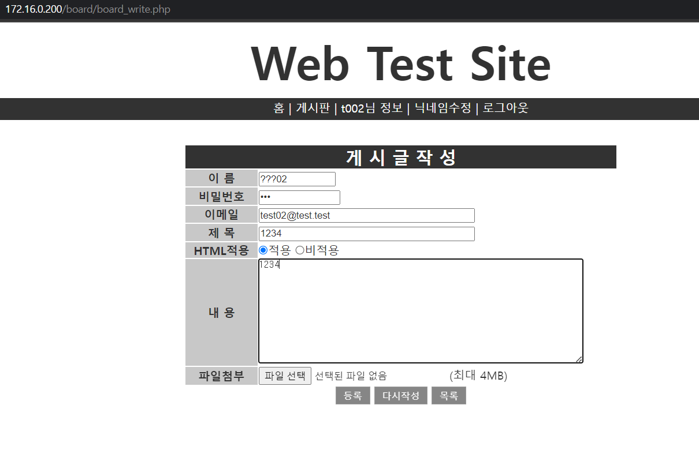

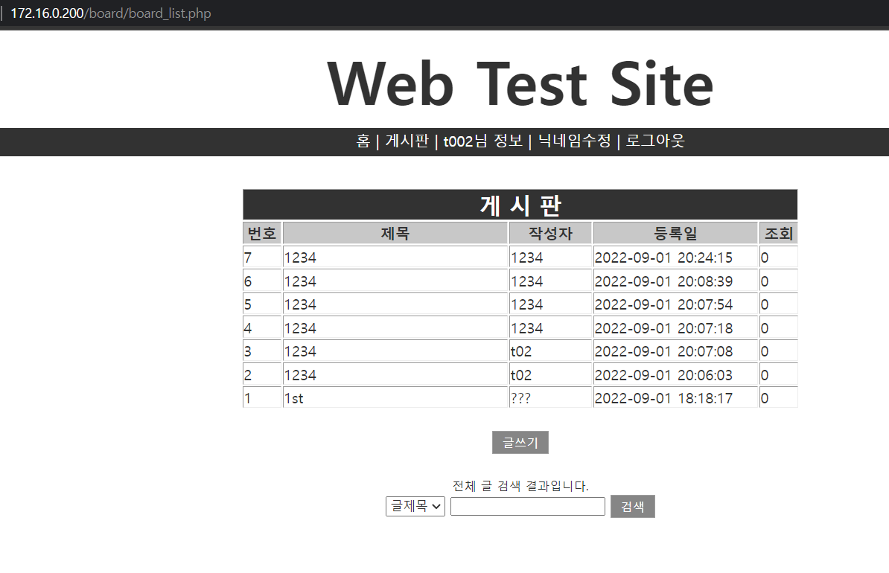

<br>

###### board_view.php

```
<!doctype html>
<html>
	<!-- head 부분 -->
	<head>
		<!-- 상단 title -->
		<title>게시판</title>
		<!-- CSS Style 지정 -->
		<link rel="stylesheet" href="../style_contents.css" type="text/css">
		<script>
			function ck(){
				if(document.dform.b_pass.value==""){
					alert("비밀번호를 입력해주세요.");
					document.dform.b_pass.focus();
					return false;
				}
				document.dform.submit();
			}
		</script>
	</head>
	<body>
		<!-- 화면 상단 header 부분 -->
		<iframe src="../head.php" id="bodyFrame" name="body" width="100%" frameborder="0"></iframe>
		<!-- 화면 하단 body 부분 -->
		<div id="board_contents" class="contents">
		<?php
			session_start();
			require("../dbcon.php");

			// 글 조회 수 증가 시키기
			$r_num = $_GET["num"];
			$strSQL = "update board set viewCount=viewCount+1 where strNumber=".$r_num.";";
			//mysql_query($strSQL);
			mysqli_query($conn,$strSQL);

			// 글 내용 조회 해오기
			$strSQL = "select * from board where strNumber=".$r_num.";";
			//$rs = mysql_query($strSQL);
			$rs = mysqli_query($conn,$strSQL);
			//$rs_arr = mysql_fetch_array($rs);
			$rs_arr = mysqli_fetch_array($rs);

			$b_num = $rs_arr["strNumber"];
			$b_name = $rs_arr["strName"];
			$b_email = $rs_arr["strEmail"];
			$b_sub = $rs_arr["strSubject"];
			$b_cont = $rs_arr["strContent"];
			$b_tag = $rs_arr["htmlTag"];
			$b_no = $rs_arr["viewCount"];
			$b_date = $rs_arr["writeDate"];
			$b_fname = $rs_arr["filename"];
			$b_fsize = $rs_arr["filesize"];

			// html 사용안하는 게시글은 html encoding 처리
			if($b_tag == "F"){
				$b_cont = htmlspecialchars($b_cont);
			}
		?>

		<!--게시글 표시 테이블 -->
		<table width="600" border="1" cellpadding="2" class="grayColor">
			<tr>
				<th colspan="5" style="background-color: #323232" >
					<font style="color: white; font-size: 150%;" >내용 보기</font>
				</th>
			</tr>
			<tr>
				<th width="15%"><font>이름</font></th>
				<td width="35%"><font><?=$b_name;?></font></td>
				<th width="15%"><font>등록일</font></th>
				<td width="35%"><font><?=$b_date;?></font></td>
			</tr>
			<tr>
				<th width="15%"><font>이메일</font></th>
				<td width="35%"><font><a href="mailto:<?=$b_email;?>"><?=$b_email;?></a></font></td>
				<th width="15%"><font>조회</font></th>
				<td width="35%"><font><?=$b_no;?></font></td>
			</tr>
			<tr>
				<th width="15%"><font>제목</font></th>
				<td colspan="3"><font><?=$b_sub;?></font></td>
			</tr>
			<tr>
				<th width="15%"><font>내용</font></th>
				<td colspan="4" style="padding:15px 0;"><font><?=$b_cont;?></font></td>
			</tr>
			<tr>
				<th width="15%"><font><b>첨부 파일</b></font></th>
				<td colspan="3"><font>
		<?php
			// 첨부 파일 다운로드
			if($b_fname != ""){ ?>
					<a href="board_file_download.php?filename=<?php echo urlencode($b_fname);?>"><?=$b_fname;?>&nbsp;&nbsp;(<?=$b_fsize;?>바이트)</a>
		<?php	} ?>
				</font></td>
			</tr>
		</table>
		<br/>
		<p align="center">
			<form name="dform" method="post" action="board_delete_ok.php?num=<?=$r_num;?>">
				<font>비밀번호</font>
				<input type="password" name="b_pass" size="20">
				<input type="button" value="삭제" class="btn_default btn_gray" onclick="ck();">
				&nbsp;&nbsp;&nbsp;&nbsp;
				<input type="button" value="목록" class="btn_default btn_gray" onclick="history.back();">
		</p>
		</div>
	</body>
</html>
```

<br>

###### board_delete_ok.php

```

```

<br>
