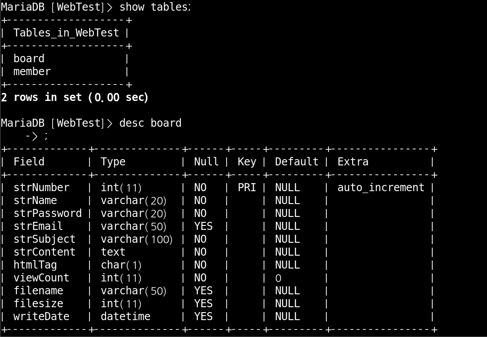
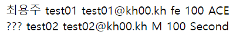

# PHP

 

PHP란 C언어를 기반으로 만들어진  서버 측에서 실행된 ServerSideScript입니다.

 

##### 기본 설정

php 설치

mariaDB 설치

vsftpd 설치하고 root 접근 가능하도록 허용

 

mariaDB 설치

yum -y install을 사용해서 mariaDB를 설치 해주시면 됩니다.

 

root 접근 가능하도록 허용

위의 2개 파일에 들어가서 root만 주석처리 해주시면 됩니다.

 

알 드라이브 사용하여 접속

알 드라이브를 설치 하시고 root 사용자로 접속 해주시면 됩니다.

 

PHP 설치

httpd도 같이 설치 해주도록 하겠습니다.

 

PHP 기본 설정

PHP로 해석해라 라는 부분 입니다.

Error 메시지 출력과 관련된 부분 입니다.

undefined index 관련 부분 입니다.

 

PHP 파일 만들기

 

PHP 파일 옮기기

알 드라이브를 이용하여 PHP 파일을 /var/www/html에 옮겨 줍니다.

 

host pc로 확인

 

### PHP 자료형

##### PHP 변수

 

host pc에서 확인

 

 

 

##### PHP 자료형 : 정수

 

확인

INT3은 최대값을 넘어서 실수로 표현됨.

 

 

 

##### PHP 자료형 : 실수

 

확인

 

 

 

##### PHP 자료형 : 문자열

 

확인

 

 

 

##### PHP 자료형 : 상수

 

확인

 

 

 

##### PHP 자료형 :  NULL

 

확인

마지막 echo "$x"는 출력되지 않음이 확인 가능 합니다.

 

 

 

### PHP 와 DB

##### PHP를 이용한 MariaDB 연결

패키지 설치

 

DB파일 만들기

 

DB파일 불러오기

 

DB 내용 확인

 

연결 해보기

연결실패 code는 password에서 마지막에 d를 빼서 일부러 틀리게 해놨습니다.

위의 예시들은 구버전용 입니다. 현재 centos7는 다른 방식이 있습니다. 지금부터 최신버전으로 예시를 다시 해 보겠습니다.

 

DB연결 성공

 

DB연결 실패

DB연결이 성공하면 con 변수안에 들어있는 DB정보들이 출력 되지만 연결에 실패하면 아무것도 안나오고 DB 선택 실패가 출력되는 모습 입니다.

 

 

 

##### PHP 를 이용한 MariaDB 에 SQL 문 전송  I - create 

성공하면 이렇게 TRUE가 출력이 되고 실패할시 FALSE가 출력 됩니다.

 

 

 

##### PHP 를 이용한 MariaDB 에 SQL 문 전송  II - insert 

 

확인

 

 

 

##### PHP 를 이용한 MariaDB 에 SQL 문 전송  II - select

#####  

 

확인

여태까지 해왔던 방식대로 select를 해보려 했으나 오류가 뜨는 모습 입니다. select는 다른 방식으로 출력을 해야 합니다.

 

select 출력 code

만약 여기서 while문을 사용하지 않는다면 1개만 출력되고 끝나는 상황이 발생하기에 while문을 사용 했습니다.

 

확인

 

추가

 

확인

만약 while문을 쓰지 않았다면 첫번째 행만 출력되고 새로 삽입한 2번째 행은 출력되지 않았을 것입니다. 이러한 이유로 while문을 사용 했습니다.

 

 

 

##### WebTest 웹사이트 구조

이렇게 구조를 만들어 보겠습니다.

 

일단 기본적인 파일들을 만들어 두겠습니다.

index.php

<!doctype html>
<html>
    <!-- head 부분 -->
    <head> 
        <!-- 상단 title -->
        <title>Web Test Site</title>
        <!-- CSS Style 지정 -->
        <link rel="stylesheet" href="style_contents.css" type="text/css">
    </head>
    <body>
        <!-- 화면 상단 header 부분 -->
            <iframe src="head.php" id="bodyFrame" name="body" width="100%" frameborder="0"></iframe>
        <!-- 화면 하단 body 부분 -->
        

            <h1>
            <?php 
                session_start();
                if($_SESSION[nickname])
                    echo $_SESSION[nickname]."님 ";
            ?>환영합니다~!!^^</h1>
            
            웹 해킹을 공부하고 싶은데 연습할 곳이 없으시다구요? 
            실제 사이트에 연습하다가는 <strong>!!철컹철컹!!</strong> 아시죠? 
            이곳은 Web Hacking 연습을 위한 Test 사이트 입니다. 
            이곳에서는 마음껏 연습하세요~!!^^ 
            
        

    </body>
</html>

 

dbconn.php

 

head.php

 

style_contents.css

 

style_head.css

이렇게 기본적인 파일들을 먼저 구성해 두고 시작 하겠습니다.

 

 

 

##### member

 

###### 로그인 과정

 

http 분석

로그인을 하게 되면 위의 member_login 파일이 정보를 전송 해 주는 방식 입니다. 첫번째 사진은 그 모습을 Wireshark로 잡은 모습 입니다.

 

회원정보 테이블 추가

이렇게 가상의 회원을 1명 추가해 보고 로그인 성공 실패를 분석 해 보겠습니다.

 

member_login_check.php 파일을 하나 만들어 보겠습니다.

이렇게 파일을 만들고 실행을 해 보겠습니다.

 

파일 실행

로그인 실패라고 출력이 됩니다.

SQL준비 부분에서 u_pass 부분이 틀렸기 때문 입니다.

이번엔 로그인 성공이 출력 되도록 실패한 부분을 주석처리 하고 실행 해보시면 됩니다.

로그인 성공이 출력 됩니다.

 

member_login_check.php

이렇게 파일을 완성 하였습니다. 사용자를 추가하여 로그인을 해 보겠습니다.

 

사용자 추가

 

로그인 시도

로그인에 성공 하였습니다.

 

로그인 성공, 실패시 팝업창이 출력 되도록 JAVAscript를 이용하여 만들어 보겠습니다.

 

member_login_check.php

script를 조금 추가해 주었습니다.

alert가 팝업창을 생성해주는 명령어 입니다.

 

팝업창 확인

팝업창이 생성 되었습니다.

 

history.back();

로그인이 실패하든 성공하든 저희가 보던 사이트는 원래 페이지로 돌아가는 기능이 있습니다.

지금 추가할 history.back(); 명령어가 그러한 기능을 해줍니다.

 

확인

로그인 전 입니다.

확인을 누르고 확인 해보시면

이렇게 전에 있던 페이지로 돌아가게 됩니다.

전에 있던 페이지로 돌아는 가지만 로그인 성공했던 기록을 가지고 돌아가는 것이 아닙니다. 이제부터는 그 기록을 가지고 페이지로 돌아가도록 해 보겠습니다.

 

location.replace();

location.replace(); 명령어를 사용해 주시면 됩니다.

history.back은 전에 실행됫던 페이지로 가지만 정보를 가지고 가지 않았습니다.

location.replace는 전에 설정한 페이지로 이동하면서 정보를 가지고 갑니다.

 

확인

여기서 확인을 눌러 주시면

index.php로 넘어가는 모습 입니다.

 

