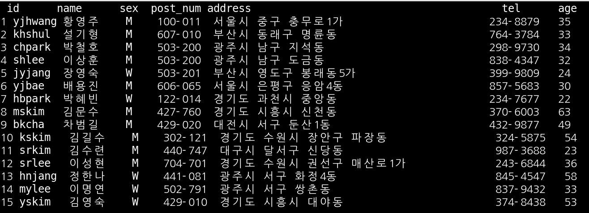
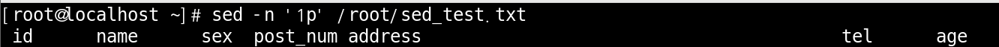
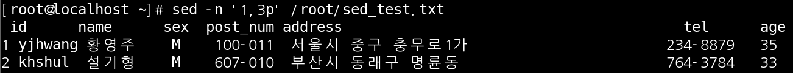
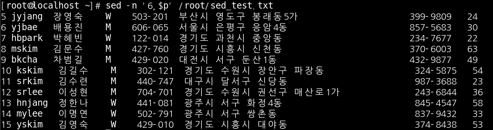
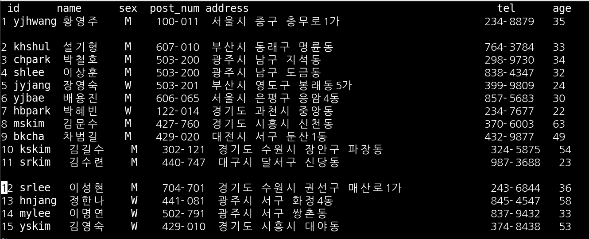
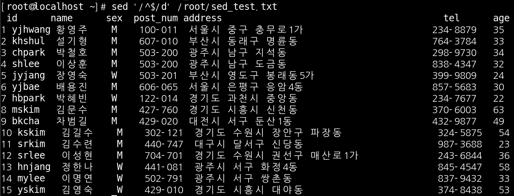
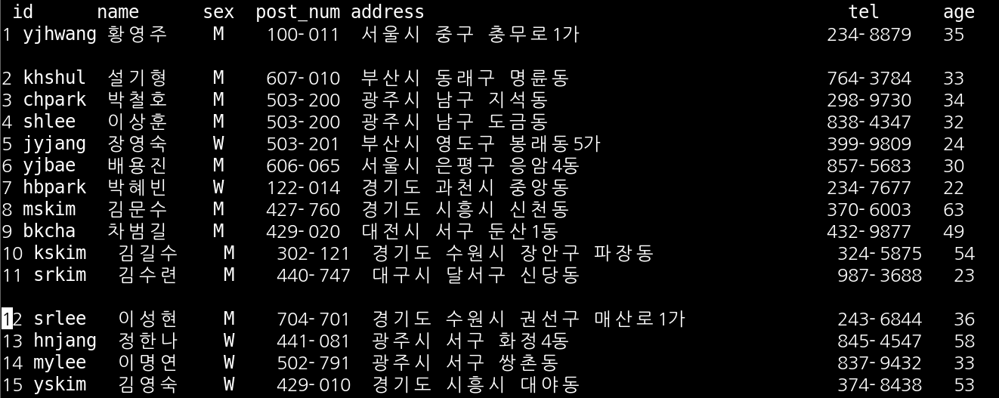
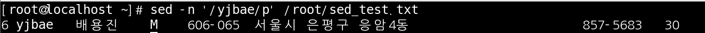
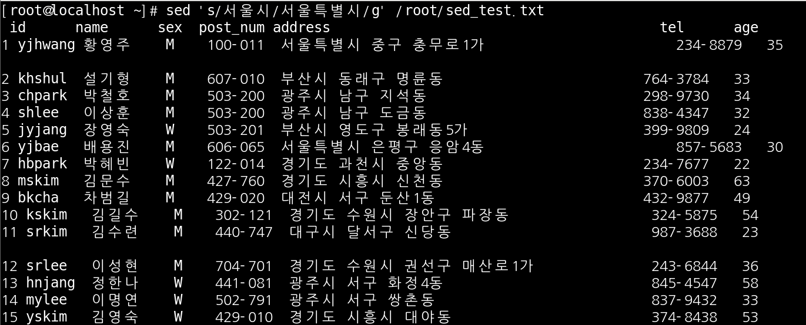

# SED

SED는 원본을 수정하지 않고 파일을 편집할 수 있는 기능 입니다.

 

실습파일 준비

sed_test.txt라는 파일로 준비를 해 보겠습니다.

 

첫 행 출력하기

 

1 ~ 3 행 출력하기

 

6 행부터 끝까지 출력하기

 

빈 행 만들기

test를 위해 의도적으로 빈 행을 만들어 보겠습니다.

 

빈 행 제거하고 출력

 

파일 확인

빈 행을 제거하고 출력 했지만 파일은 수정이 안된 원본 그대로의 상태 입니다.

 

단어로 출력

 

단어 치환

서울시 > 서울특별시로 단어를 치환한 모습 입니다.

 

