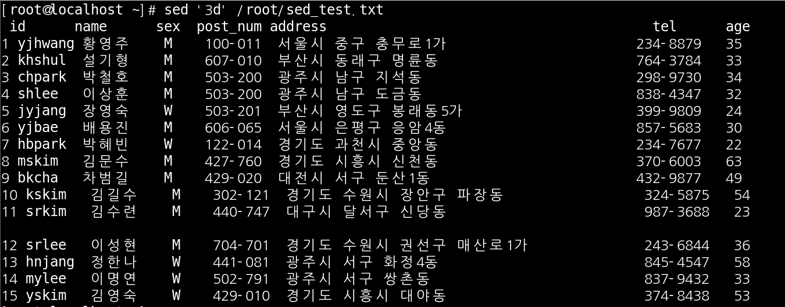

# SED

SED는 원본을 수정하지 않고 파일을 편집할 수 있는 기능 입니다.

 

실습파일 준비

sed_test.txt라는 파일로 준비를 해 보겠습니다.

 

첫 행 출력하기

 

1 ~ 3 행 출력하기

 

6 행부터 끝까지 출력하기

 

빈 행 만들기

test를 위해 의도적으로 빈 행을 만들어 보겠습니다.

 

빈 행 제거하고 출력

 

파일 확인

빈 행을 제거하고 출력 했지만 파일은 수정이 안된 원본 그대로의 상태 입니다.

 

단어로 출력

 

단어 치환

서울시 > 서울특별시로 단어를 치환한 모습 입니다.

 

특정 단어~특정 단어 사이 행 출력

 

3번째 행부터 15로 시작 되는 행까지

 

3번째 행부터 삭제후 출력

 

5번째 행부터 마지막 행까지 삭제

 

마지막 행을 삭제후 출력

 

특정 단어를 포함하는 모든 행을 삭제 나머지 행을 출력

 

치환이 된 행만 출력

p옵션을 주면 변경이 일어난 행만 출력을 합니다.

 

패턴이 포함된 행을 찾으면 그 선택한 행을 다른 파일에 추가

원본 파일 수정을 할 수 있는 i옵션을 제외 하고 기본적인 옵션과 방법들은 다 했습니다. 이제 실습 파일이 아닌 기존에 가지고 있는 파일을 바탕으로 실습을 해 보겠습니다.

 

인터페이스 주소 변경

 

치환된 행만 출력

 

원본 파일 확인

 

-i 옵션 사용

-i 옵션을 사용하니 원본 파일이 수정되는 모습을 확인 해 볼 수 있습니다.

 

명령어 두 가지를 복합하여 사용 해보기

실습 파일 만들기

 

파일 찾기 명령어 

 

내용 변경

 

검색된 파일의 특정한 문자열 지정된 문자열로 변경 

 

원본 파일 확인

아직 -i 옵션을 사용하지 않아서 원본 파일이 수정되지는 않았습니다.

 

-i 옵션 사용해서 검색된 파일의 특정한 문자열 지정된 문자열로 변경

-i 옵션을 사용하니 원본 파일이 수정 되었습니다.

 

변수로 문자열을 입력받아 처리하는 shell script

shell script 파일 만들기

 

실행 해보기

아까 bbb로 수정했던 파일을 aaa로 다시 수정 했습니다.

 

