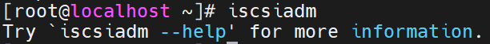

# iSCSI service

 

구상도

 

##### iSCSI Target 설정

디스크 추가

10GB 디스크를 single로 추가해 주시면 됩니다.

 

패키지 설치

 

패키지 확인

 

명령어 Test

block : 외부에서 공간사용요청할때 어떤디스크의 파티션같은 데서 가져올것인가 

fileio :  디스크 의 일부 디렉터리 를 외부에서 사용할수 있게 한다 

 

파티션 생성

 

block 생성

 

fileio 생성

 

생성 확인

 

iscsi 생성

 

iscsi 내부 node를 생성

 

iscsi 를 이용하여 접속할 initiator 를 선언

 

확인

 

initiator 에 인증정보 설정

 

port 확인

 

 

 

##### iSCSI initiator 설정

패키지 설치

 

target 검색

 

initiator 주소를 입력

 

데몬 실행

 

target 에 접속

