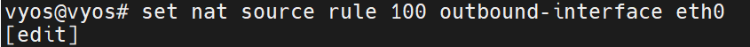
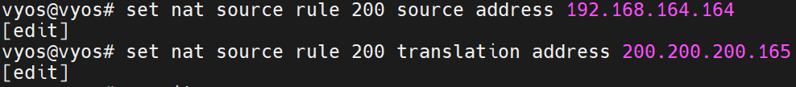

# Vyos

 

구상도

 

moboxterm 연결하기

`$ configure  `

`-- 설정  `

 `set system login user admin full-name "Admin User" `

 `set system login user admin authentication plaintext-password P@ssw0rd `

 `set service ssh port 22 `

`-- 적용 > 저장  `

`commit  `

`save exit `

`$ exit`

moboxterm을 연결해서 조금 더 편하게 진행 해보겠습니다.

 

interface 확인

 

interface 설정

 

default route 설정

 

dns 설정

 

ntp server 설정

 

inside 설정

 

##### masquerade

masquerade 설정

 

masquerade 확인

 

##### 1 to 1 NAT

eth0 주소 하나 더 추가

 

1 to 1 NAT 설정

 

1 to 1 NAT 설정

 

1 to 1 NAT 확인

 

##### eth0 을 dhcp  client 로 만들기

 