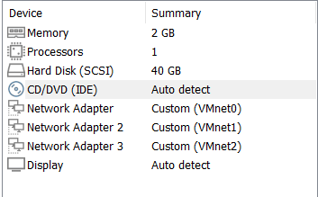
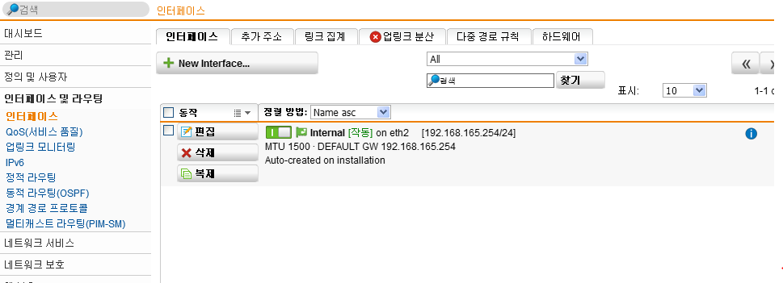
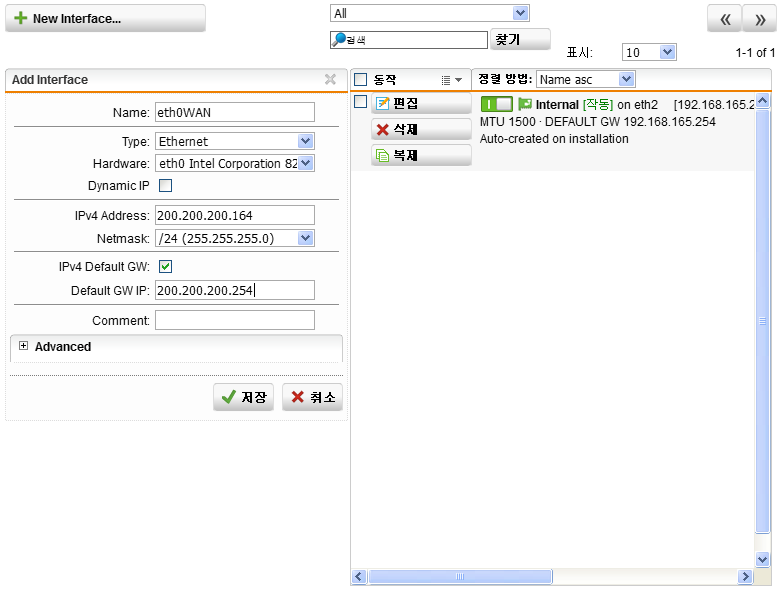
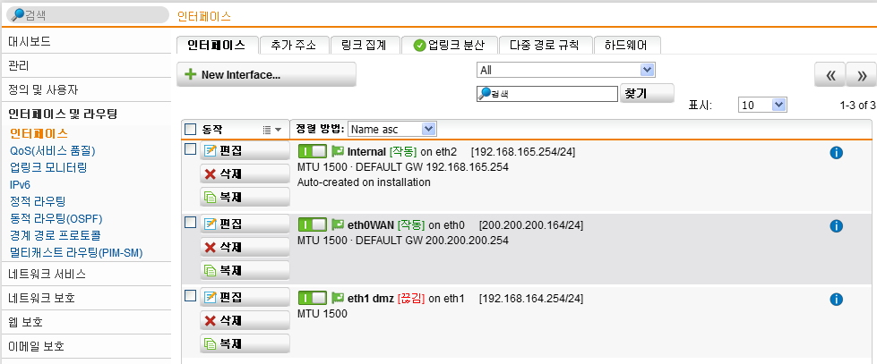
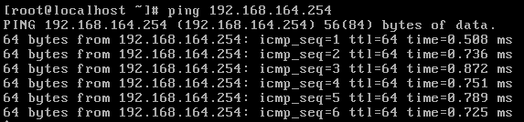
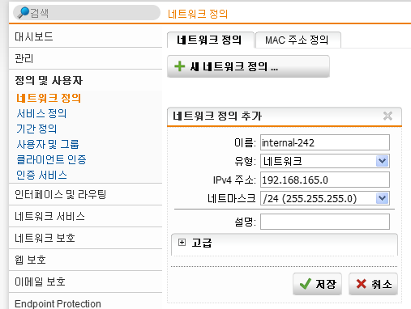
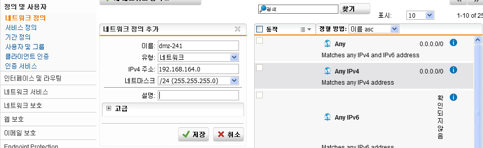

# UTM - Sophos

 

##### UTM(=Unified Threat Management)

- **통합 위협 관리 시스템**

- 단일 장비에 다양한 보안기능을 결합한 통합 보안장비

- 현재 제공될 수 있는 모든 보안기능들을 제고하며 업데이트를 통해 추후 업데이트 가능

   

  VM Ware interface

  

 

UTM interface

 

UTM interface 추가

 

UTM interface 2개 추가해서 총 3개

 

ping check

 

새 네트워크 추가

 

방화벽 설정

 

확인

xp 환경에서 putty를 사용했습니다.

 

