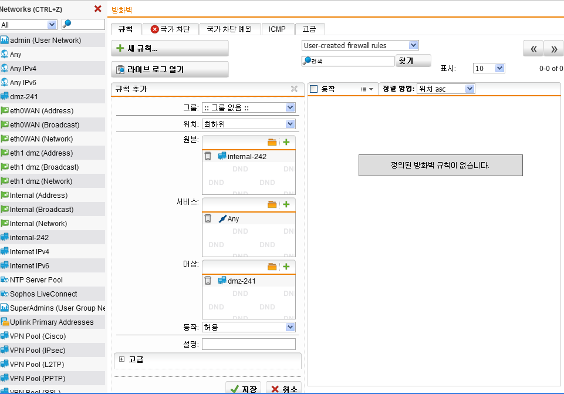
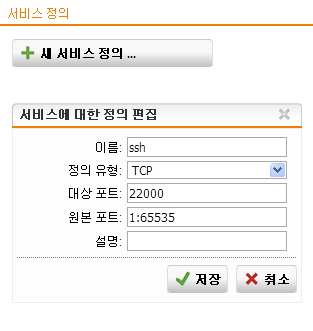

# UTM - Sophos

 

##### UTM(=Unified Threat Management)

- **통합 위협 관리 시스템**

- 단일 장비에 다양한 보안기능을 결합한 통합 보안장비

- 현재 제공될 수 있는 모든 보안기능들을 제고하며 업데이트를 통해 추후 업데이트 가능

   

  VM Ware interface

  

 

UTM interface

 

UTM interface 추가

 

UTM interface 2개 추가해서 총 3개

 

ping check

 

새 네트워크 추가

 

방화벽 설정

 

확인

xp 환경에서 putty를 사용했습니다.

 

마스커레이딩

 

방화벽 설정

 

xp에서 인터넷 접속

 

네트워크 주소 추가

165번을 다른 분이 쓰고 계셔서 166으로 수정 했습니다.

 

MAC 주소 확인

164, 166의 MAC주소가 똑같으면 됩니다.

 

네트워크 생성

여기도 192.168.164.164로 수정 했습니다.

 

NAT 설정

 

정책 설정(방화벽 설정)

 

확인

host PC에서 확인 하시면 됩니다.

 

웹서버 공인 IP주소:22000  ssh 접속을 하면 웹서버 사설:22로 ssh 가 가능하도록 설정 

 

서비스 정의

 

정책 설정

 

NAT 설정

 

확인

 

