# Dig

 

구상도

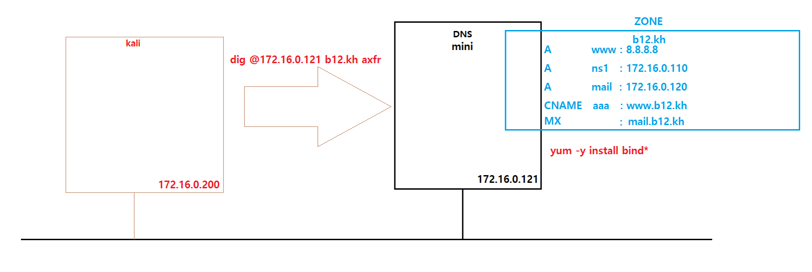

 

mini에 bind 설치

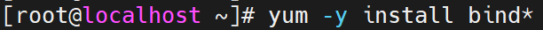

 

dns 설정파일 설정 변경

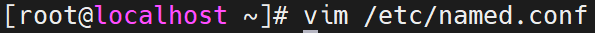

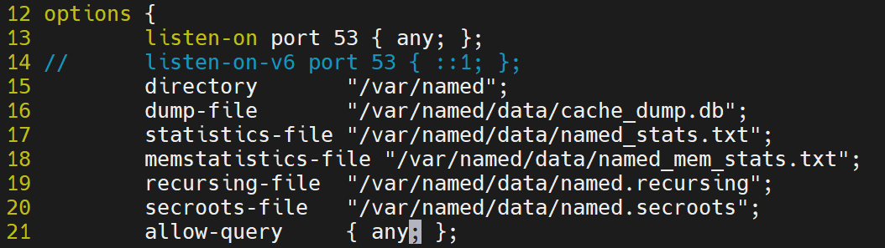

 

영역 파일 복사

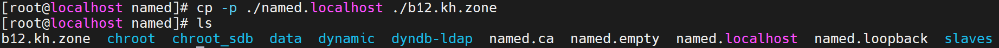

 

영역 파일 설정 변경

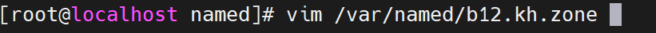

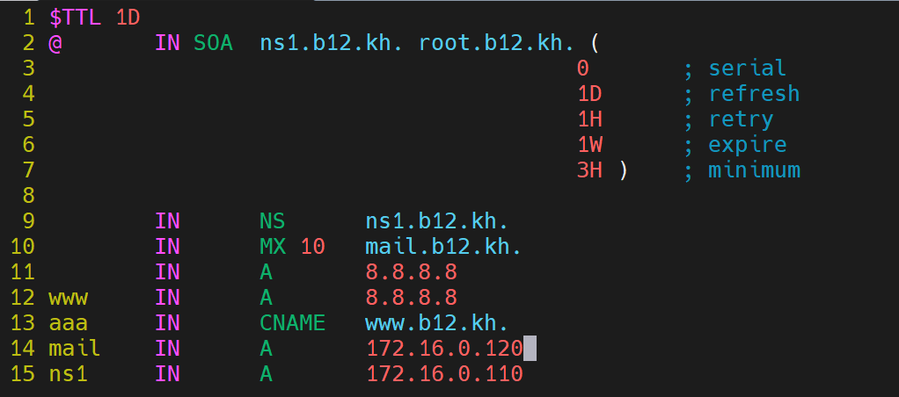

 

영역파일 영역 파일관리 파일에 등록

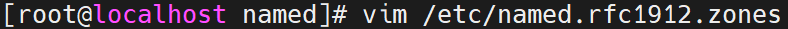

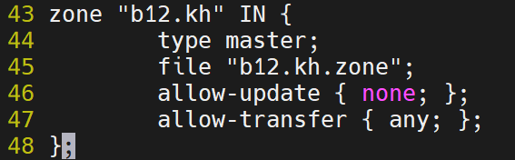

 

데몬 재시작

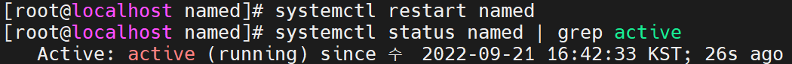

 

Host PC에서 확인

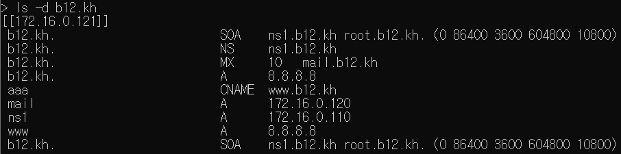

 

kali linux에서 확인

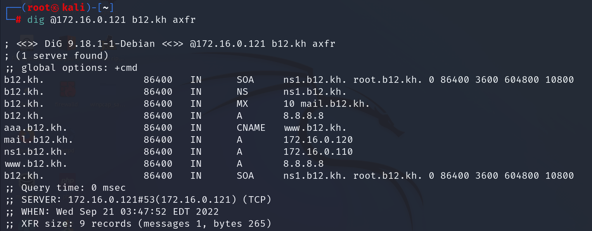

 

취약점 확인

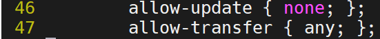

allow-transfer { any; };는 어떤 서버든지 영역전송이 가능하도록 설정 을 한 겁니다.

모든 서버를 막으려면 none로 막을수 있지만 모든 서버가 영역전송이 불가능해 지므로 필요한 서버만 등록하여 서버 접근이 가능 하도록 하겠습니다.

allow-transfer { 허용할 주소; };로 변경 해주시면 됩니다.

