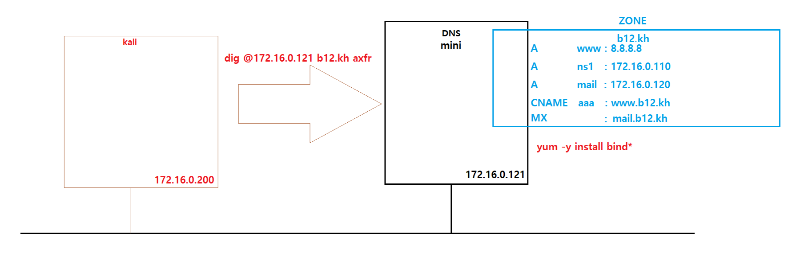
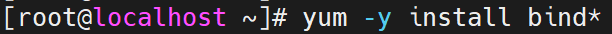
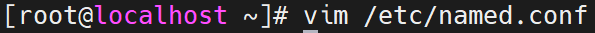
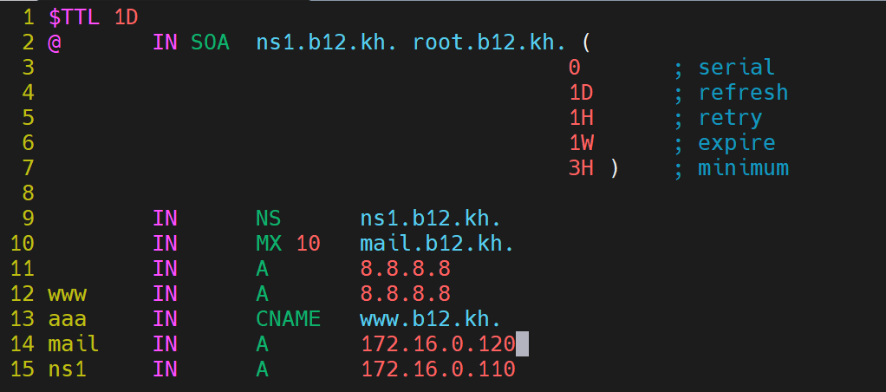
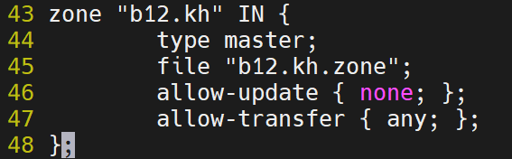
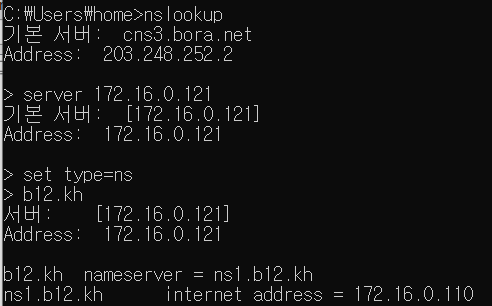
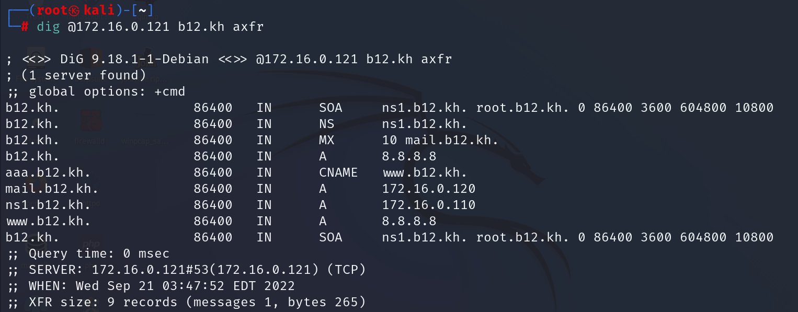
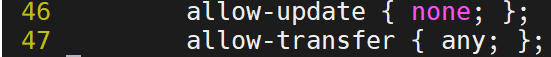

# Domain 정보수집

<br>

### DNS  zone transfer

<br>

구상도



<br>

mini에 bind 설치



<br>

dns 설정파일 설정 변경




<br>

영역 파일 복사


<br>

영역 파일 설정 변경




<br>

영역파일 영역 파일관리 파일에 등록




<br>

데몬 재시작


<br>

Host PC에서 확인




<br>

kali linux에서 확인



<br>

취약점 확인




allow-transfer { any; };는 어떤 서버든지 영역전송이 가능하도록 설정 을 한 겁니다.

모든 서버를 막으려면 none로 막을수 있지만 모든 서버가 영역전송이 불가능해 지므로 필요한 서버만 등록하여 서버 접근이 가능 하도록 하겠습니다.

allow-transfer { 허용할 주소; };로 변경 해주시면 됩니다.

<br>

설정 변경


<br>

확인


<br>

WireShark 확인


Refused 메시지는 영역전송이 차단된 메시지 입니다.


error 메시지는 dig 사용 불가 메시지 입니다.

<br>

<br>

<br>

### DNS bruteforcing

DNS  zone transfer  가 안되는경우 사용하는 방법 입니다.

무차별 대입 공격(Brute-Force)라고 하며 무조건 정보를 획득 할 수 있는 장점이 있으나 경우의 수가 많을 수록 시간이 오래 걸린다는 단점도 존재 합니다.

<br>

사전파일(dictionary file) 제작


<br>

Dictionary Attack


```
dnsenum VERSION:1.2.6

-----   b12.kh   -----                                                                                          
                                                                                                                
                                                                                                                
Host's addresses:                                                                                               
__________________                                                                                              
                                                                                                                
b12.kh.                                  86400    IN    A           8.8.8.8                                     

                                                                                                                
Name Servers:                                                                                                   
______________                                                                                                  
                                                                                                                
ns1.b12.kh.                              86400    IN    A        172.16.0.110                                   

                                                                                                                
Mail (MX) Servers:                                                                                              
___________________                                                                                             
                                                                                                                
mail.b12.kh.                             86400    IN    A        172.16.0.120                                   

                                                                                                                
Trying Zone Transfers and getting Bind Versions:                                                                
_________________________________________________                                                               
                                                                                                                
unresolvable name: ns1.b12.kh at /usr/bin/dnsenum line 900.                                                     
                                                                                                                
Trying Zone Transfer for b12.kh on ns1.b12.kh ... 
AXFR record query failed: no nameservers

                                                                                                                
Brute forcing with /root/dns_dic.txt:                                                                           
______________________________________                                                                          
                                                                                                                
www.b12.kh.                              86400    IN    A           8.8.8.8                                     
aaa.b12.kh.                              86400    IN    CNAME    www.b12.kh.
www.b12.kh.                              86400    IN    A           8.8.8.8
ns1.b12.kh.                              86400    IN    A        172.16.0.110

                                                                                                                
b12.kh class C netranges:                                                                                       
__________________________                                                                                      
                                                                                                                
 8.8.8.0/24                                                                                                     

                                                                                                                
Performing reverse lookup on 256 ip addresses:                                                                  
_______________________________________________                                                                 
                                                                                                                
unresolvable name: ns1.b12.kh at /usr/bin/dnsenum line 660.                                                     
                                                                                                                
0 results out of 256 IP addresses.

                                                                                                                
b12.kh ip blocks:                                                                                               
__________________                                                                                              
                                                                                                                
                                                                                                                
done.

```

위의 방법을 사전파일(dictionary file) 을 생성하여 정보수집 공격하는 Dictionary Attack이라고 합니다.

<br>

WireShark 확인


<br>


대입해서 정보가 있으면 주소를 답해주고 없으면 no such name으로 답을 해주는 모습 입니다.

<br>


