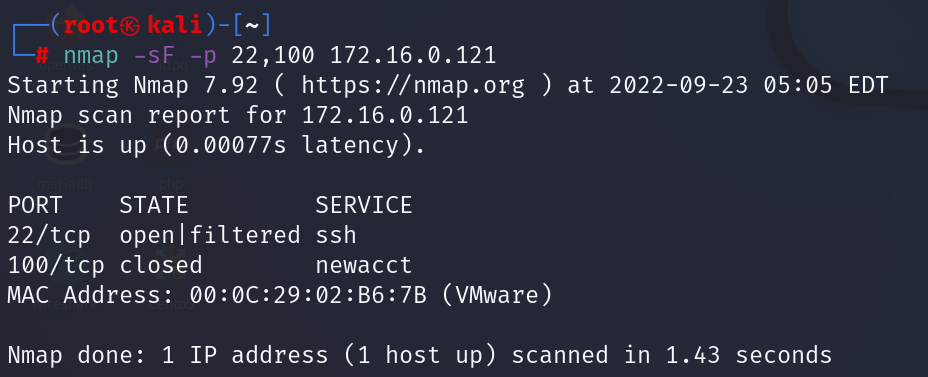
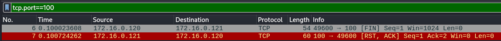

# ActiveHost Scanning 

<br>

##### ping


<br>

##### faipScanner.exe


<br>

##### arping

대상 컴퓨터의 Mac 주소 확인 


<br>

##### fping

sweeping : 네트워크 내에서 활성화된 시스템을 찾는것


<br>

##### nmap

구상도


<br>

sP : ping scan  , 로컬네트워크 ,  arp ,  원격네트워크는  icmp


<br>

외부로 ping 보낼때


내부에서 ping을 할때는arp로 하지만 외부는 icmp로 확인한다.

<br>

-sU : UDP Scan

centOS에 bind* 설치

```
yum -y install bind*

vi /etcc/named.conf에 들어가서 설정 변경
```


<br>

데몬 재시작 후 확인


<br>

-sU : UDP Scan


<br>

WireShark 확인


<br>

TCP Connect Scanning (Full Connection Scan)

- 3 Way-Handshaking을 통해 대상 시스템의 포트 상태 확인 

- Port가 열려있을 경우 세션 수립 / 닫혀있을 경우 RST Packet 수신 - 결과가 정확하고 일반 계정으로 Scanning 가능 함 
- - Overhead 가 크고 Log가 남아 발각되기 쉬움


<br>

WireShark 확인


열려있는 22번 port는 3way-handshake 모습이 보이지만 tcp port가 아닌 100번은 바로 닫히는 모습 입니다.

<br>

SYN Stealth Scanning (Half Open Scan)

- 포트가 열려있을 경우 S/A Packet을 받은 후 RST Packet을 보내 연결을 끊는 방법 

- 닫혀 있을 경우 RST Packet 수신

- 세션이 수립되지 않게 ACK 신호를 안보내기 때문에 비교적 Log를 적게 남김


<br>

WireShark 확인


<br>

FIN Scanning

- RST Flag 가 설정된 Packet을 확인 함으로써 포트가 닫혔음을 판단함 

- IDS 를 회피할 수 있는 가능성이 높지만, 목표 시스템이 UNIX 플랫폼일 경우만 가능 
- Open/Filter/오류의 결과가 불분명 함



<br>

WireShark 확인




<br>

